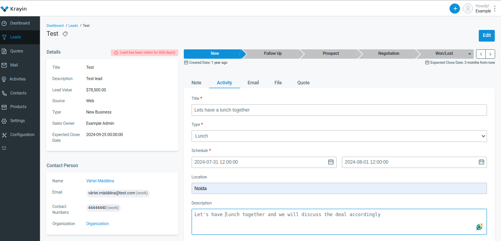
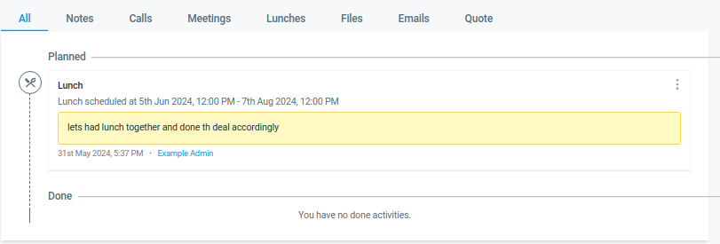

# Activities

**Activities** typically refer to any interactions, tasks, or events associated with managing relationships with customers or prospects. These activities can include various actions by sales, marketing, and customer service teams to engage with customers, nurture leads, and support ongoing relationships.

There are by default 3 Activities present in Krayin CRM.

1) Lunch

2) Call

3) Meeting

### To create an Activity follow the below steps.

**Step-1** Go to admin panel click on **Leads >> Open Lead >> Click on Activity** and add the details listed below.

**1) Title-** Add the title of the activity.

**2) Type-** Select the type of the meeting from the options **lunch, call, meeting**

**3) Schedule-** Schedule a date for the activity.

**4) Location-** Add the location for the activity.

**5) Description-** Add the description of the activity.

**6) Participants-** Add the participants from the activity.

Now click on the **Save** button 

 

Now it will be visible where activity is created check the below image.

**Step-2** Now a new record is created click on **Activity** to check the record in the activity grid.

