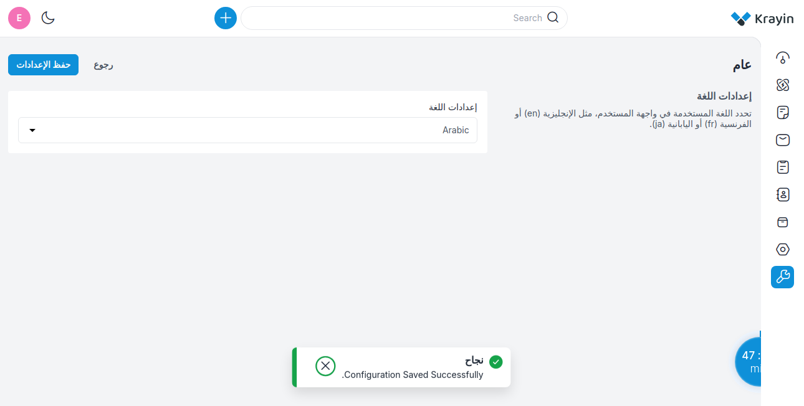

# Configuration

You can manage the configurations here and also change the local languages from the configuration.

### Manage Locale in Krayin

**Step-1** Go to admin panel of krayin and click on **Configuration >> General >> Locale Setting**. 

**Step-2** Now select your desired locale from the dropdown by default, we provide **English, Arabic, Spanish, Persian, and Turkish** languages.

Now click on the **Save** button.

**Step-3** As we have selected the Arabic local layout gets updated according to the Arabic language as shown in the below image.

By following the above steps you can easily use multiple Locales in Krayin CRM.

