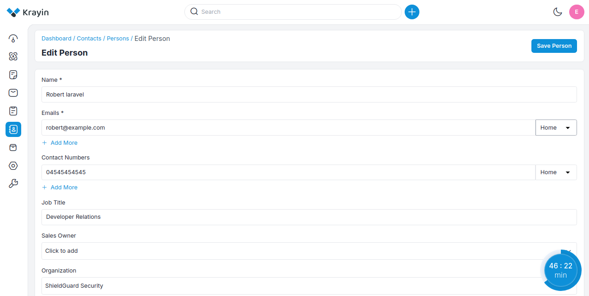
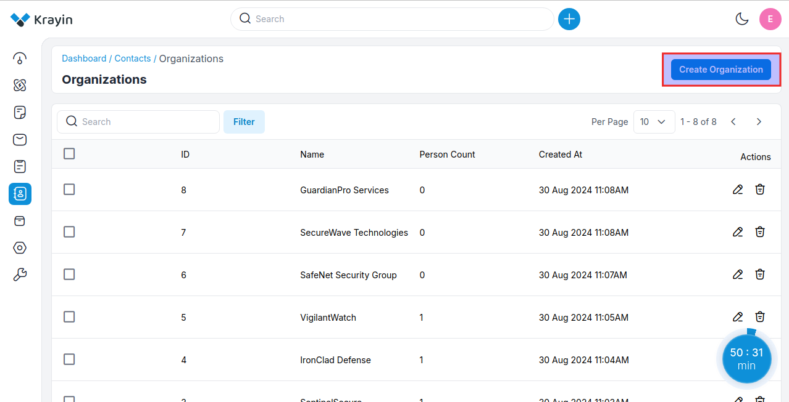
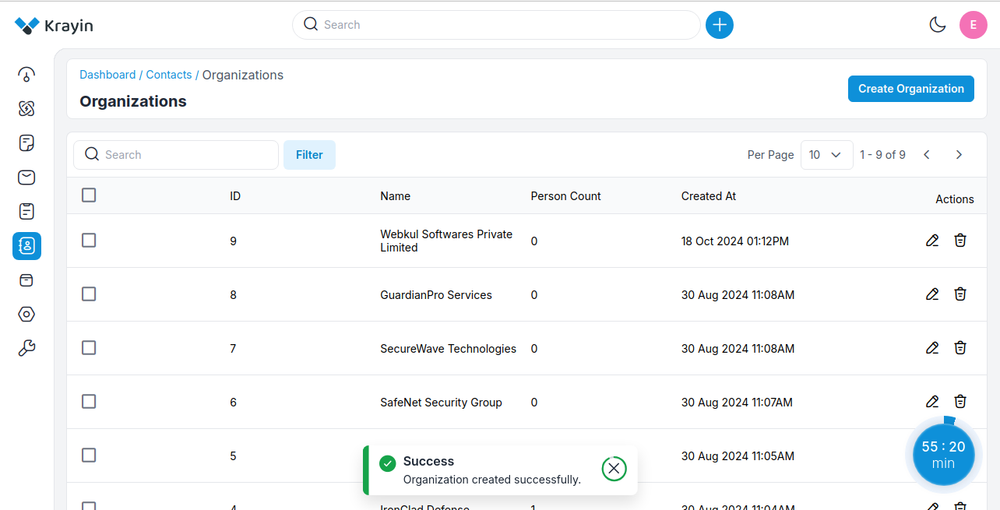

# Contacts

**Contacts** typically refer to individuals or entities with whom a business has a relationship or intends to establish one. These contacts could be existing customers, potential leads, partners, suppliers, or others relevant to the business's operations.

## Person

This individual could be a customer, a lead, a prospect, or any other person with whom the business has or aims to establish a relationship.

### Create person in Krayin

**Step-1** Go to admin panel of krayin and click on **Contacts >> Persons >> Create Person** as shown in the below image.

**Step-2** Add the below details.

**1) Name-** Enter the name of the person.

**2) Emails-** Enter the email ID of the person.

**3) Contact Number-** Enter the contact details 

**4) Organization-** Enter the name of the organization.

Now click on **Save as Person** button.

**Step-3** Now a new record is created click on **Persons** to check the record in the Contact Person grid.

## Orgnization

**Organization** typically refers to a company, business, or entity with which the CRM user interacts or intends to establish a relationship. Organizations can be customers, clients, partners, suppliers, or any other entity relevant to the business's operations.

It could be a commercial enterprise, a non-profit organization, a government agency, or any other entity that deals with customer relationships.

### Create organizations in Krayin

**Step-1** Go to admin panel of krayin and click on **Contacts >> Organizations >> Create Organization** as shown in the below image.

**Step-2** Add the below details briefly.

**1) Name-** Enter the name of the organizations.

**2) Address-** Enter the address of the organization **County State City Pincode**

Now click on **Save as Organization** button.

**Step-3** Now a new record is created in the contact organization grid you can use this organization while creating a lead.

 

**NOTE-** These above **Persons** and **Organization** you can assign it while creating a lead.