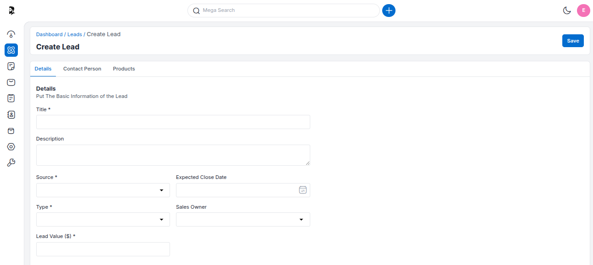
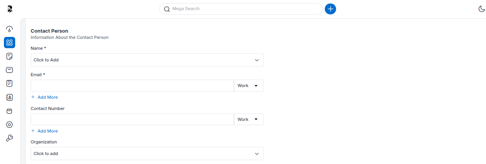

# Leads

A Lead is a potential customer or prospect. Generating a lead is the first step of the sales process in CRM. Lead records are designed to store all known information on the lead, including company name, address, contact details, and the lead's current position in the sales funnel.

### Create Leads in Krayin 

**Step 1)** Go to Admin Panel of Krayin and click on **Leads >> Create Leads** as shown in the below image.

 

**Step 2)** Fill in all the details below.

**1) Title-** Enter the title of the lead.

**2) Description-** Enter the description of the lead.

**3) Lead Value-** Enter the value of the particular lead.

**4) Source-** Select the Source from where you got connected with the customer by Emails, Web, Web Form, Phone, and Direct platforms.

**5) Type-** Select the type whether it is the Existing Business or a New Business.

**6) Sales Owner-** Select a sales owner.

**7) Expected Close Date-** Enter the expected close date of the Lead.

 

**Step 3)** Now click on **Contact Person** details.

**1) Name-** Enter the name of the contact person.

**2) Email-** Enter the email of the person.

**3) Contact Number-** Enter the contact number of the person.

**4) Organization-** Enter the organization of the customer.

 

**Step 4)** Now click on the **Products** Details.

**1)** Add the product item. 

**2)** Add the price of the product.

**3)** Add the quantity of the product.

**4)** Add the amount of the product.

 

Now click on the **Save as Lead** button. 

Click on the lead below as shown in the below image.

**A complete pipeline is created you can also add the steps in the pipeline as shown in the below image**

