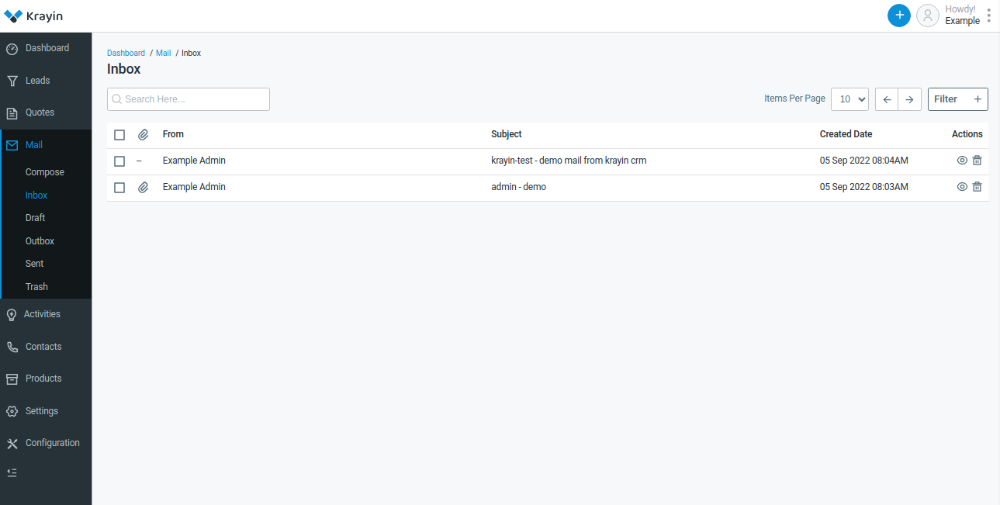
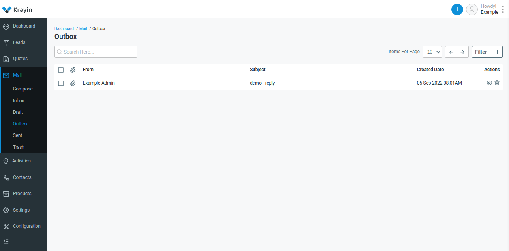
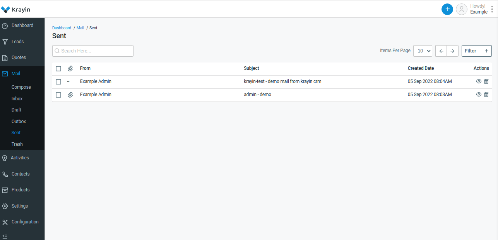

# Mails 

**Mail** typically refers to electronic mail, commonly known as email. It's a method of exchanging digital messages between people using electronic devices such as computers, smartphones, and tablets. Email is widely used for communication in both personal and professional settings. It allows users to send text-based messages, attachments (such as documents, images, or videos), and other digital content to one or more recipients over the internet. Email can be used for various purposes, including sending messages, sharing information, collaborating on projects, and conducting business communications.

## Compose

To compose an email is another term for writing an email. For many email providers, you see a button that says “compose email” which, when clicked on, will let you start writing an email to be sent to a recipient.

 

To send mail click on **Send** Button

## Inbox

An inbox is a primary location where all incoming emails are stored in an email account. The first screen appears when you log in to your email account. The inbox displays the list of emails you have received, along with their subject lines, senders, and the date and time they were received. 

A list of Emails is stored as shown in the below image.

 

## Draft

A draft in email refers to an unsent email message that is saved as a work-in-progress. Drafts are a useful feature in email because they allow users to start composing an email message, but then save it to be finished or edited at a later time.

A list of draft emails is stored as shown in the below image.

 

## Outbox

An outbox is a folder in your email client that stores messages that have been composed but have not yet been sent. The messages remain in the outbox until they are successfully sent, at which point they are moved to the sent items folder.

A list of outbox emails is stored as shown in the below image.

 

## Sent 

With e-mail, Sent or Sent items is a folder or area that stores any e-mails that were successfully delivered. The sent items are different than the outbox, it's where e-mail stays until it's delivered.

A list of sent emails is stored as shown in the below image.

 

## Trash 

The Trash folder is where emails are temporarily stored after being deleted from the Inbox or other folders. Emails in the Trash folder are usually automatically permanently deleted after a certain period of time, for example, 30 days.

A list of trash emails is stored as shown in the below image.

 

**NOTE-** Kindly add the **SMTP details** in the **.env** file which is present in the root directory of Krayin to enable the functionality to send Emails. 

 

