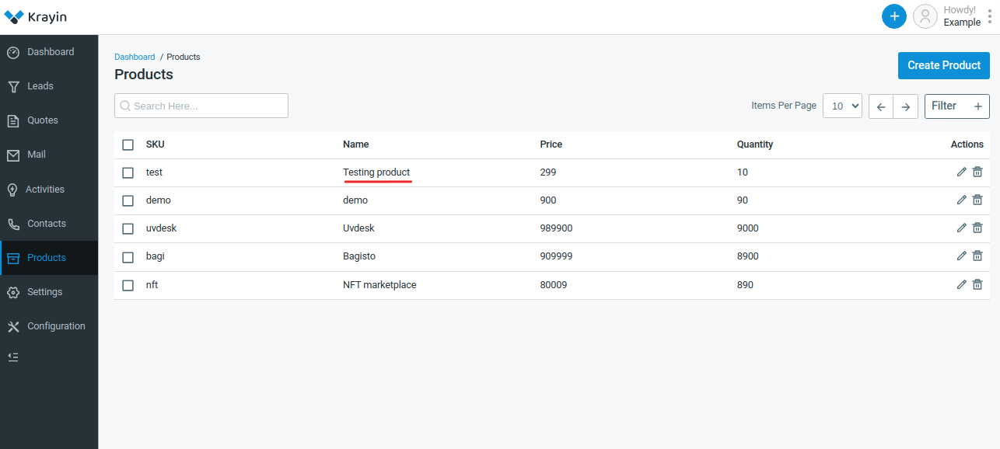

# Products

Products encompass tools and functionalities designed to manage customer relationships effectively, including contact management, sales automation, marketing automation, customer service and support, analytics and reporting, integration capabilities, mobile CRM, customization and scalability, and AI and machine learning features.

### Create Products in Krayin

**Step-1** Go to admin panel of krayin and click on **Products >> Create Product** as shown in the below image.

**Step-2** Add the below details briefly.

**1) Name-** Enter the name of the product.

**2) Description-** Add the description of the product.

**3) SKU-** Enter the SKU of the product.

**4) Quantity-** Enter the quantity of the product.

**5) Price-** Enter the price of the product.

Now click on **Save as Product** button to save the product.

**Step-3** Now a new record is created in the product data grid as shown in the below image.

