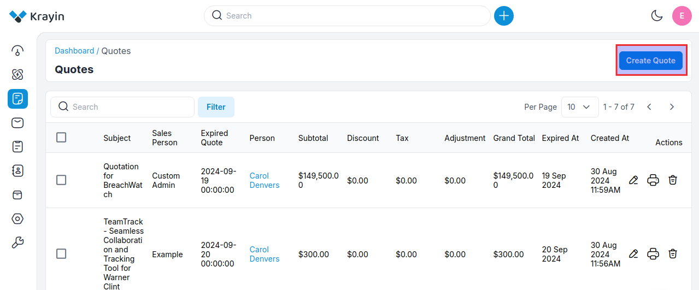
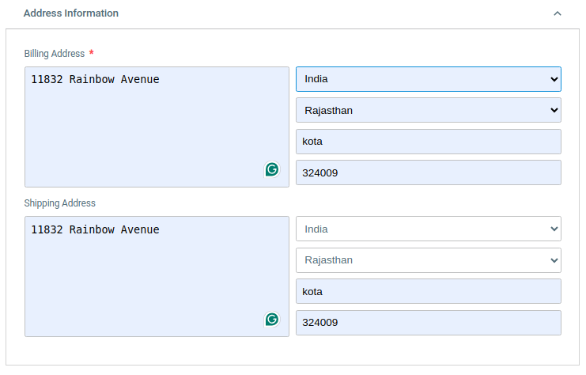
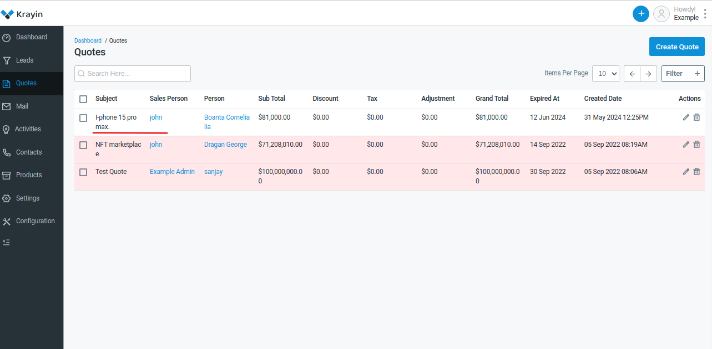

# Quotes

**Quotes** in the context of Customer Relationship Management (CRM), typically refer to formal proposals or estimates provided to potential customers outlining the products or services offered, along with their associated prices. These quotes serve as documented offers, detailing the terms and conditions of a potential sale. They often include itemized lists of products or services, quantities, pricing information, payment terms, and any applicable discounts or taxes.

CRM software often includes features for creating, managing, and tracking quotes as part of the sales process. This allows sales teams to efficiently generate and send quotes to leads or prospects, track their status, and follow up accordingly. Quotes play a crucial role in the sales cycle by providing transparency and clarity to both the seller and the buyer regarding the terms of a potential transaction.

### Create Quotes in Krayin

**Step-1** Go to Admin Panel of Krayin and click on **Quotes >> Create Quotes** as shown in the below image.

 

**Step-2** Add the **Quote Information** detail below.

**1) Sales Owner-** Select the sales owner.

**2) Subject-** Enter the subject.

**3) Description-** Enter the complete description of the product.

**4) Expired At-** Enter the date when this quotation will get expired.

**5) Person-** Enter the user name to whom you are sending a Quote.

**6) Lead-** Enter the name of the lead.

 

**Step-3** Add the **Address Information** detail below.

**1) Billing Address-** Enter the billing address country, state, city, pincode.

**2) Shipping Address-** Enter the shipping address country, state, city, pincode.

 

**Step-4** Add the **Quote Items** detail below. 

**1)Name-** Enter the name of the product.

**2)Quantity-** Enter the quantity of the product.

**3)Price-** Enter the price of the product.

**4)Amount-** Enter the amount of the product.

**5)Discount-** Enter the discount if you want to apply for the products.

**6)Tax-** Enter the Tax if applicable.

**7)Total-** Total amount of the products.

**Note- Also is you want to add more products click on +Add More**

 

Now click on **Save as Quote** button to save the quote.

**Step-5** Now you will able to see the new quote is registered successfully.

 

