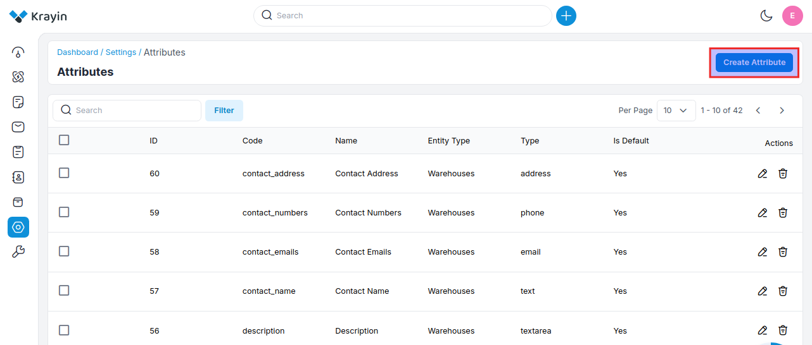
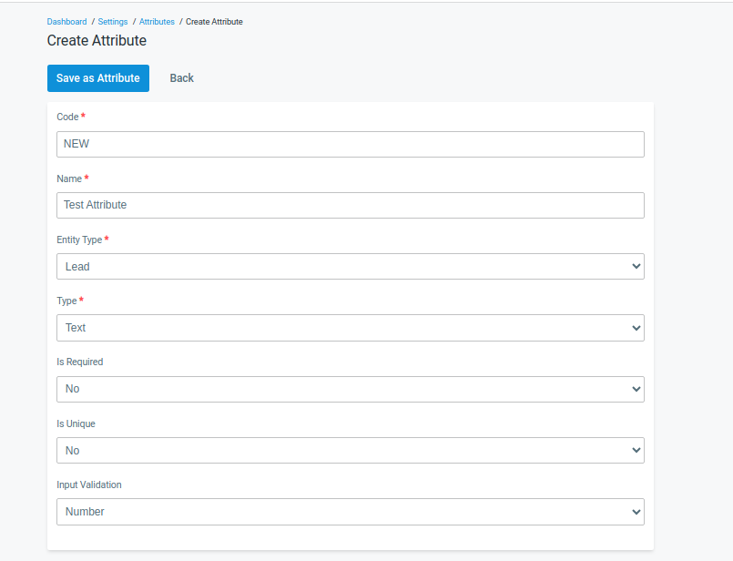
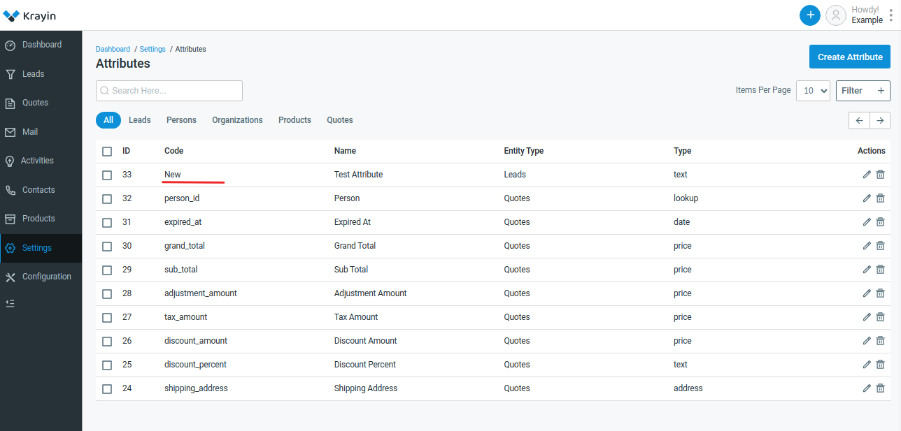

# Attributes

Attributes are used to record distinctive information on (potential) business partners, contacts, opportunities, or activities and to segment data when specifying a batch selection for generating activities, mail merge (letters), or flexible reports.

### Create Attributes in Krayin.

**Step-1** Go to admin panel of krayin and click on **Settings >> Attributes >> Create Attributes** as shown in the below image.

**Step-2** Enter the below details.

**1) Code-** Add the code of the attribute.

**2) Name-** Enter the name of the attribute.

**3) Entity Type-** Select the entity type i.e. (lead, person, organization, product, quote) for the attribute.

**4) Type-** Select the type of the attribute from the dropdown.

**5) Is Required-** Select Yes/No if you want to make the attribute a required field or not.

**6) Is Unique-** Select Yes/No if you want to make the attribute a unique field or not.

**7) Input Validation-** Select the input validation i.e. (Number, Email, Decimal, URL).

Now click on **Save as Attribute** button. 

**Step-3** A new record is created in the attribute data grid as shown in the below image.

