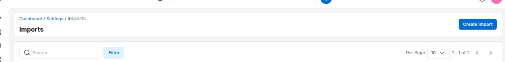
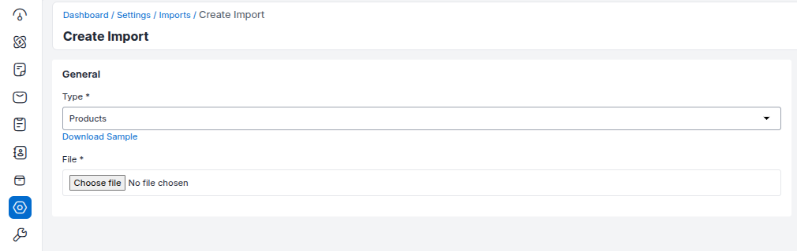
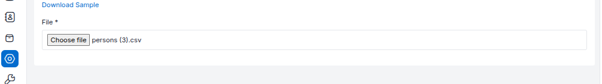
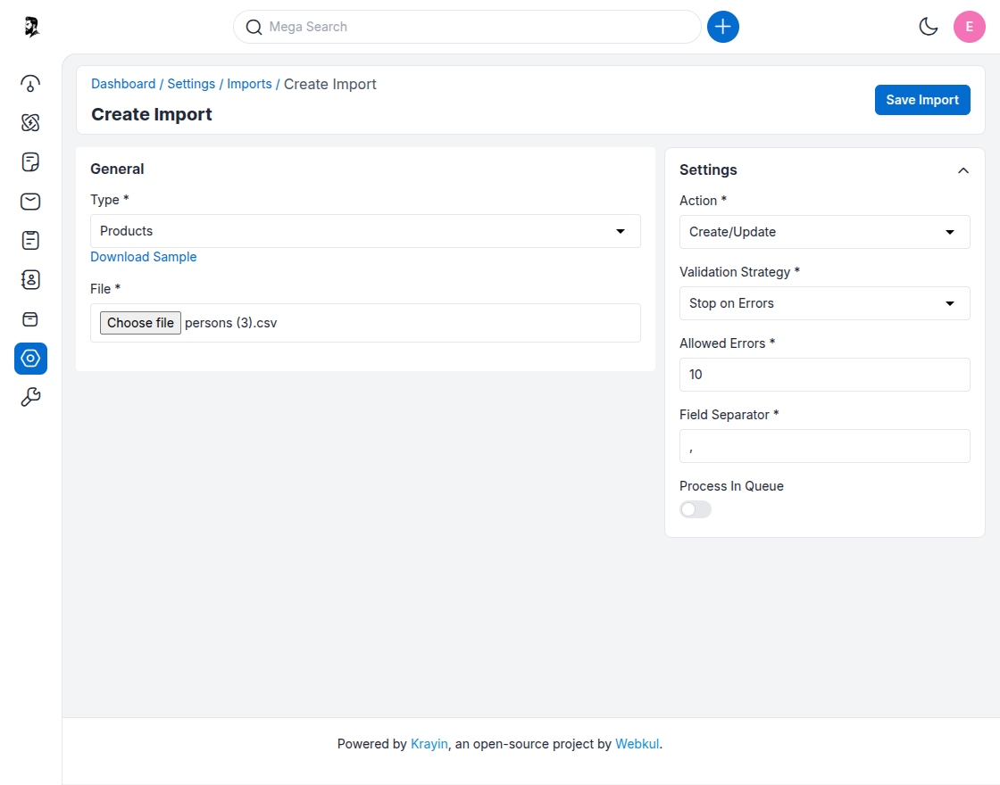
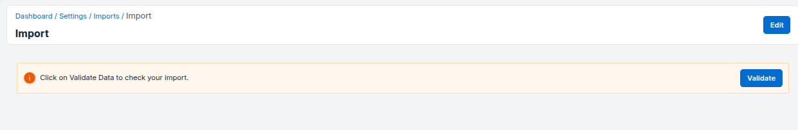
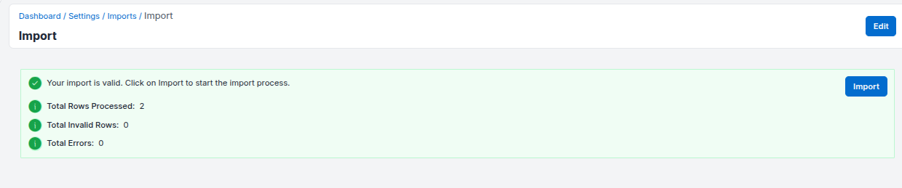
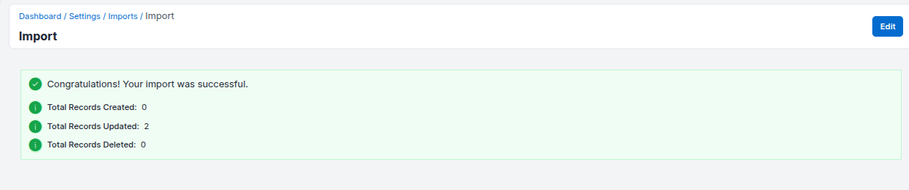

# Data Transfer — Import Feature

---

## Overview

The **Import** feature in Krayin CRM allows you to bulk upload data such as persons, products, or leads using a CSV file. This is especially useful for migrating from another system or batch-updating records.

---

## Create Import

**Step-1** Go to the admin panel of Krayin and click on  
**Settings >> Data Transfer >> Create Import**.

---

### General Configuration

**Step-2** Under the **General** section:

- **Type** – Select the entity type you want to import (e.g., `Persons`, `Product`, etc.)
- Click on **Download Sample** to get a template CSV file with correct formatting.

---

### Upload File

**Step-3** Upload the CSV file you want to import:

- Click on **Choose File**
- Select your `.csv` file formatted per the sample

---

### Settings

**Step-4** Configure additional import settings:

- **Action** – Choose between `Create`, `Update`, or `Create/Update`
- **Validation Strategy** – Choose to `Stop on Errors` or `Skip Errors`
- **Allowed Errors** – Set the maximum allowed errors (default: `10`)
- **Field Separator** – Typically `,` (comma)
- **Process in Queue** – Enable this to run import asynchronously

---

### Validate Import

**Step-5** Click on **Validate Data** to check the integrity of the uploaded file.

- You will see a summary like:
  - **Total Rows Processed**
  - **Total Invalid Rows**
  - **Total Errors**

> ✅ If the file passes validation, a message will appear:  
> _“Your import is valid. Click on Import to start the import process.”_

---

### Perform Import

**Step-6** Click **Import** to begin the actual data import process.

---

### Summary

Once completed, you will see a summary report:

- **Total Records Created**
- **Total Records Updated**
- **Total Records Deleted**

---

## Notes

- Always validate your CSV file using the sample provided.
- Use the **Create/Update** option for importing mixed datasets.
- If errors are found, an **Error File** will be available for download and review.

By following the above steps, you can seamlessly transfer and update large datasets in Krayin CRM.

