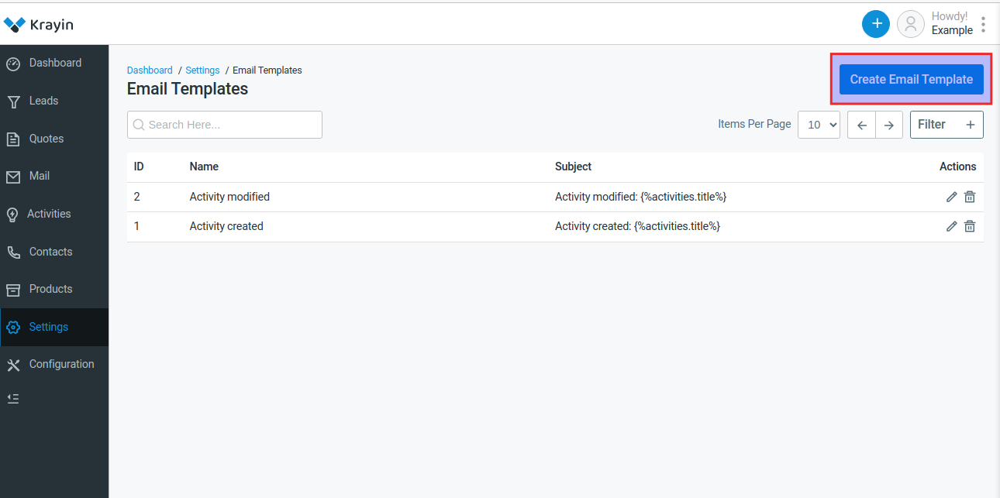
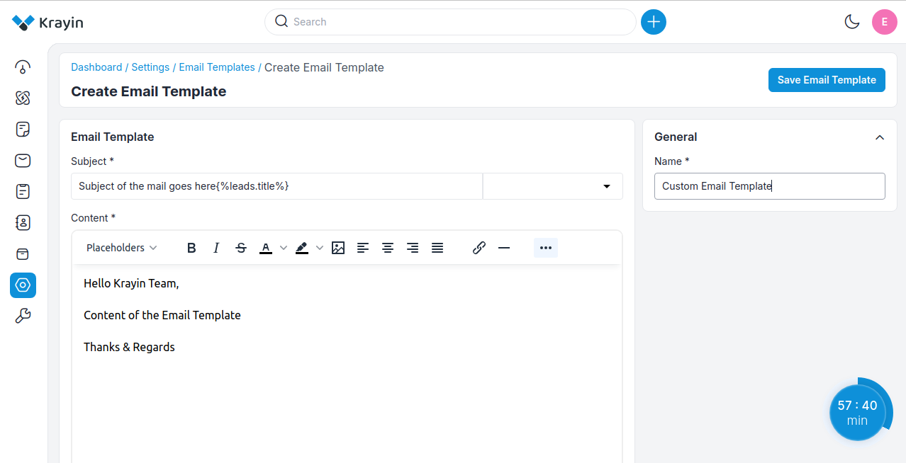
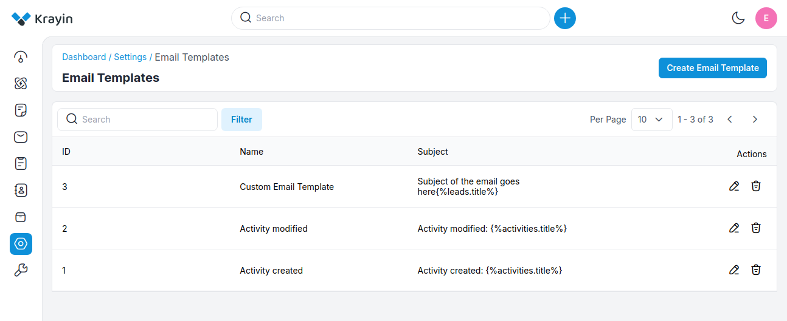

# E-mail template

Email templates are a fast and easy way to send repetitive and recurring emails to multiple customers. They help save time and provide a way to create consistent, professional, preformatted email messages that can be used when communicating with customers.

### Create E-mail templates in Krayin

**Step-1** Go to admin panel of krayin and click on **Settings >> E-mail template >> Create E-mail template** as shown in the below image.

**Step-2** Add the below details.

**1) Name-** Enter the name of the email template.

**2) Subject-** Enter the subject of the email template.

**3) Content-** Enter the content of the email template.

Now click on **Save as Email Template** button.

**Step-3** A new record is created in the Email template grid as shown in the below image.

**Step-4** Now you can add this Email template in Workflow now click on **Settings >> Workflow >> Create Workflow** select the **Event** to whom you need to send this email and now go to **Actions** and select **Send Email** as shown in the below image.

**Step-5** Now from **Choose Option** select your email template as shown in the below image.

