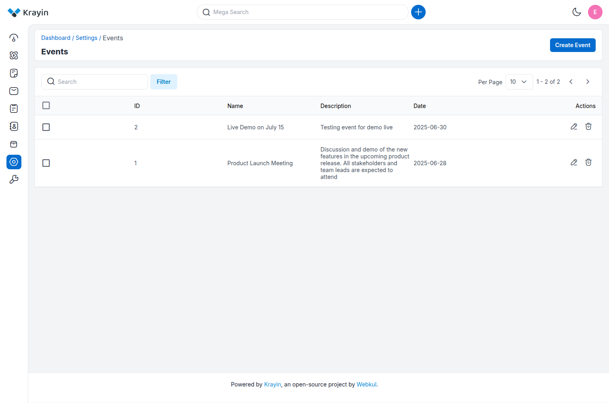
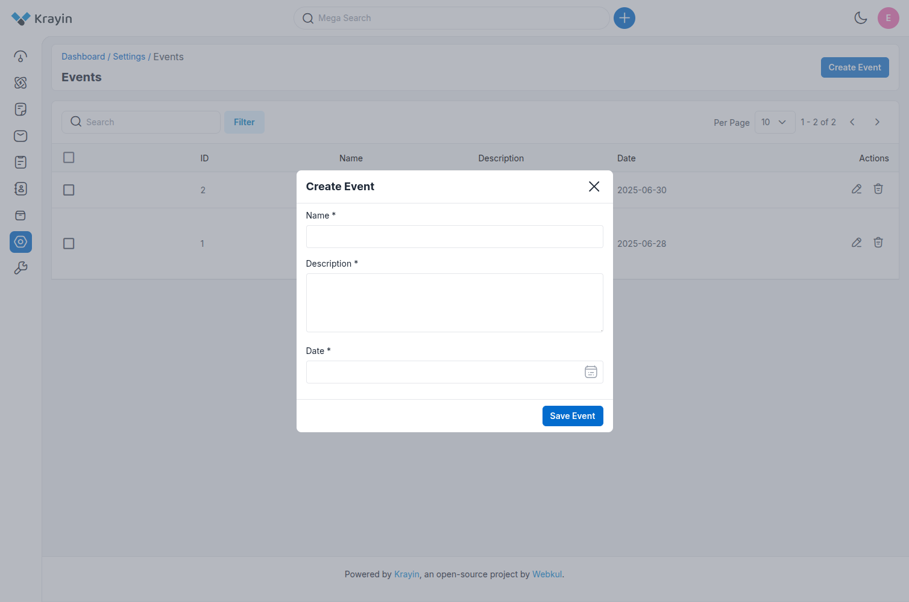
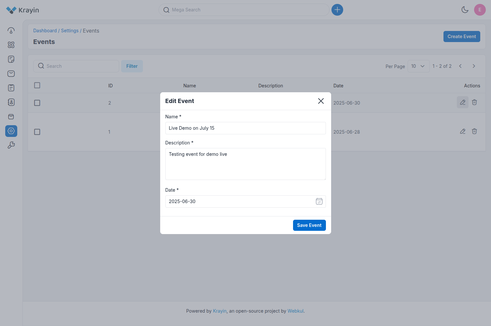
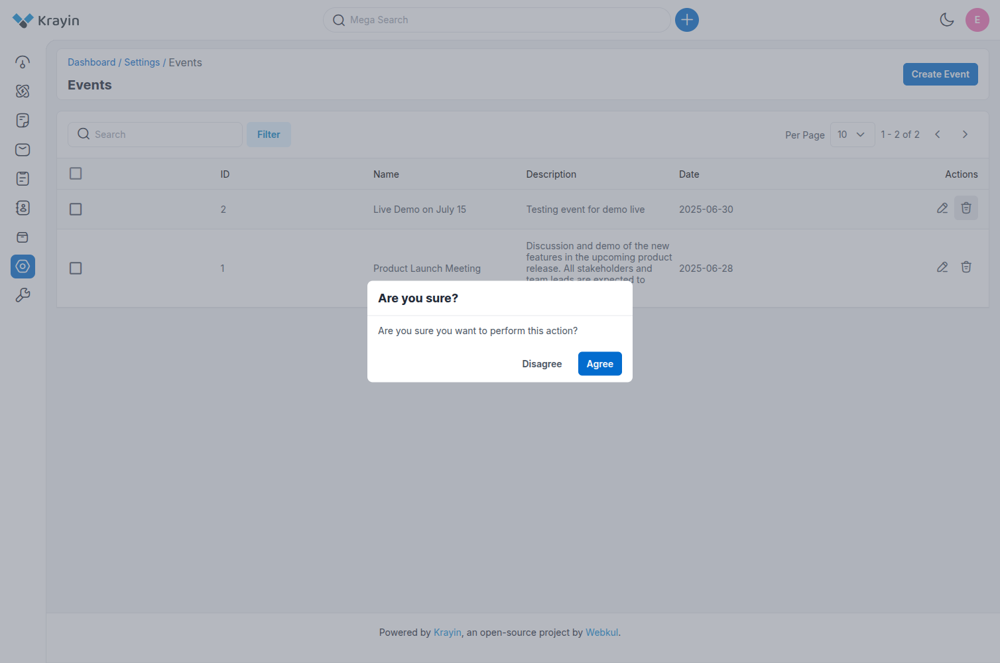
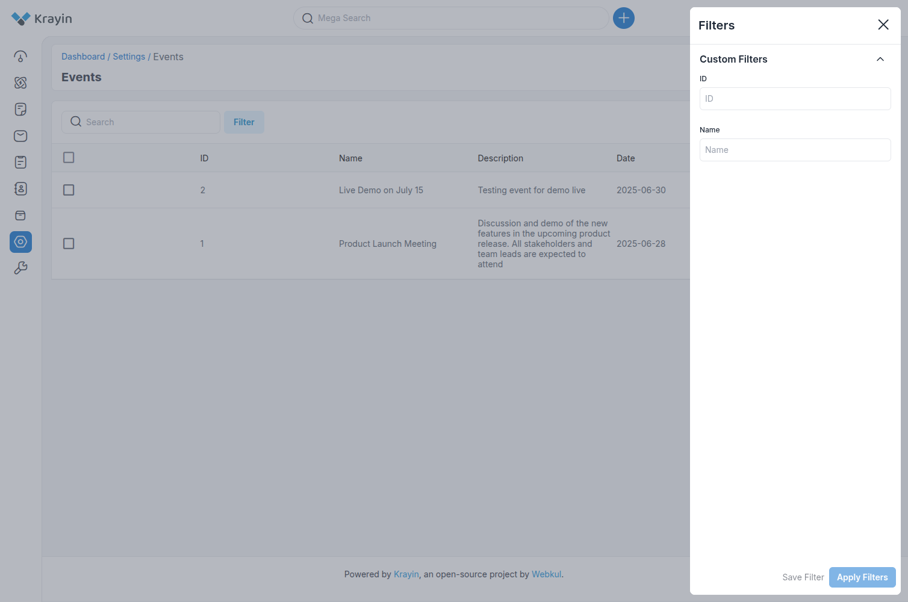

# Events

In Krayin CRM, **Events** refer to scheduled activities or meetings that are related to leads, contacts, or internal tasks. These help teams keep track of important milestones, appointments, and follow-ups.

Creating and managing events ensures better organization and productivity within the system.

---

### Create Events in Krayin

**Step-1**  
Go to the admin panel of Krayin and click on **Settings >> Events >> Create Event** as shown in the below image.

**Step-2**  
Add the details below:

**1) Name** – Enter the title or name of the event.  
*Example:* "Product Demo", "Follow-up Meeting", etc.

**2) Description** – Enter a brief summary or agenda of the event.  
*Example:* "Discuss feature updates with the client", "Internal sales planning", etc.

**3) Date** – Select the scheduled date for the event using the calendar picker.

Now click on the **Save Event** button.

**Step-3**  
A new record is created in the event data grid as shown in the below image.

---

### Edit Events

You can modify or edit events in Krayin CRM at any time based on changes in schedule or agenda.

You can update the **Name**, **Description**, or **Date** as needed.

---

### Deleting Events

If an event is no longer required, you can delete it from your Krayin CRM.

In the **Actions** column, click on the **Delete** button as shown in the below image.

---

### Use of Filter in Events

You can use the **Filter** option to easily locate specific events using the following parameters:

- **ID**
- **Name**

---

**NOTE:**  
Events help keep your CRM activities streamlined and organized. Make sure to regularly update or manage them for efficient workflow planning.

By following the above steps, you can easily create and manage events in Krayin CRM.
