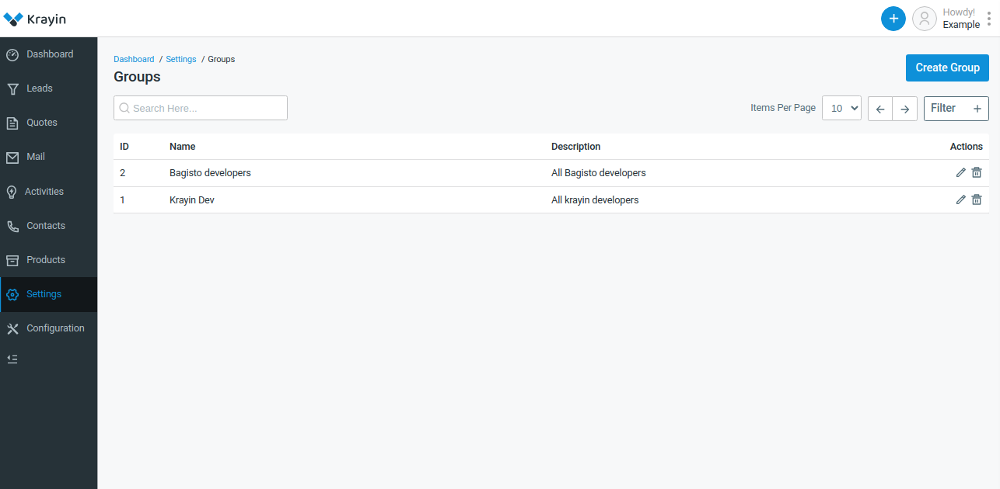

# Groups

In Krayin CRM, groups typically refer to a feature that allows users to categorize or segment contacts, leads, or customers based on certain criteria. These groups can help organize data and streamline communication or marketing efforts. Users can create groups based on various factors such as demographics, interests, purchasing behavior, or any other relevant attributes. This segmentation facilitates targeted messaging and personalized interactions, improving the effectiveness of sales and marketing efforts within the CRM system.

### Create Groups in Krayin

**Step-1** Go to admin panel of krayin and click on **Settings >> Groups >> Create Group** as shown in the below image.

**Step-2** Enter the below details.

**1) Name-** Enter the name of the group.

**2) Description-** Add the description of the group.

Now click on **Save as Group** button.

**Step-3** A new record is created in the group data grid as shown in the below image.

