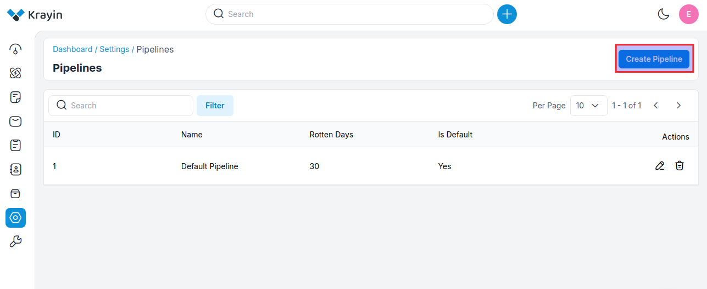
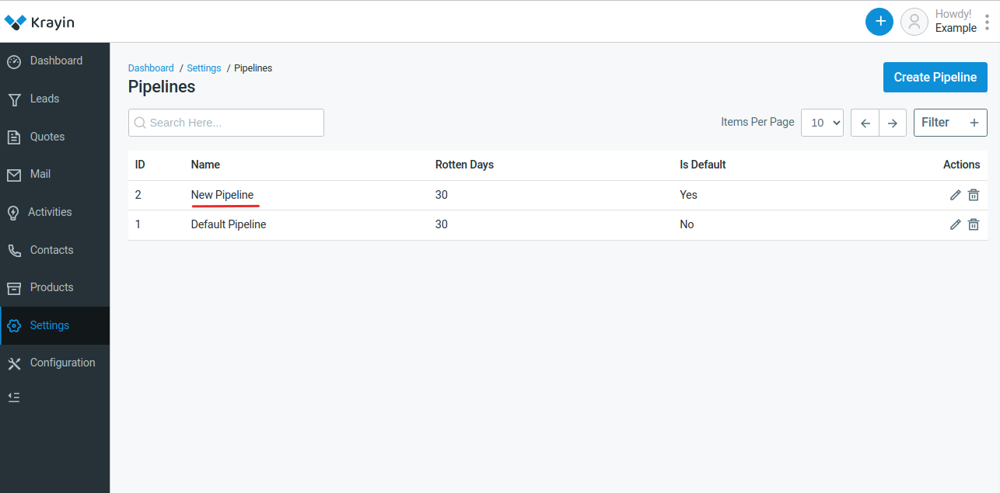
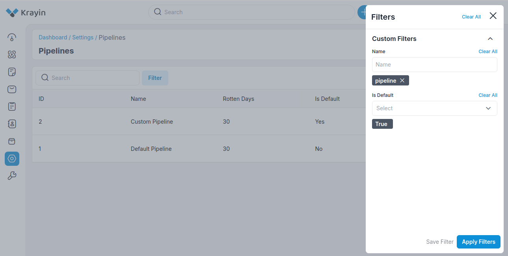

# Pipeline

A pipeline refers to the stages through which a potential customer progresses from initial contact to conversion. It's essentially a visual representation of the sales process, outlining the steps that sales representatives take to move prospects from being leads to becoming paying customers.

### Create a Pipeline in Krayin

**Step-1** Go to admin panel of krayin and click on **Settings >> Pipeline >> Create Pipeline** as shown in the below image.

**Step-2** Enter the below details.

**1) Name-** Enter the name of the pipeline.

**2) Rotten Days-** Enter the days till your pipeline gets finished.

**3) Mark as default-** Pipeline can be managed from the enable/disable icon as per your requirements.

**4) Add Stages-** Add the stages of your pipeline as per your requirements as shown in the below image.

Now click on the **Save Pipeline** button.

**Step-3** A new record is created in the pipeline data grid as shown in the below image.

### Kanban View

After the creation of the pipeline, all the created pipelines will be visible in the dropdown. You can check the pipeline Kanban view from **Leads**, as shown in the image below.

### Use of Filter in Pipeline

After creating the pipeline, you can use a “Filter” to find out the specific pipeline by using **Name & Is Default**.

### Actions in Pipeline

There are two types of actions you can perform in the Pipeline section:

1) Edit
2) Delete

**A) Edit Pipeline**

After pipeline creation, if you want to edit or update the **Pipeline Name, Rotten Days, Default Status** or you want to add or remove the **Stages** then go to the “Edit” option and click on **Save Pipeline** button after making changes. 

**B) Delete Pipeline**

If you want to delete an unnecessary pipeline from your Krayin CRM, in the action click on **Delete** button, as shown in the below image.

By following the above steps you can easily create pipelines in Krayin CRM.