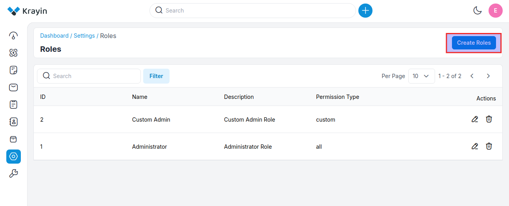
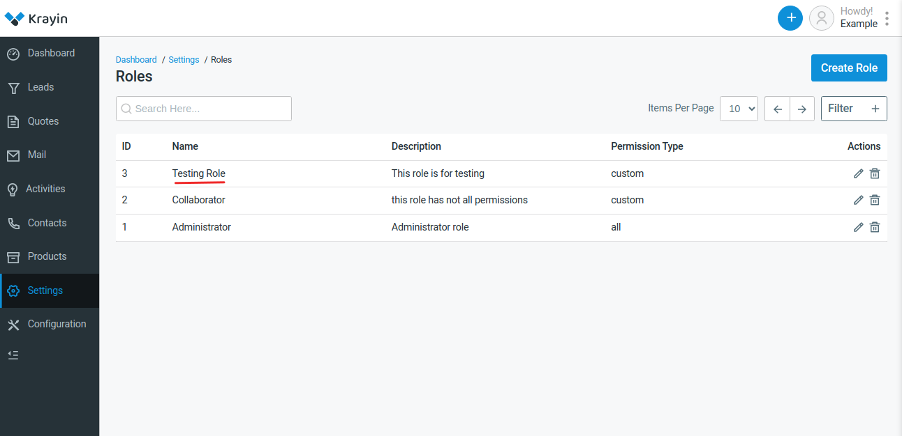

# Roles

In Krayin CRM, roles typically refer to predefined sets of permissions and access levels that determine what actions users can perform within the system. These roles help to manage and control the level of access granted to different users based on their responsibilities and job functions. By assigning roles to users, administrators can ensure that sensitive data remains secure and that users only have access to the features and information necessary for their tasks. Common roles in Krayin CRM may include administrators, managers, sales representatives, and customer support agents, each with their own set of permissions tailored to their responsibilities.

### Create Roles in Krayin 

**Step-1** Go to admin panel of krayin and click on **Settings >> Roles >> Create Role** as shown in the below image.

**Step-2** Add the details below 

**1) Name-** Enter the name of the role.

**2) Description-** Enter the description of the role.

**3) Permission Type-** There are two permission types that are mentioned below.

**a) Custom-** Custom permissions are specific to the needs of the application or organization. They can be created and assigned to roles as required. For instance, in an e-commerce platform, custom permission might be "Manage Orders" or "View Analytics". These permissions would be assigned to roles based on the responsibilities of the users within the system.

**b) All-** When a user or role is granted "all" permissions, it means they have unrestricted access to all resources and actions within the system. This is often reserved for superuser roles or administrators who need full control over the system.

Now click on **Save as Role** button.

**Step-3** A new record is created in the role data grid as shown in the below image.

