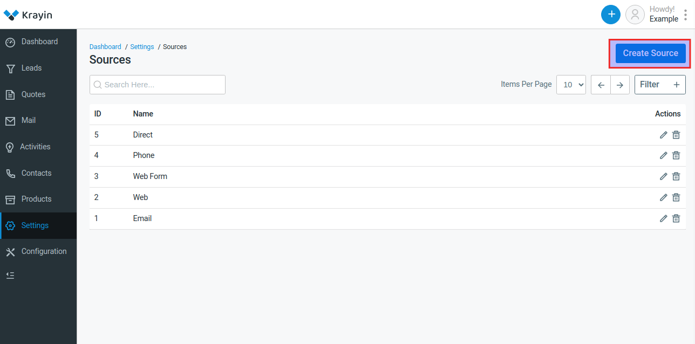
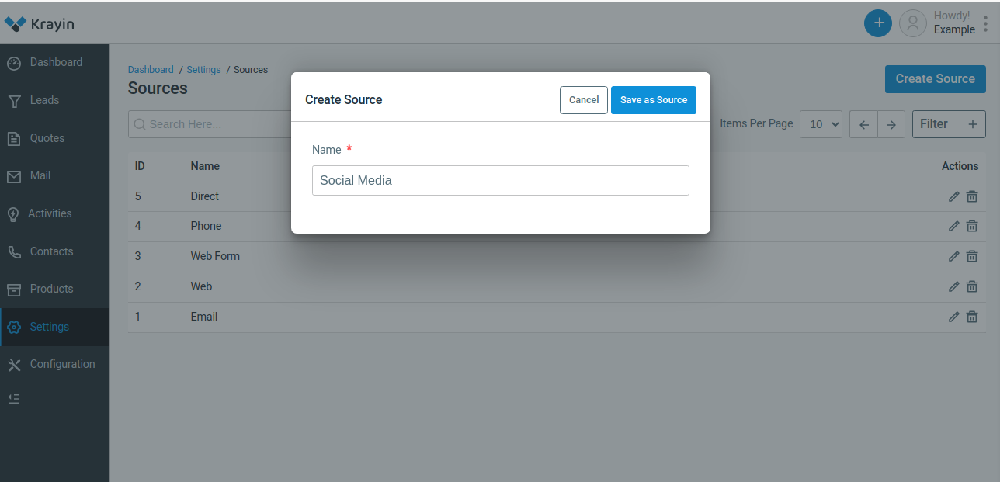

# Sources

Sources refer to the channels or methods through which leads or prospects enter your sales pipeline. Accurately tracking the sources of leads is crucial for understanding the effectiveness of your marketing and sales efforts, as well as for optimizing your lead generation strategies.

### Create Sources in Krayin

**Step-1** Go to admin panel of krayin and click on **Settings >> Sources >> Create Source** as shown in the below image.

**Step-2** Enter the name of the source and then click on **Save as Source** button.

**Step-3** A new record is created in the source data grid as shown in the below image.

