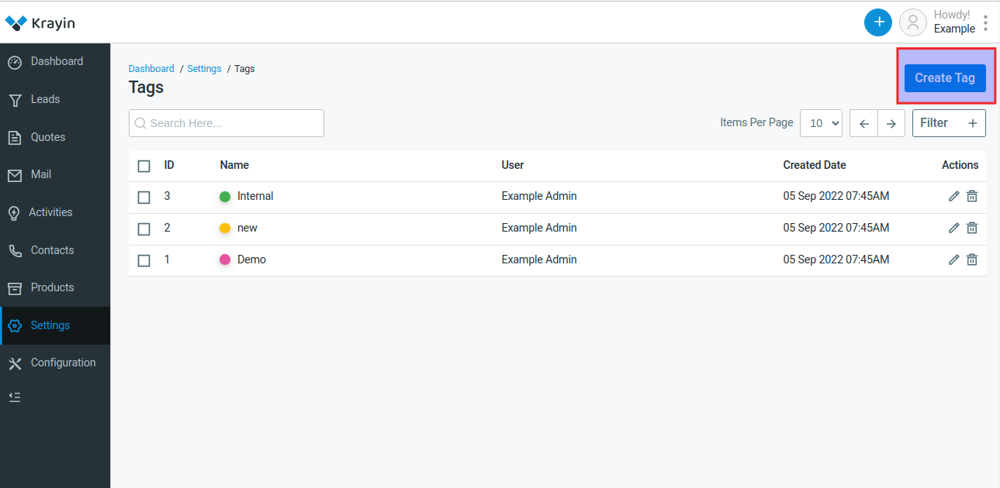

# Tags

Tags are unique identifiers that you can attach to customer data in your CRM system. They allow you to group people based on their needs and interests so that when it's time for marketing, they get the right message at the right time - something all marketers want!

### Create Tags in Krayin.

**Step-1** Go to admin panel of krayin and click on **Settings >> Tags >> Create Tags** as shown in the below image.

**Step-2** Enter the name of the tag and choose the color of the tag as shown in the below image.

**Step-3** A new record is created in the tags grid as shown in the below image.

