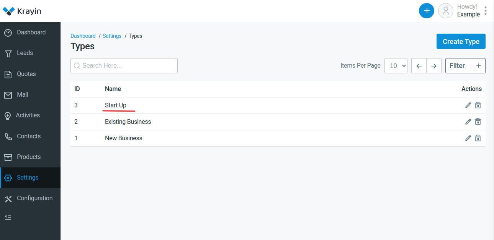

# Types 

It is the model that identifies weather it is an existing business or a new business also you can create new types.

### Create Types in Krayin

**Step-1** Go to admin panel of krayin and click on **Settings >> Types >> Create Type** as shown in the below image.

**Step-2** Enter the name of the new type. 

Now click on **Save as Type** button as shown in the below image.

**Step-3** A new record is created in the type data grid as shown in the below image.

