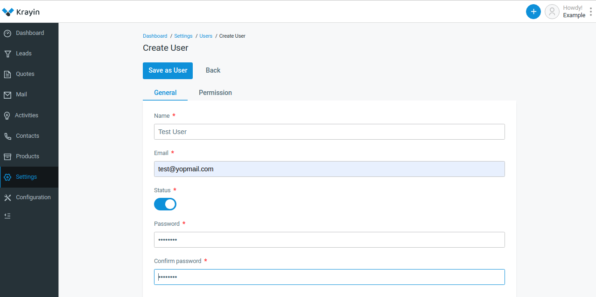
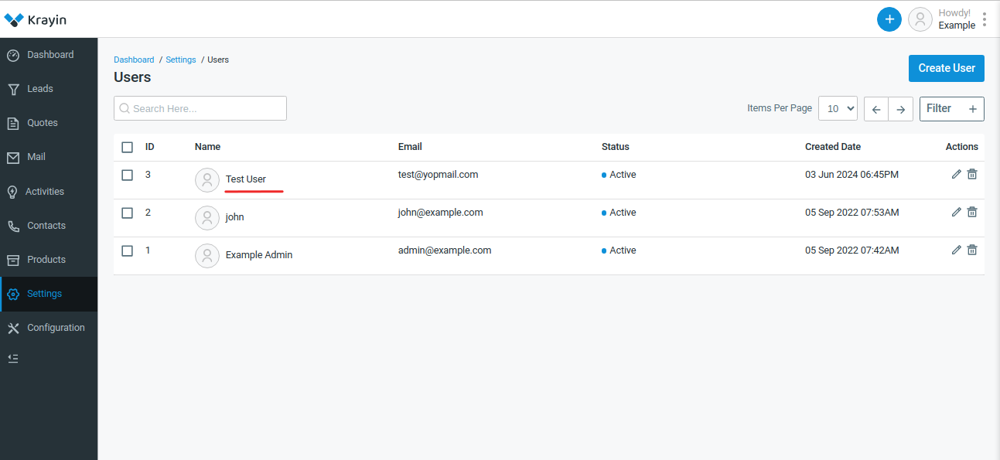

# Users

A user typically refers to an individual who interacts with the CRM platform to manage customer relationships, sales processes, marketing campaigns, and other related activities. 

### Create a User in Krayin

**Step-1** Go to admin panel of krayin and click on **Settings >> Users >> Create User** as shown in the below image.

**Step-2** Enter the below details.

**1) Name-** Enter the name of the user.

**2) Email-** Enter the email of the user.

**3) Status-** Enable the status.

**4) Password-** Enter the password of the user.

Now click on **Save as User** button.

**Step-3** A new record is created in the user data grid as shown in the below image.

