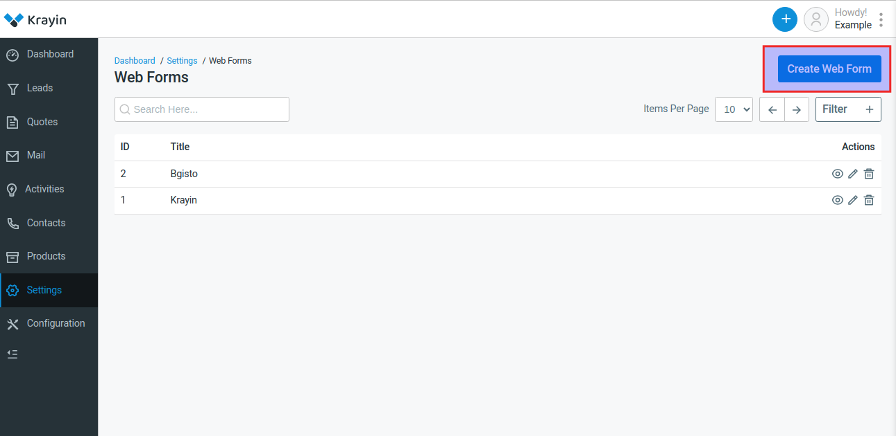
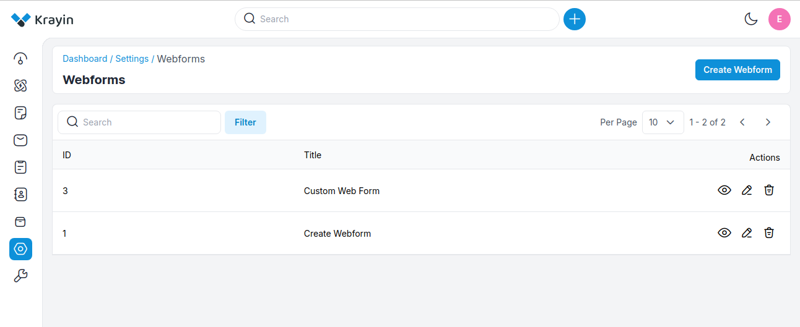

# Webforms

Web forms simplify the process of capturing visitors' or users' information from your website into your CRM system. They are designed to automate the importing of data. Non-technical users find it easy to design and publish their web forms.

### Create Webforms in Krayin

**Step-1** Go to admin panel of krayin and click on **Settings >> Webforms >> Create Webforms** as shown in the below image.

**Step-2** Add the below details.

**1) Web Forms-** Enter the name of the web form.

**2) Description-** Enter the description of the web form.

**3) Submit Button Label-** Enter the name of the submit button label.

**4) Submit Success Action-** Enter the custom message of submit success action also you can apply the redirect URL.

**5) Create New Lead With Contact-** You can Enable/Disable from here.

**6) Customize Web Forms-** Customize your web form with element colors of your choosing with CSS.

**7) Attributes-** Add custom attributes to the form.

Now click on **Save as Web Form** button.

**Step-3** A new record is created in the webform grid as shown in the below image.

