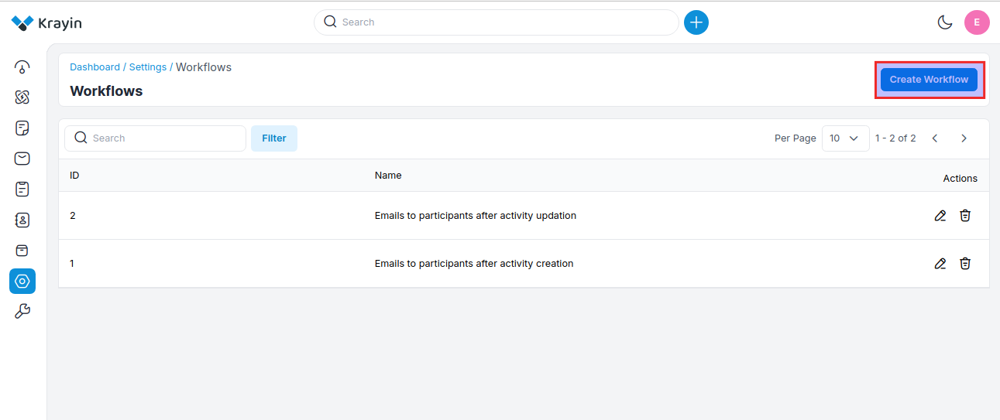
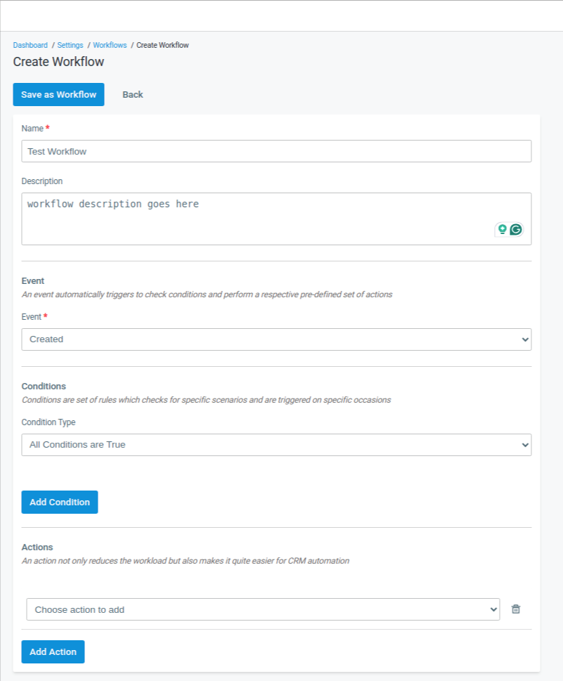
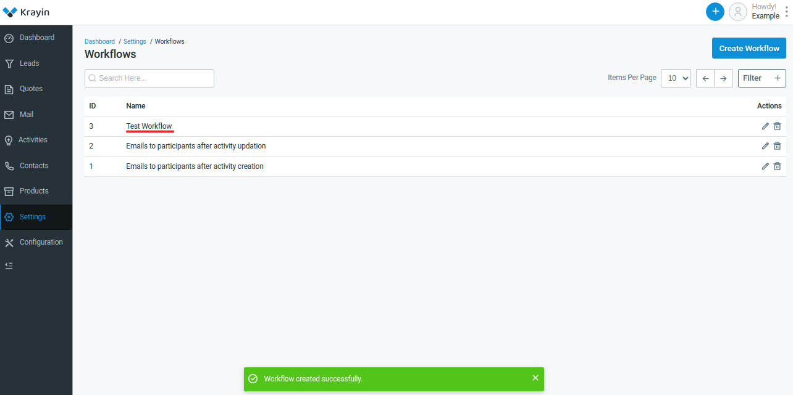

# Workflows

A CRM workflow is a series or collection of steps required to complete a business process such as making a sale or responding to a customer complaint. You can think of a CRM workflow as a line of dominoes you need to knock over to get from an initial trigger to your desired outcome.

### Create Workflows in Krayin 

**Step-1** Go to admin panel of krayin and click on **Settings >> Workflows >> Create Workflow** as shown in the below image.

**Step-2** Add the below details.

**1) Name-** Enter the name of the workflow.

**2) Description-** Enter the description of the workflow.

**3) Events-** Select the eventfor the workflow .

**4) Condition-** Apply the condition as per the requirements.

**5) Actions-** Select the action of the workflow.

Now click on **Save as Workflow** button.

**Step-3** A new record is created in the workflow grid as shown in the below image.

