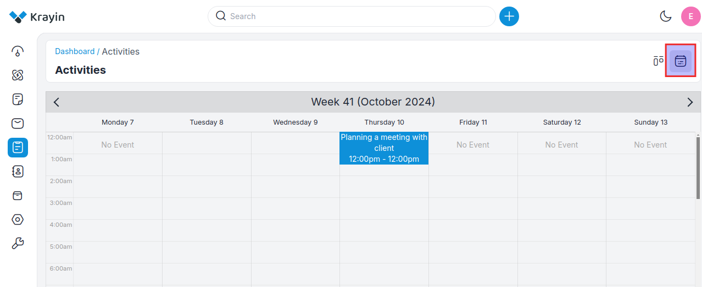

# Activities

**Activities** typically refer to any interactions, tasks, or events associated with managing relationships with customers or prospects. These activities can include various actions by sales, marketing, and customer service teams to engage with customers, nurture leads, and support ongoing relationships.

There are by default 3 Activities present in Krayin CRM.

1) Lunch

2) Call

3) Meeting

### To create an Activity follow the below steps.

Go to the admin panel click on **Leads >> Open Lead >> Click on Activity** and add the details listed below.

**1) Add Activity-** Select the activity from the dropdown i.e. Call, Lunch, Meeting

**2) Title-** Add the title of the activity.

**3) Description-** Enter the detailed description of the selected activity.

**4) Participants-** Add the participants from the activity.

**5) Schedule-** Schedule a date **From** and **To** for the activity.

**6) Location-** Add the location for the activity.

Now click on the **Save Activity** button 

 

Now it will be visible where activity is created in the **All** & **Lunch, Call, Meeting** sections accordingly as shown in the below image.

Now the created Activity becomes visible in the activity grid as shown in the image below.

 

### Calendar View 

After the creation of the activity, you can see it in the Activities tab directly. You can also find out your desired activity when you click Calendar view according to the created date and time.

### Edit or Delete the Activity

By using the Actions tab you can edit or delete the activity as shown in the image.

### Use of Filter

Here you can use the Filter tab to find out the desired activity. 

By default, there are **Title, Created By, Lead, Schedule From, Schedule To, Created At** filters available as shown in the image below.

By following the above steps you can easily create & manage activity in Krayin CRM.