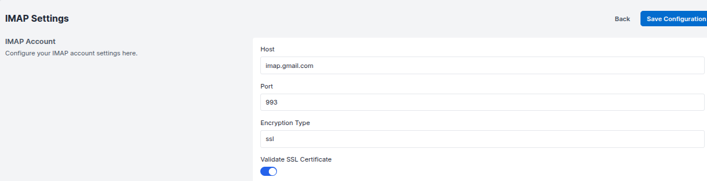
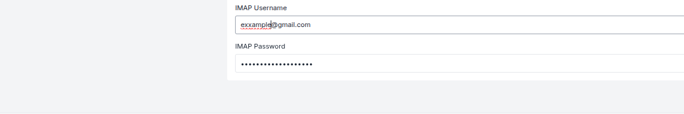
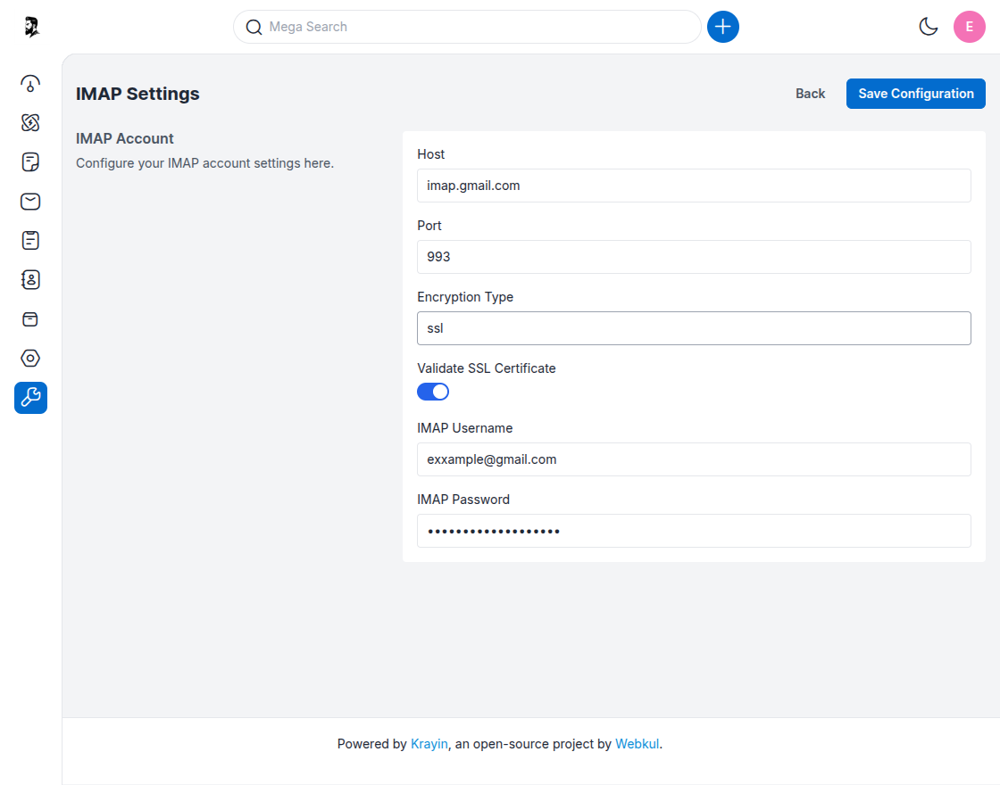
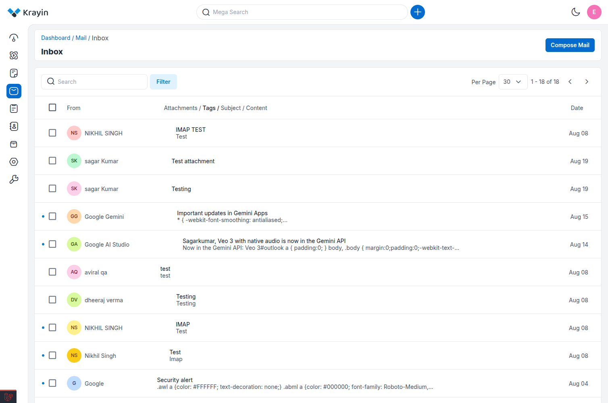

<!-- wp:heading -->
# IMAP Settings
<!-- /wp:heading -->

<!-- wp:paragraph -->
The **IMAP Settings** section in Krayin CRM allows you to connect your email account to the CRM. Once configured, incoming emails will be accessible directly within the CRM interface for better communication and lead tracking.
<!-- /wp:paragraph -->

---

<!-- wp:heading {"level":3} -->
### Configure IMAP Settings
<!-- /wp:heading -->

<!-- wp:paragraph -->
**Step-1** Go to the admin panel of Krayin and click on  
**Settings >> Configuration >> IMAP Settings**.
<!-- /wp:paragraph -->

<!-- wp:paragraph -->
**Step-2** In the **IMAP Account** section, enter the required server details:
<!-- /wp:paragraph -->

<!-- wp:list -->
- **Host** – Enter your mail server host.  
  _Example: `imap.gmail.com`_

- **Port** – Enter the secure port for IMAP.  
  _Recommended: `993`_

- **Encryption Type** – Select the encryption protocol.  
  _Common: `ssl`_

- **Validate SSL Certificate** – Check this box to validate the server's SSL certificate.
<!-- /wp:list -->

<!-- wp:image -->

<!-- /wp:image -->

---

<!-- wp:heading {"level":3} -->
### Add Your Email Credentials
<!-- /wp:heading -->

<!-- wp:paragraph -->
**Step-3** Fill in your email login details:
<!-- /wp:paragraph -->

<!-- wp:list -->
- **IMAP Username** – Your email address  
  _Example: `youremail@example.com`_

- **IMAP Password** – Your email account password (input is masked)
<!-- /wp:list -->

<!-- wp:image -->

<!-- /wp:image -->

---

<!-- wp:heading {"level":3} -->
### Save Configuration
<!-- /wp:heading -->

<!-- wp:paragraph -->
**Step-4** Click on the **Save Configuration** button to store the settings.
<!-- /wp:paragraph -->

<!-- wp:image -->

<!-- /wp:image -->

---

<!-- wp:heading {"level":3} -->
### Edit the .env File
<!-- /wp:heading -->

<!-- wp:paragraph -->
**Step-5** To activate the email fetching process, open your `.env` file located at the root of your Krayin installation. Add the following line:
<!-- /wp:paragraph -->

<!-- wp:code -->
MAIL_RECEIVER_DRIVER=webklex-imap
<!-- /wp:code -->

<!-- wp:paragraph -->
This tells Krayin to use the **Webklex IMAP driver** for processing inbound emails.
<!-- /wp:paragraph -->

---

<!-- wp:heading {"level":3} -->
### Run Email Processing Command
<!-- /wp:heading -->

<!-- wp:paragraph -->
**Step-6** Now run the following artisan command to start fetching emails into your CRM:
<!-- /wp:paragraph -->

<!-- wp:code -->
**php artisan inbound-email:process**
<!-- /wp:code -->

<!-- wp:paragraph -->
This command processes new inbound emails and creates records in Krayin.  
- On a **local environment**, you’ll need to run this command manually each time.  
- On a **live server**, this command is automatically executed every 5 minutes via a cron job, so incoming emails are fetched regularly without manual effort.
<!-- /wp:paragraph -->

---

<!-- wp:heading {"level":3} -->
### Check Emails in Inbox Section
<!-- /wp:heading -->

<!-- wp:paragraph -->
**Step-7** Once your email configuration is complete and the command is executed, go to the **Inbox** section in Krayin CRM. Here you can view and manage all incoming emails associated with your leads or contacts.

<!-- /wp:paragraph -->
