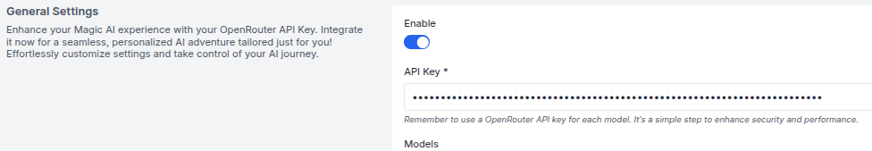
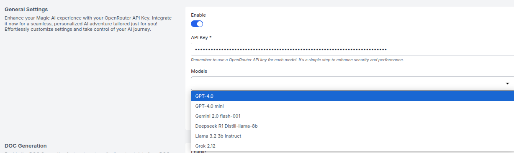
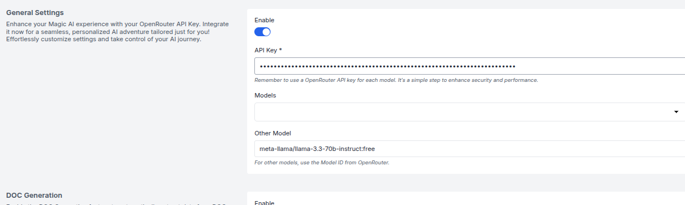
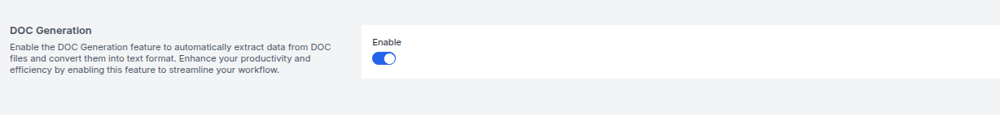
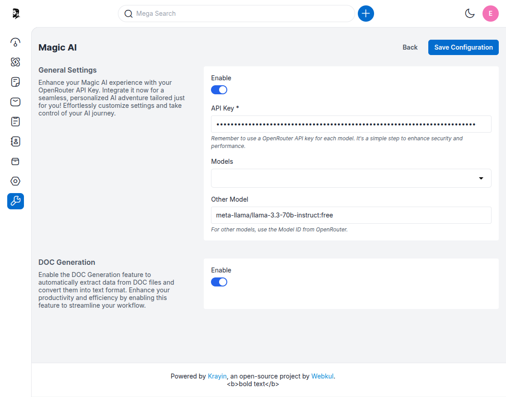
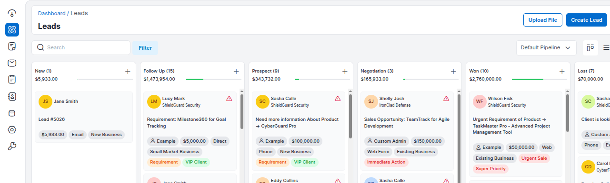

# Magic AI

---

## Magic AI Configuration

The **Magic AI** section in Krayin CRM enables you to connect an AI model using an API key from OpenRouter. This integration allows automatic text extraction from DOC files and other documents, simplifying lead creation and enhancing productivity.

---

### General Settings

**Step-1** Go to the admin panel of Krayin and click on  
**Settings >> Configuration >> Magic AI**.

**Step-2** Enable the **Magic AI** feature by switching the **Enable** toggle to ON.

---

### API Key Configuration

**Step-3** In the **API Key** field, enter your API key generated from [OpenRouter](https://openrouter.ai).  
Each AI model should use a unique key for better security and performance.

🔗 [How to create an OpenRouter API key](https://krayincrm.com/how-to-use-magic-ai-in-krayin-crm/)

---

### Model Selection

**Step-4** Under the **Models** section:

- If a model is listed, select it from the dropdown.

- If not, enter the model name manually in the **Other Model** field.  
  Example:  

---

## Enable DOC Generation

**Step-5** Enable the **DOC Generation** toggle to allow the system to extract text content from uploaded `.doc` files automatically.

---

### Save Configuration

**Step-6** Click on the **Save Configuration** button to apply all changes.

---
**Step-7** Go to **Leads >> All Leads**.  

- Click on the **Upload File** button to upload a `.doc` or supported file format containing lead data.

- Once the file is uploaded, **Magic AI** will automatically extract details like name, email, and phone number, and create a lead entry.

- These leads will appear in the **“New” stage** by default on your leads pipeline board.

You can then edit, assign, or move these leads through the pipeline as needed.

---

By following the above steps, you can easily configure **Magic AI** in Krayin CRM. Once active, it will begin extracting data from supported documents and simplify workflows like lead creation.

---

**Helpful Links**  
- 📘 [Magic AI Blog](https://krayincrm.com/how-to-use-magic-ai-in-krayin-crm/)  
