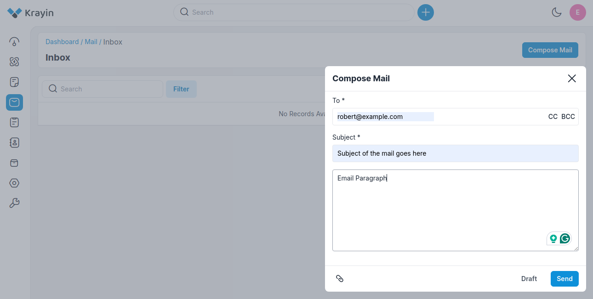
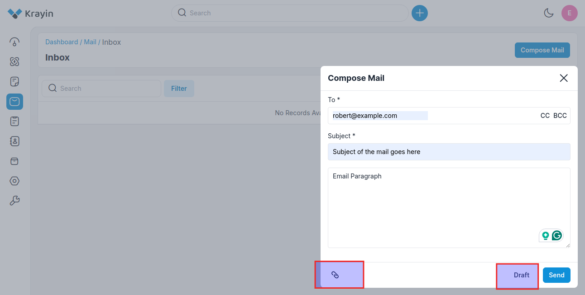
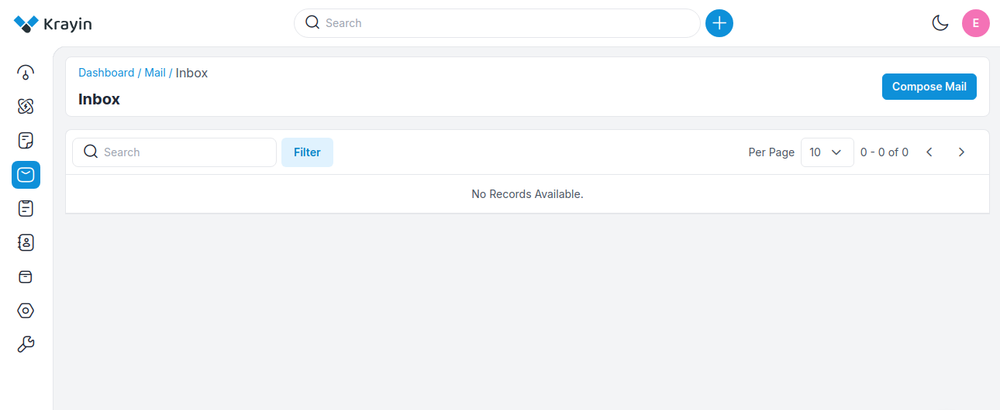
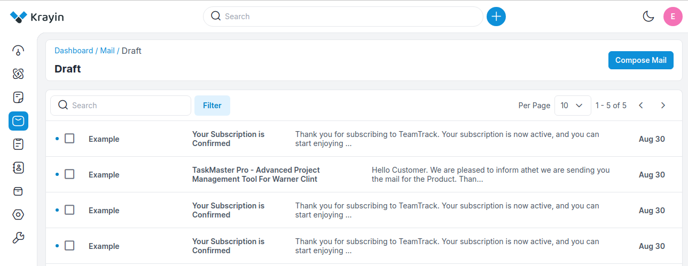
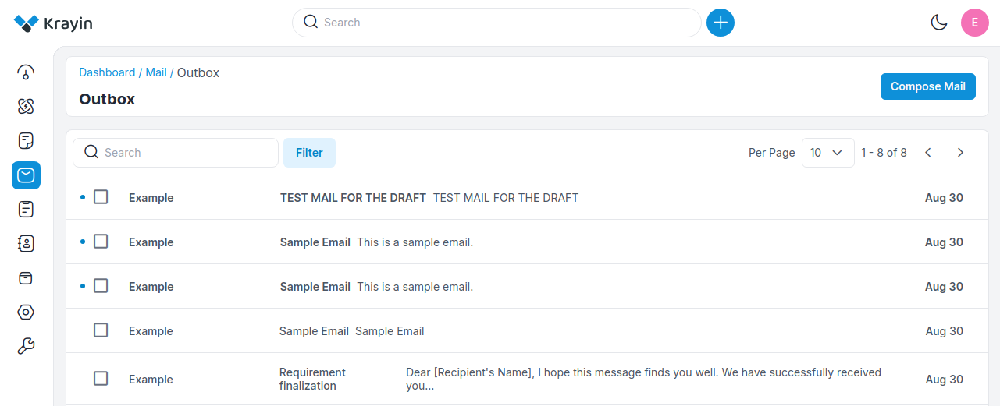
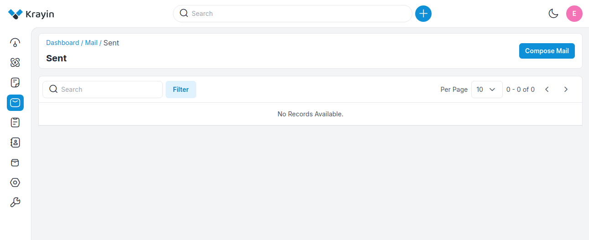
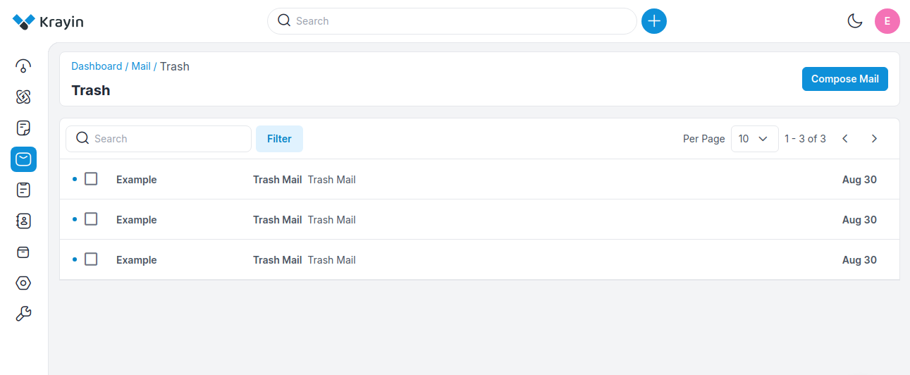
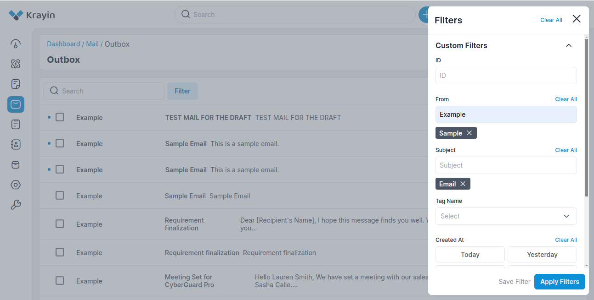
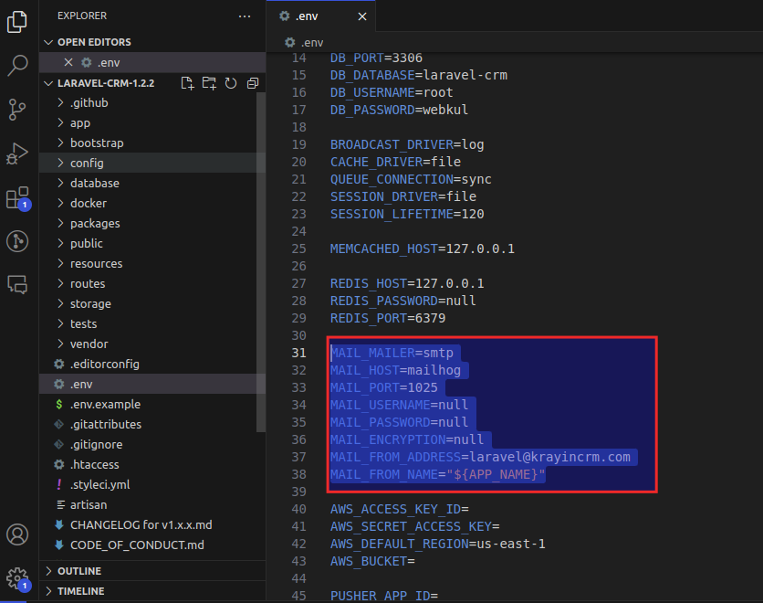

# Mails 

**Mail** typically refers to electronic mail, commonly known as email. It's a method of exchanging digital messages between people using electronic devices such as computers, smartphones, and tablets. Email is widely used for communication in both personal and professional settings. 

Email can be used for various purposes, including sending messages, sharing information, collaborating on projects, and conducting business communications.

## Compose

**To** An ‘address bar‘ where you put the email address

**Subject:** ‘Subject bar’ is the title of your message, where you write what your email is about

Then enter the main body of your email where you write your message.

 

**Add Attachment:** There is an option for attaching a file if you want to attach some files with email.

**Save to Draft:** You can save mail into the draft also.

 

## Inbox

Here you can see all the incoming emails. You can search mail from the Search Here and if you want to perform any action then select the email from the checkbox Select Action from the drop-down and Submit that.

 

## Draft

While sending mail to the sender, if you saved the message in the draft, so you see in this section. You can edit or delete the mail also using the Actions tab in the below screenshot.

 

## Outbox

An outbox is a folder in your email client that stores messages that have been composed but have not yet been sent.

The messages remain in the outbox until they are successfully sent, at which point they are moved to the sent items folder.

A list of outbox emails is stored as shown in the below image.

 

## Sent 

In this field, you can see all send mails, using Actions you can see the mail and delete the mail also if it is not in use.

 

## Trash 

The Trash folder is where emails are temporarily stored after being deleted from the Inbox or other folders. Emails in the Trash folder are usually automatically permanently deleted after a certain period, for example, 30 days.

A list of trash emails is stored as shown in the below image.

 

### Use of Filter in Mails 

In Filter, you can find out filtered mail for that you have to put **ID, From, Subject, Tag Name, and Created At**. The same filter you can find in Draft, Inbox, Sent, and Trash. You can find out all deleted messages in the Trash.

 

**NOTE-** Kindly add the **SMTP details** in the **.env** file which is present in the root directory of Krayin to enable the functionality to send Emails. 

 

By following the above steps you can easily use Mail functionality in Krayin CRM.

