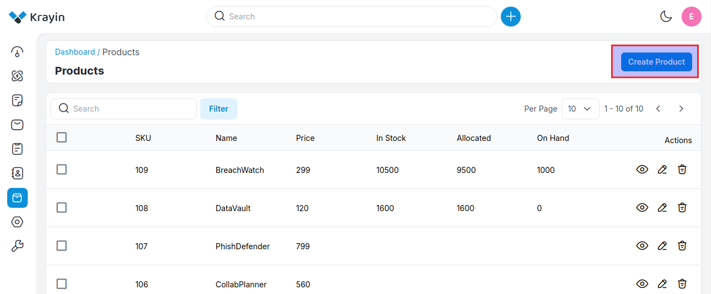
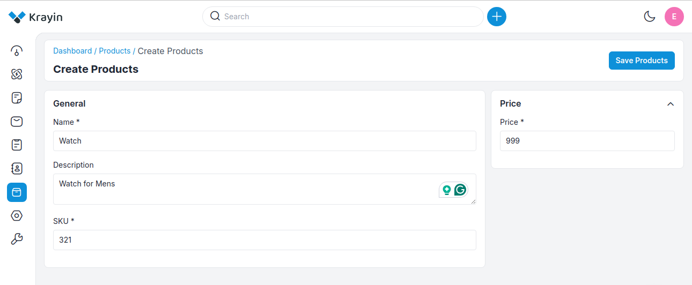
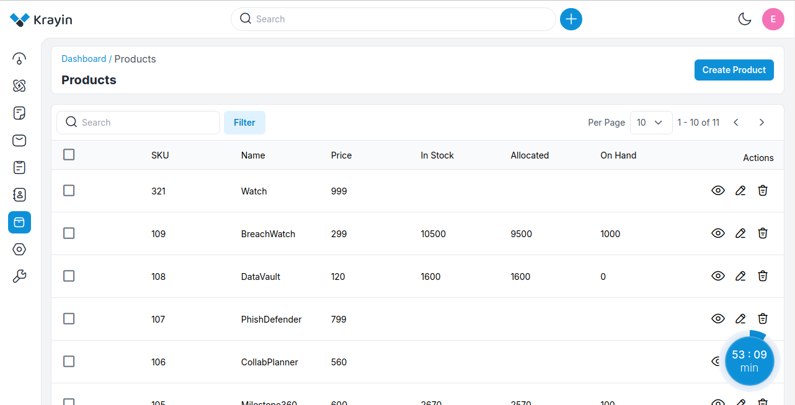
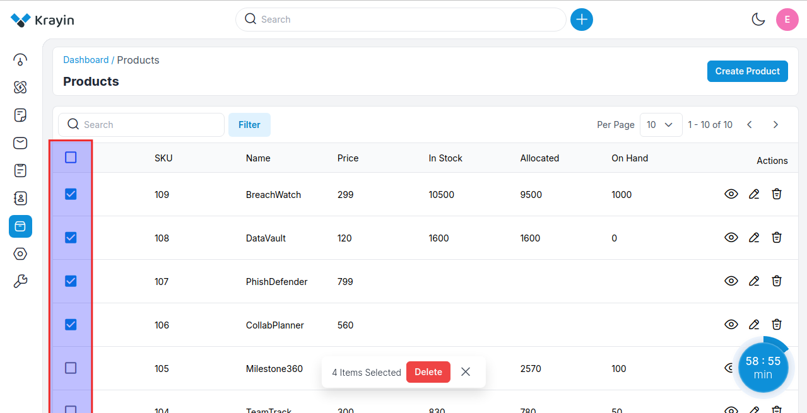
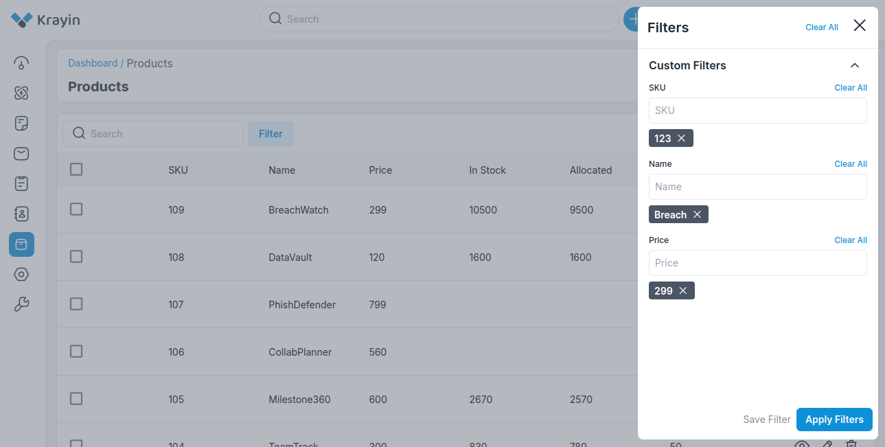
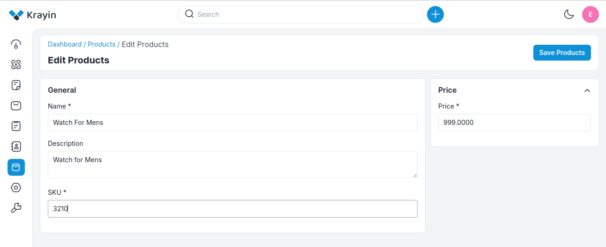
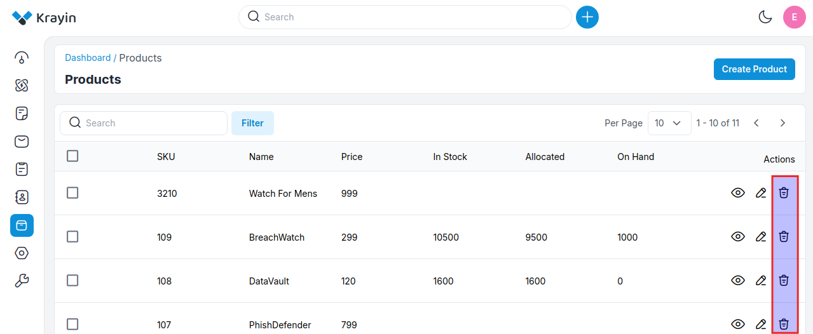
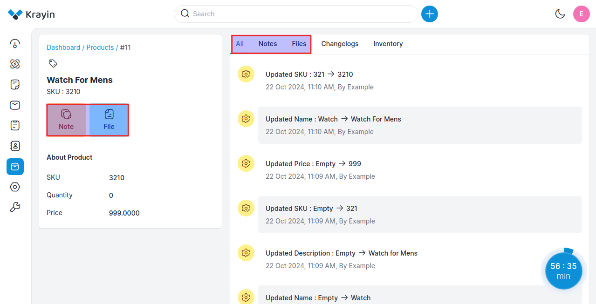

# Products

Products encompass tools and functionalities designed to manage customer relationships effectively, including contact management, sales automation, marketing automation, customer service and support, analytics and reporting, integration capabilities, mobile CRM, customization and scalability, and AI and machine learning features.

### Create Products in Krayin

**Step-1** Go to admin panel of krayin and click on **Products >> Create Product** as shown in the below image.

**Step-2** Add the below details briefly.

**1) Name-** Enter the name of the product.

**2) Description-** Add the description of the product.

**3) SKU-** Enter the SKU of the product.

**4) Price-** Enter the price of the product.

Now click on **Save as Product** button to save the product.

**Step-3** Now a new record is created in the product data grid as shown in the below image.

### Mass Delete Products

You can delete all products at the same time by clicking on a check box and then clicking on Delete as shown in the below image.

### Use of Filter in Products

You can search the products by using **SKU, Product Name, and Price** as filters as shown in the below image.

### Actions in Products

There are three types of actions you can perform in the Products section:

1) Edit
2) Delete
3) View

**A) Edit Products**

After Products creation, if you want to edit the Product **Name, Description, SKU, and Price** then go to the “Edit” option and click on **Save Product** button after making changes.

**B) Deleting Products**

If you want to delete an unnecessary Products from your Krayin CRM, in the action click on **Delete** button, as shown in the below image.

**C) View Products**

If you want to view a Product or make some edits like if you want to add **Files, Notes** from your Krayin CRM, in the action click on **View** button and easily add the Files, Notes, and the data will get visible in **Notes, Files and All** sections respectively as shown in the below image.

**NOTE-** These products can be assigned while creating a lead. 

By following the above steps you can easily create quotes in Krayin CRM.

