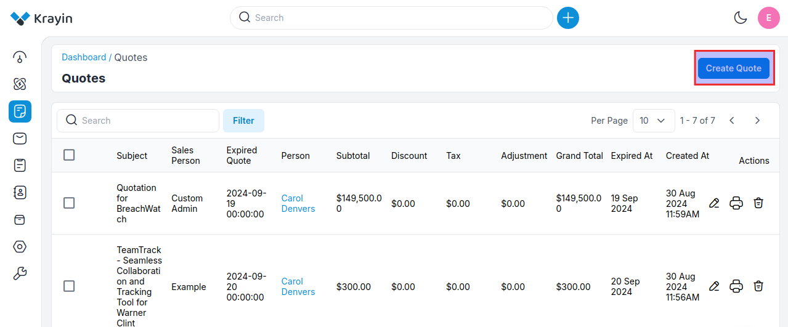
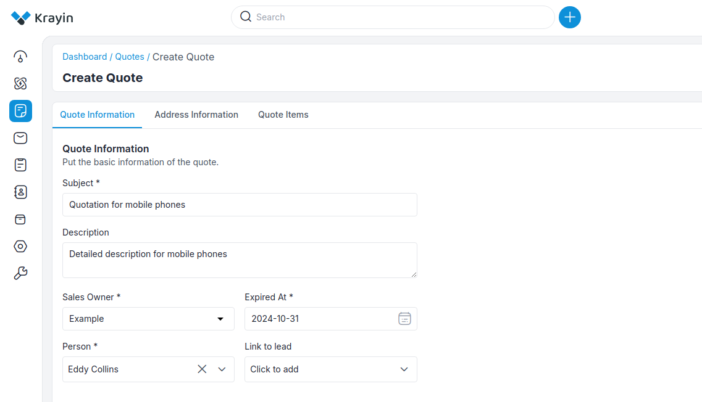
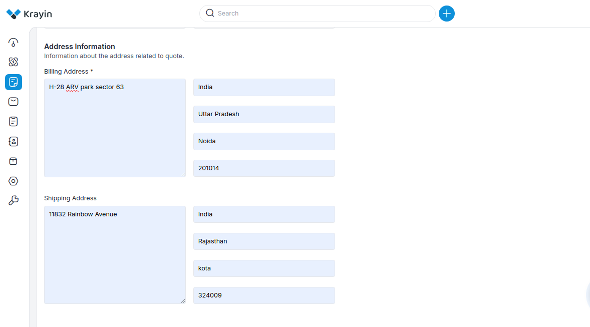
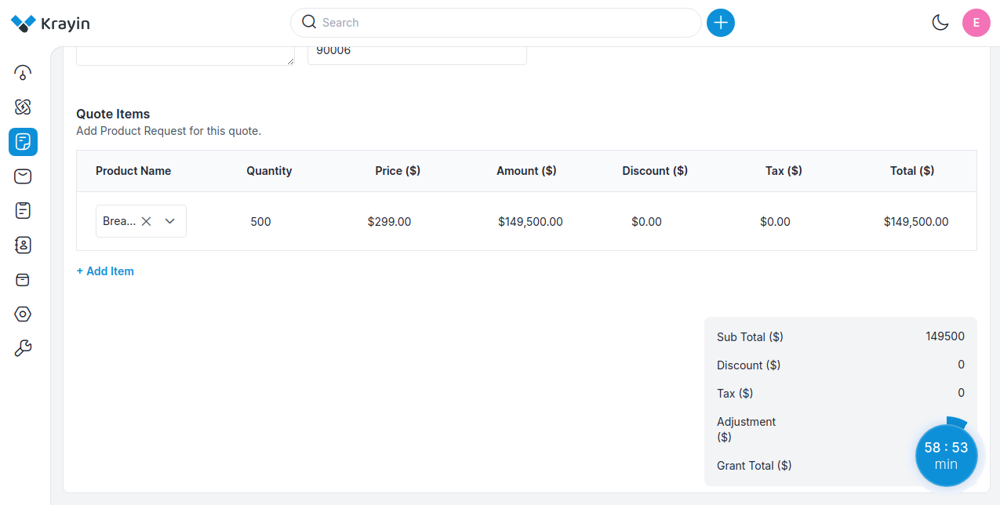
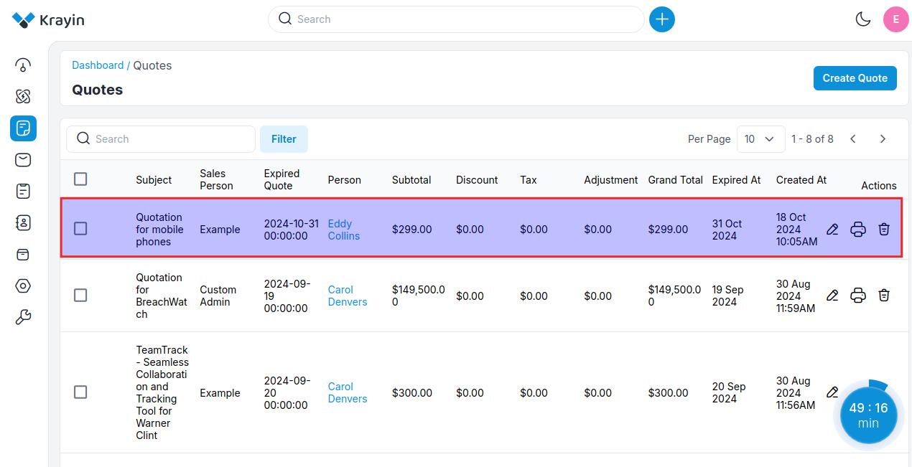
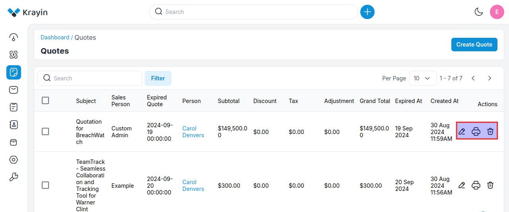
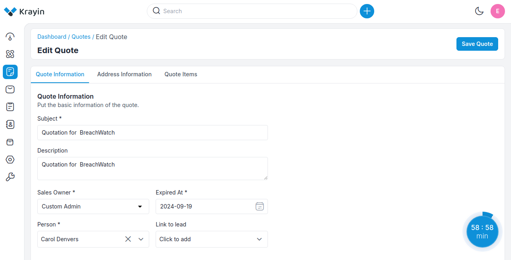
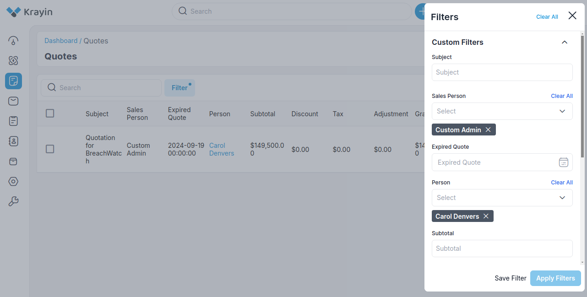

# Quotes

**Quotes** in the context of Customer Relationship Management (CRM), typically refer to formal proposals or estimates provided to potential customers outlining the products or services offered, along with their associated prices. 

These quotes serve as documented offers, detailing the terms and conditions of a potential sale. They often include itemized lists of products or services, quantities, pricing information, payment terms, and any applicable discounts or taxes.

### Create Quotes in Krayin

**Step-1** Go to Admin Panel of Krayin and click on **Quotes >> Create Quotes** as shown in the below image.

 

**Step-2** Add the **Quote Information** detail below.

**1) Subject-** Enter the subject of the Quote.

**2) Description-** Now enter the detailed description of the Quote.

**3) Sales Owner-** Select the sales owner.

**4) Expired At-** Enter the date when this quotation will expire.

**5) Person-** Enter the user name to whom you are sending a Quote.

**6) Link to Lead-** Enter the name of the lead.

 

**Step-3** Add the **Address Information** detail below.

**1) Billing Address-** Enter the billing address country, state, city, and pin code.

**2) Shipping Address-** Enter the shipping address country, state, city, and pin code.

 

**Step-4** Add the **Quote Items** detail below. 

**1)Name-** Enter the name of the product.

**2)Quantity-** Enter the quantity of the product.

**3)Price-** Enter the price of the product.

**4)Amount-** Enter the amount of the product.

**5)Discount-** Enter the discount if you want to apply for the products.

**6)Tax-** Enter the Tax if applicable.

**7)Total-** Total amount of the products.

**Note- If you want to add more products click on the +Add Item link**

 

Now click on **Save as Quote** button to save the quote.

**Step-5** Now you will able to see the new quote is registered successfully.

 

### Edit Quotes

To edit a line item that is already included on the quote, now go to the **Dashboard -> Quote -> Actions** then perform **Edit, Print and Delete**.

 

When you click on the edit button, then you are able to perform all the actions, after that **Save as Quote** and back to the Quote.

 

### Use of Filter in Quotes

By using the **Filter** tab, you will be able to find out a particular filtered quote. You need to put the **Subject**, name of **Sales Person** from the drop-down, and **Person**(customer name), then you will find out your required quote.

 

By following the above steps you can easily create quotes in Krayin CRM.