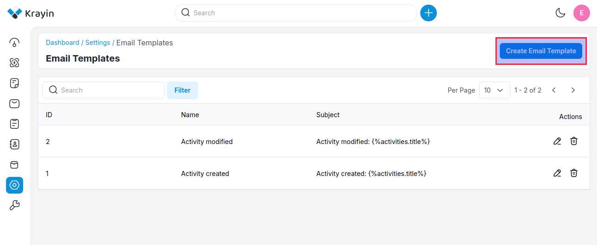
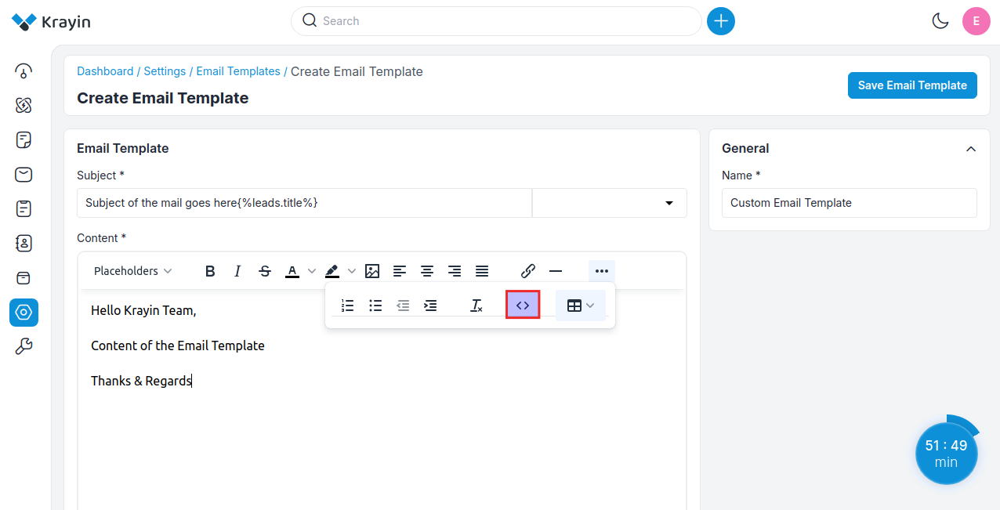
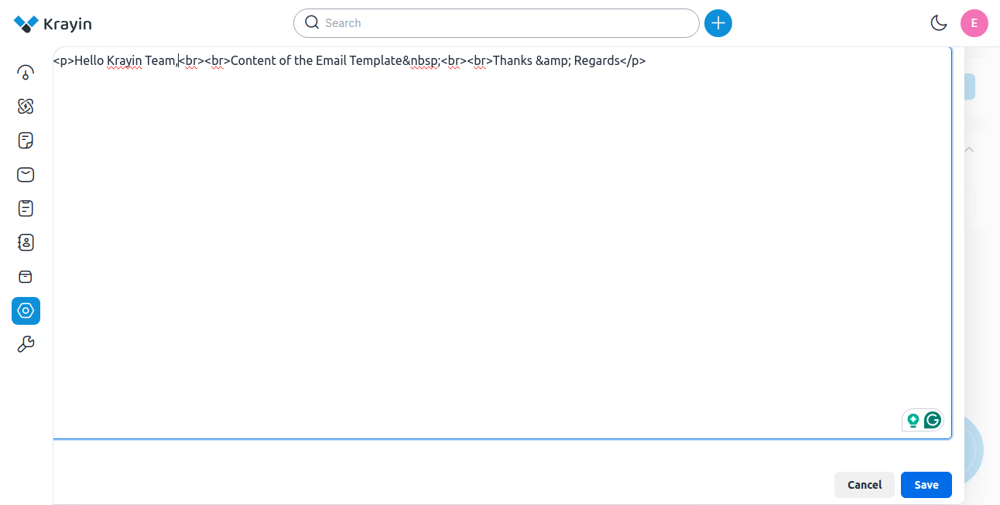
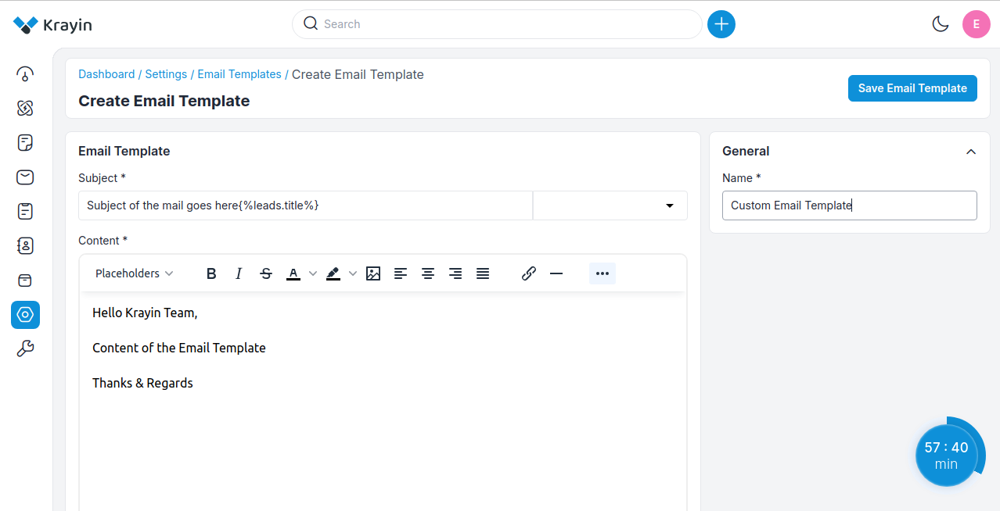
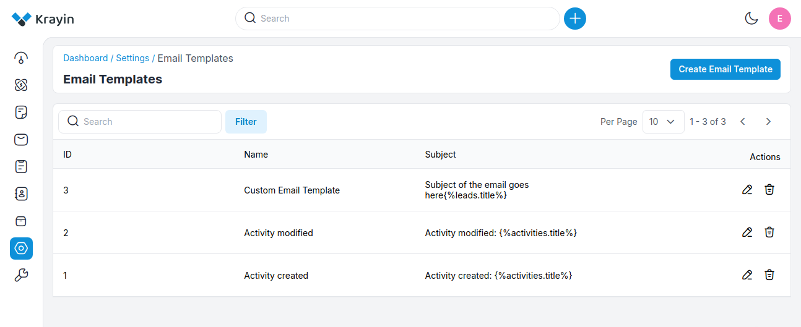
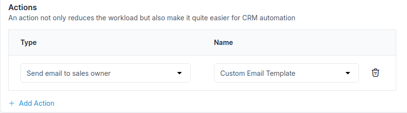
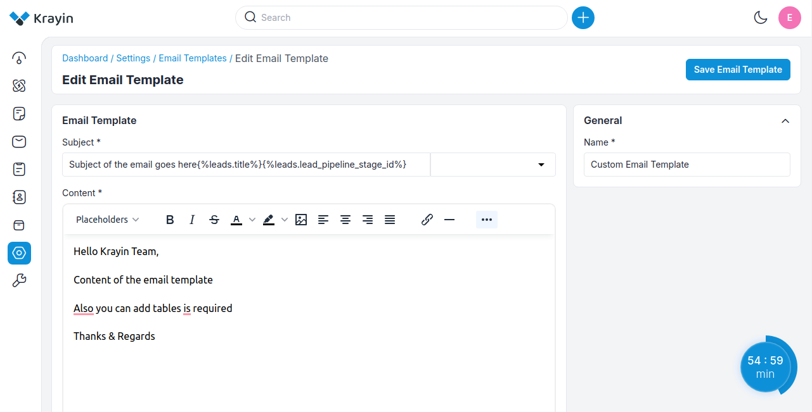
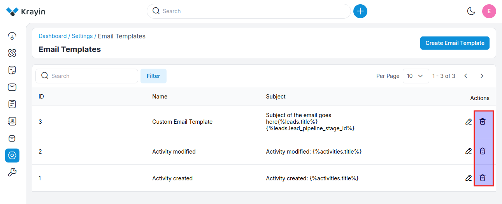
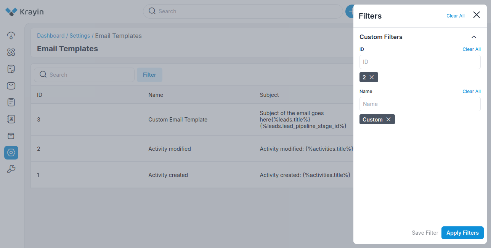

# E-mail template

Email templates are a fast and easy way to send repetitive and recurring emails to multiple customers. They help save time and provide a way to create consistent, professional, preformatted email messages that can be used when communicating with customers.

### Create E-mail templates in Krayin

**Step-1** Go to admin panel of krayin and click on **Settings >> E-mail template >> Create E-mail template** as shown in the below image.

**Step-2** Add the below details.

**1) Name-** Enter the name of the email template.

**2) Subject-** In the subject line you need to put the Subject of the email template and from the placeholder, you can select placeholder name from the drop-down which is dynamic.

### Creating an Email Template

While writing the Content, you can select the placeholder according to your template title, or you can insert the table as well if you’re required.

For example when you click on lead then you choose Title, Lead value, source, type, sales owner, and expected close date that will take dynamic values from the drop-down.

### Creating an Email Template by inserting HTML
 
1) In the Krayin CRM, Go to Dashboard ⇾ Setting ⇾ Email Template

2) In the Template Gallery click on the Insert HTML code / Plain text link.

3) Click on the HTML icon.

After, clicking on the source code button there is a section where you can add your HTML code. You can edit the source code when you click on the source code option.

Now click on **Save Email Template** button.

**Step-3** A new record is created in the Email template grid as shown in the below image.

**Step-4** Now you can add this Email template in Workflow now click on **Settings >> Workflow >> Create Workflow** select the **Event** to whom you need to send this email and now go to **Actions** and select **Send Email** as shown in the below image.
 
Now from **Choose Option** select your email template as shown in the below image.

### Actions in Email Template

There are two types of actions you can perform in the Email Template section:

1) Edit
2) Delete

**A) Edit Email Template**

After Email Template creation, if you want to edit or update the Email Template **Subject, Content & Name** then go to the “Edit” option and **Save Email Template** button after making changes. 

**B) Delete Email Template**

If you want to delete an unnecessary Email Template from your Krayin CRM, in the action click on **Delete** button, as shown in the below image.

### Use of Filter in Email Template

After creating an Email Template, you can use a “Filter” to find out the specific group by using **Id and Name**.

By following the above steps you can easily create and manage Email Templates in Krayin CRM.
