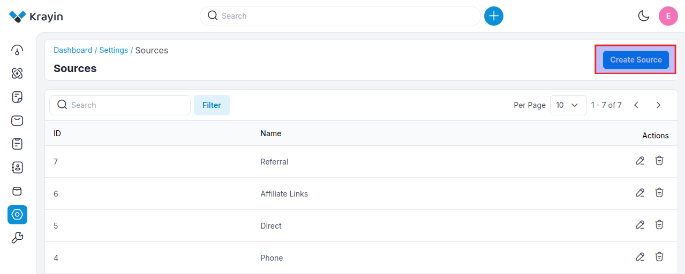
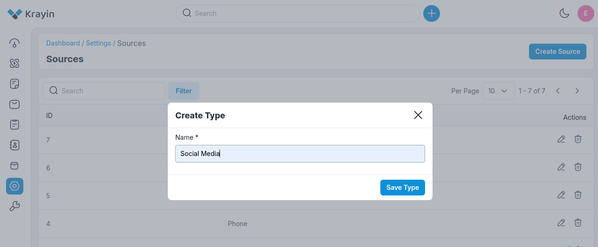
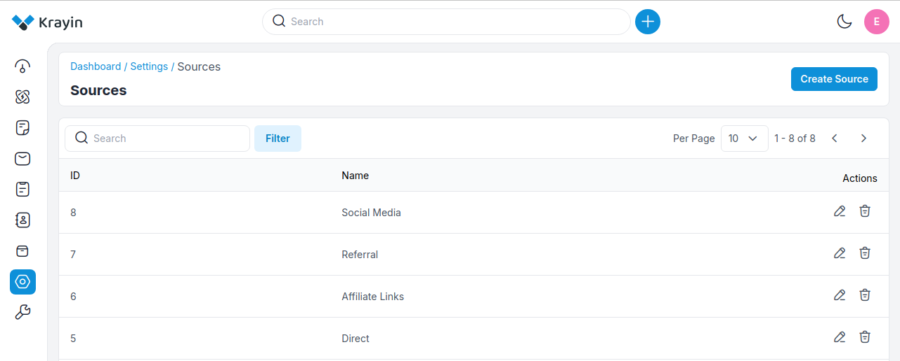
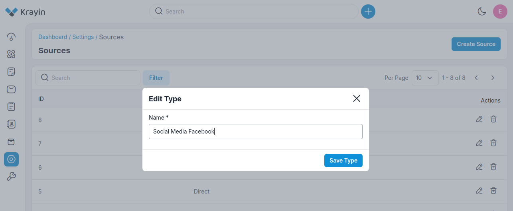
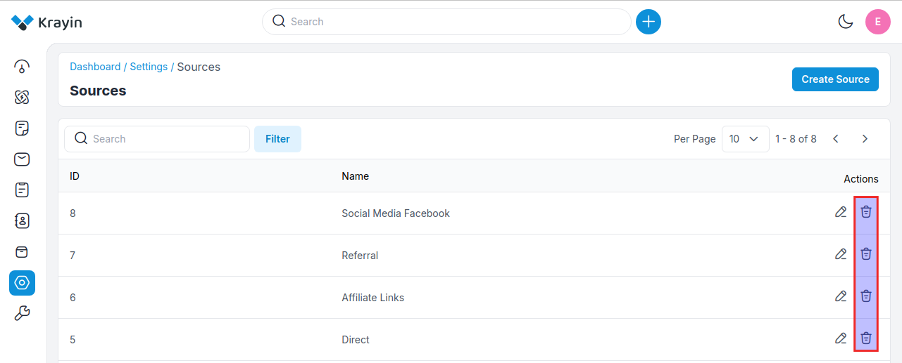
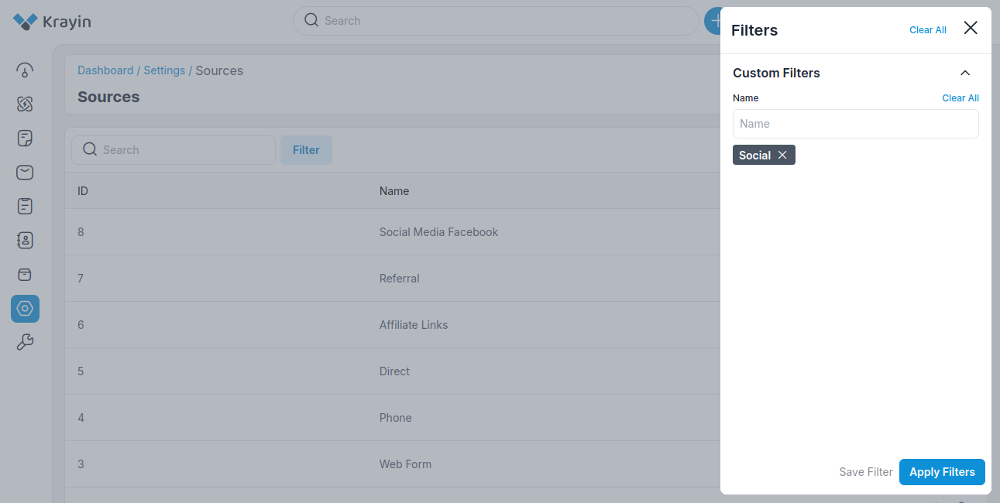

# Sources

Sources refer to the channels or methods through which leads or prospects enter your sales pipeline. Accurately tracking the sources of leads is crucial for understanding the effectiveness of your marketing and sales efforts, as well as for optimizing your lead generation strategies.

### Create Sources in Krayin

**Step-1** Go to admin panel of krayin and click on **Settings >> Sources >> Create Source** as shown in the below image.

**Step-2** Enter the name of the source and then click on **Save Type** button.

**Step-3** A new record is created in the source data grid as shown in the below image.

### Actions in Sources

There are two types of actions you can perform in the source section:

1) Edit
2) Delete

**A) Edit Source**

After Source creation, if you want to edit the Source Type **name** then go to the “Edit” option and click on **Save Type** button after making changes.

**B) Deleting Source**

If you want to delete an unnecessary source from your Krayin CRM, in the action click on **Delete** button, as shown in the below image.

### Use of Filter in Source

After creating a Source, you can use a “Filter” to find out the specific source by using **Name** as shown in the image below.

**NOTE-** These sources can be assigned while creating a lead. 

By following the above steps you can easily create sources in Krayin CRM.

