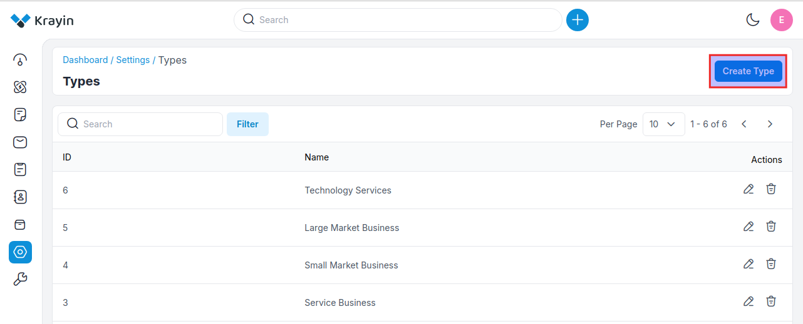
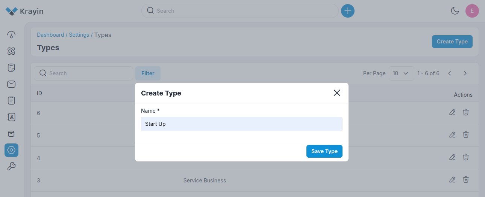
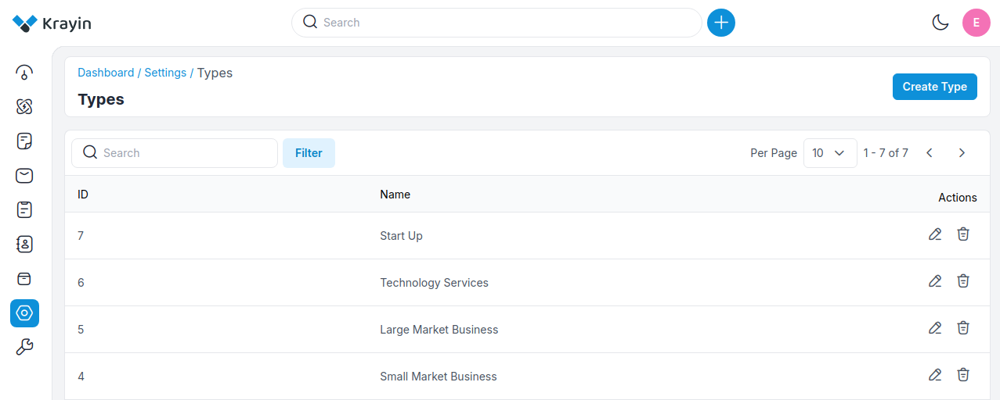
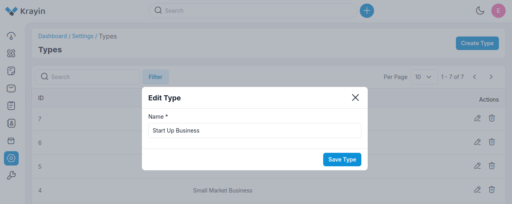
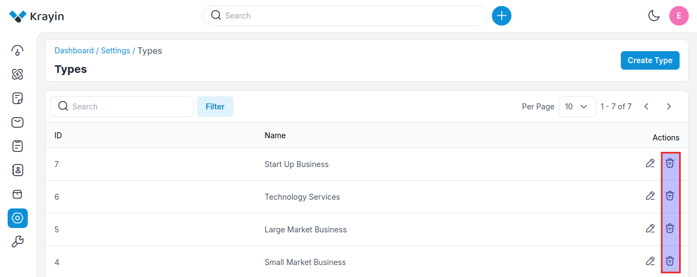
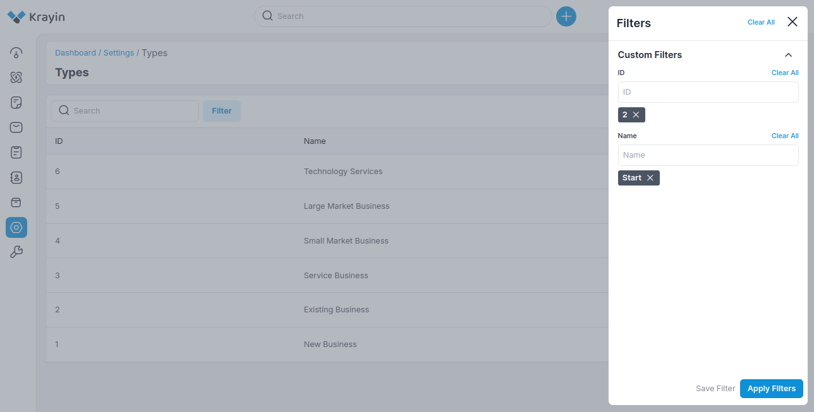

# Types 

The model refers to a framework or system that helps identify different types of businesses you can create. 

Each type of business model has its own characteristics, benefits, and drawbacks, influencing factors like liability, taxation, and management. 

### Create Types in Krayin

**Step-1** Go to admin panel of krayin and click on **Settings >> Types >> Create Type** as shown in the below image.

**Step-2** Enter the name of the new type. 

Now click on **Save as Type** button as shown in the below image.

**Step-3** A new record is created in the type data grid as shown in the below image.

### Actions in Types

There are two types of actions you can perform in the type section:

1) Edit
2) Delete

**A) Edit Types**

After Types creation, if you want to edit the type **name** then go to the “Edit” option and click on **Save Type** button after making changes.

**B) Deleting Type**

If you want to delete unnecessary types from your Krayin CRM, in the action click on **Delete** button, as shown in the below image.

### Use of Filter in Types 

After creating Types, you can use a “Filter” to find out the specific Types by using **ID, Name** as shown in the image below.

**NOTE-** These types can be assigned while creating a lead. 

By following the above steps you can easily create Types in Krayin CRM.
