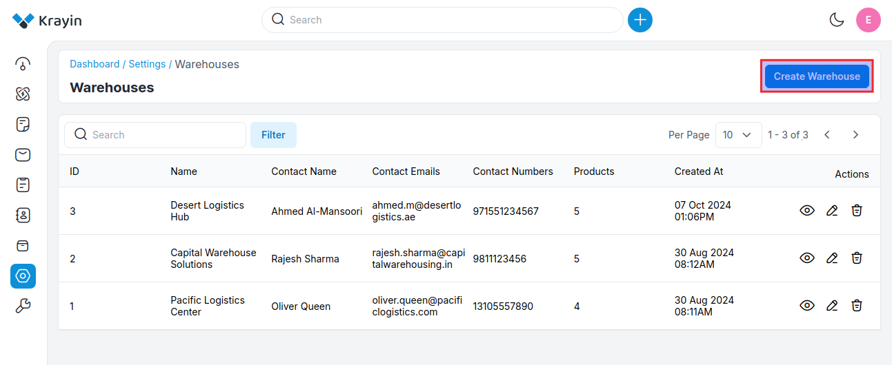
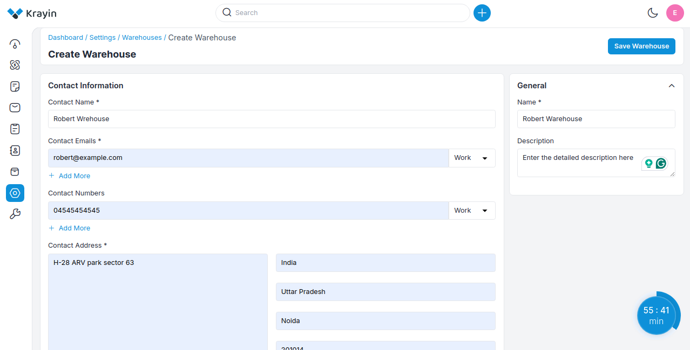
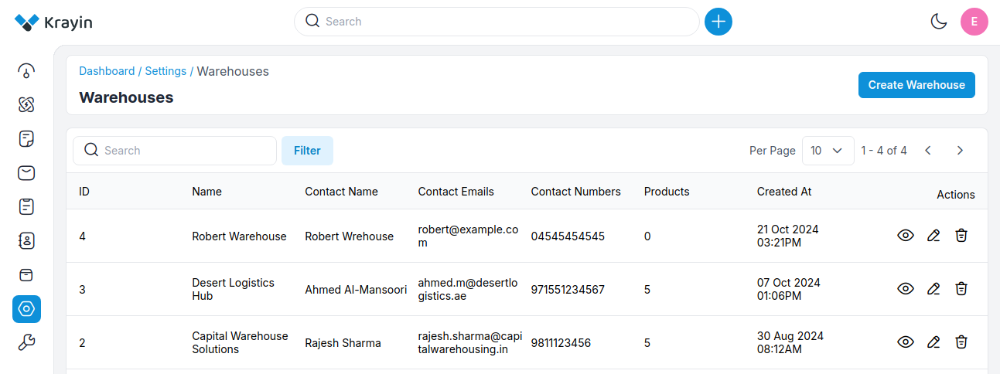
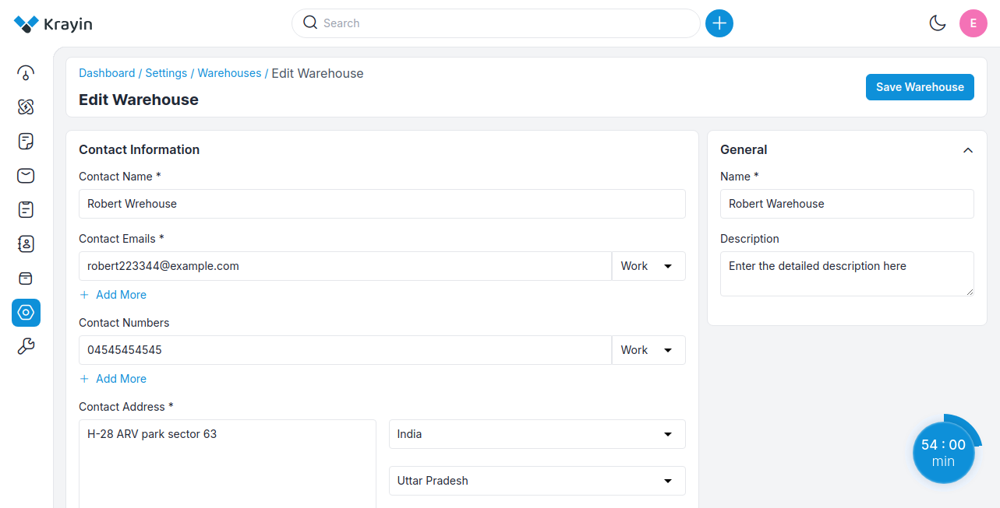
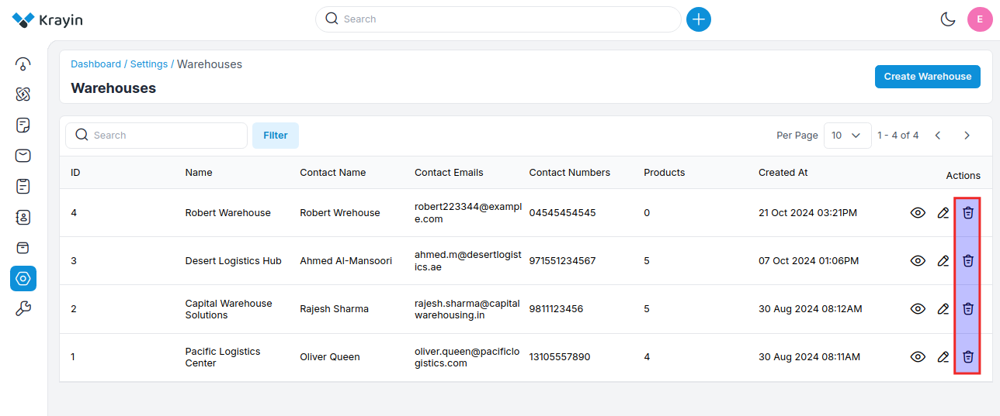
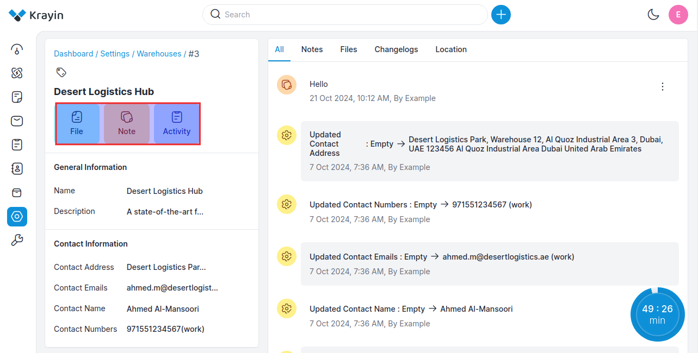
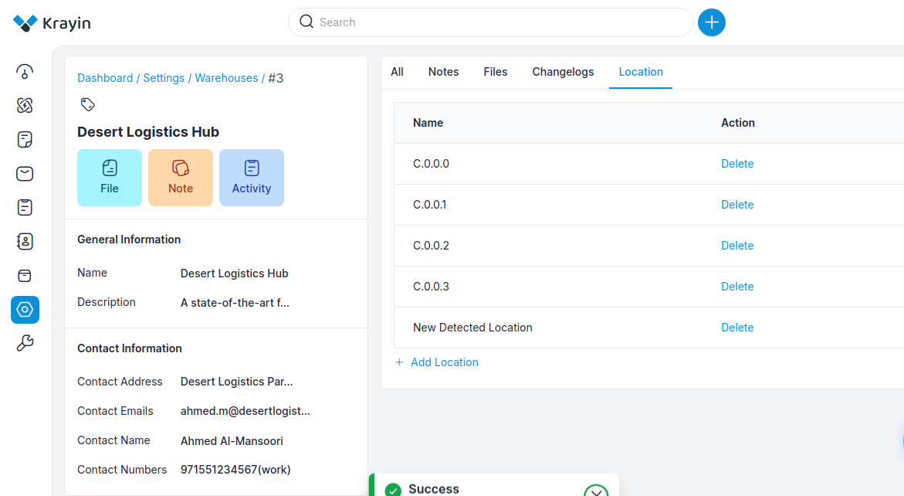
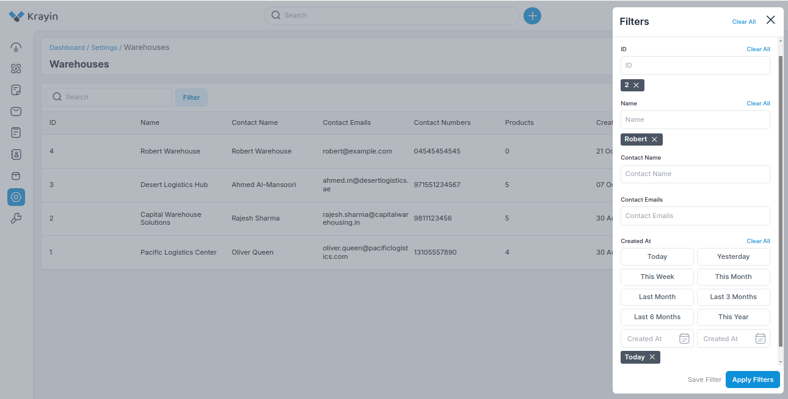
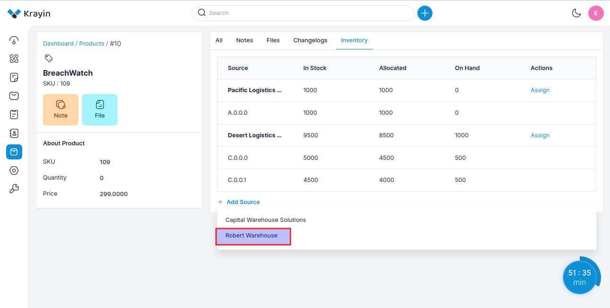

# Warehouses

A warehouse can refer to a data warehouse where large volumes of customer and sales data are stored and analyzed. 

This helps businesses make informed decisions by providing insights into customer behavior, sales trends, and marketing effectiveness.

### Create Warehouses in Krayin

**Step-1** Go to admin panel of krayin and click on **Settings >> Warehouse >> Create Warehouse** as shown in the below image.

**Step-2** Enter the below details.

**1) Warehouse Name-** Enter the name of the warehouse.

**2) Warehouse Description-** Enter the detailed description of the warehouse.

**3) Contact Name-** Enter the contact name of the warehouse.

**4) Contact Emails-** Enter the email ID and from the dropdown you can select whether it is your work email or home email.

**3) Contact Number-** Enter the contact number and from the dropdown you can select whether it is your work email or home email.

**4) Contact Address-** Enter the address of the warehouse.

Now click on **Save Warehouse** button.

**Step-3** A new record is created in the warehouse data grid as shown in the below image.

### Actions in Warehouse

There are three types of actions you can perform in the warehouse section:

1) Edit
2) Delete
3) View

**A) Edit Warehouse**

After Warehouse creation, if you want to edit the Warehouse **Contact Name, Contact Email, Contact Number, Contact Number, Contact Address, Warehouse Name & Warehouse Description** then go to the “Edit” option and click on **Save Warehouse** button after making changes.

**B) Deleting Warehouse**

If you want to delete an unnecessary Warehouse from your Krayin CRM, in the action click on **Delete** button, as shown in the below image.

**C) View Warehouse**

If you want to view a warehouse or make some edits like if you want to add **Files, Notes, Activity** from your Krayin CRM, in the action click on **View** button and easily add the "Files, Notes, Activity and the data will get visible in **Notes Files and All** sections respecively as shown in the below image.

Additionally, you can also add the location of the warehouse from the **Location** tab as shown in the image. Below.

### Use of Filter in Warehouse 

After creating a Warehouse, you can use a “Filter” to find out the specific Warehouse by using **ID, Name, Contact Name, Contact Emails, Created At** as shown in the image below.

This Warehouse will gets visible on **Product View Page** in the **Inventory** tab as shown in the image below.

By following the above steps you can easily create & manage a warehouse in Krayin CRM.

