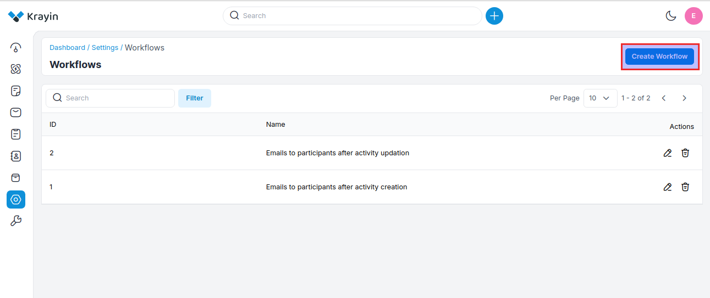
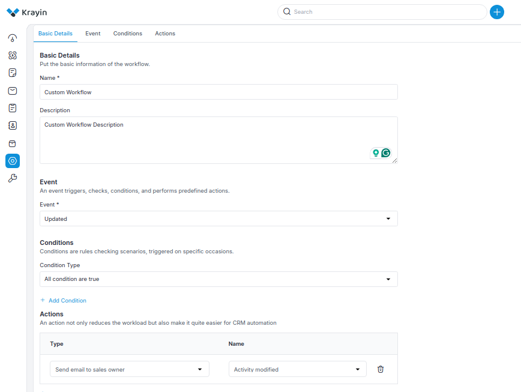
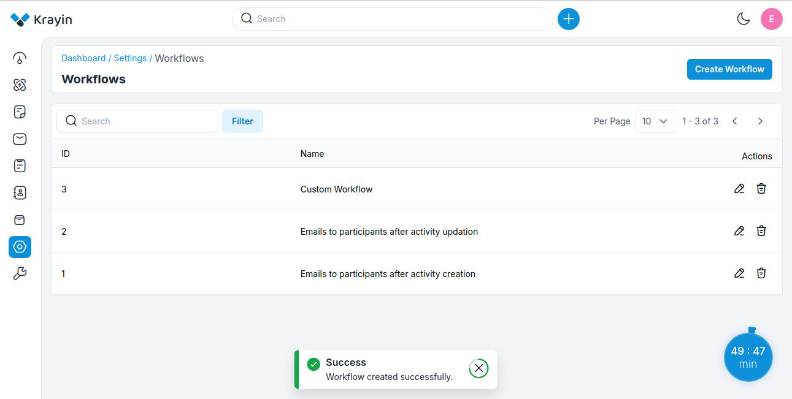
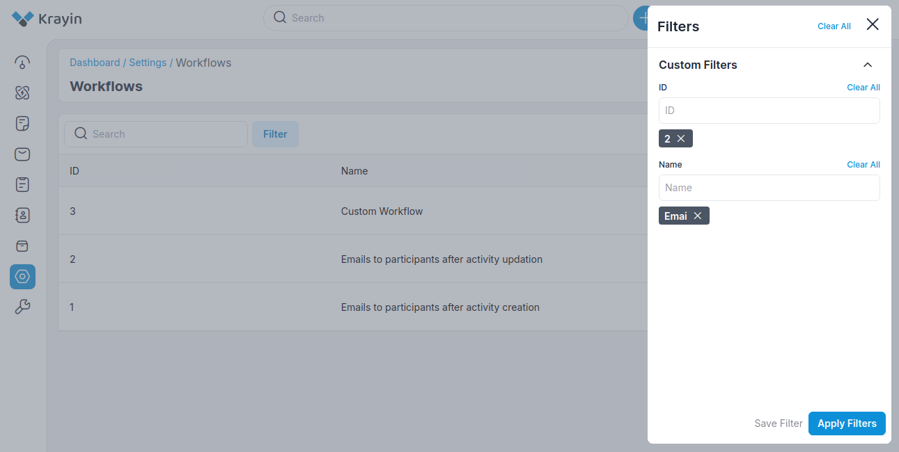
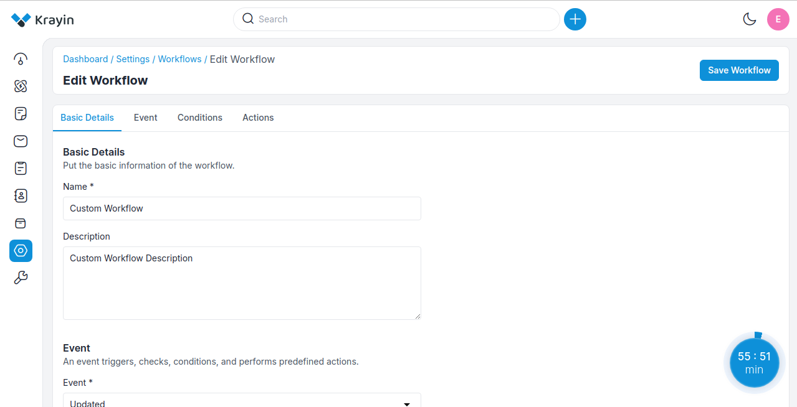
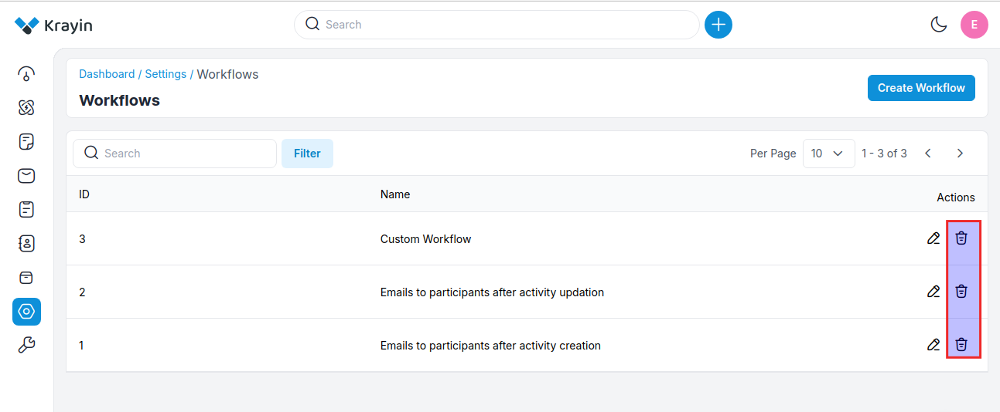

# Workflows

A CRM workflow is a series or collection of steps required to complete a business process such as making a sale or responding to a customer complaint. 

You can think of a CRM workflow as a line of dominoes you need to knock over to get from an initial trigger to your desired outcome.

### Create Workflows in Krayin 

**Step-1** Go to admin panel of krayin and click on **Settings >> Workflows >> Create Workflow** as shown in the below image.

**Step-2** Add the below details.

**1) Name-** Enter the name of the workflow.

**2) Description-** Enter the description of the workflow.

**3) Events-** Select the event for the workflow. In the event, you have to select the **Lead, Activities, Person or Quotes**, and inside that you need to select the actions like create, update, and delete.

**4) Condition-** Apply the condition as per the requirements. You can set conditions, for specific Events, and are triggered on specific occasions.

**5) Actions-** Select the action of the workflow.

Now click on **Save Workflow** button.

**Step-3** A new record is created in the workflow data grid as shown in the below image.

### Use of Filter in Workflow

After creating Workflow, you can use a “Filter” to find out the specific Workflow by using **ID, Name**

### Actions in Workflow

There are two types of actions you can perform in the Workflow section.

1) Edit
2) Delete

**A) Edit Workflow**

After Workflow creation, if you want to edit the Workflow **Name, Description, Event, Conditions, Actions** then go to the “Edit” option and click on **Save Workflow** button after making changes.

**B) Deleting Workflow**

If you want to delete an unnecessary Workflow from your Krayin CRM, in the action click on **Delete** button, as shown in the below image.

By following the above steps you can easily create & manage Workflow in Krayin CRM.

