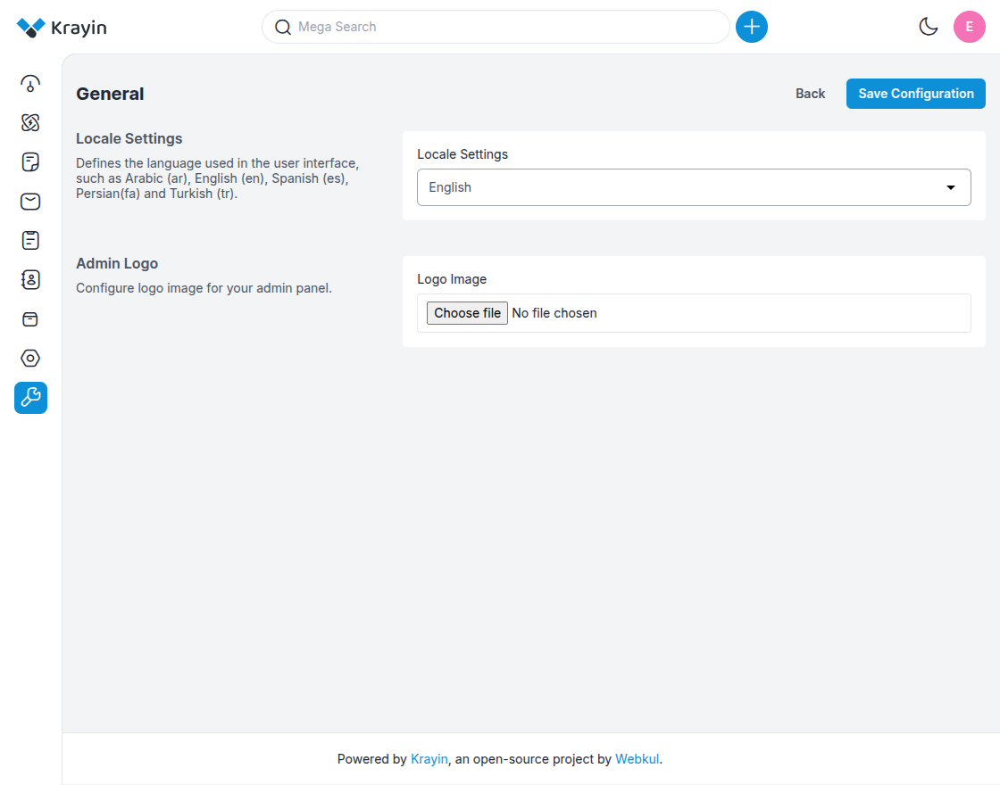
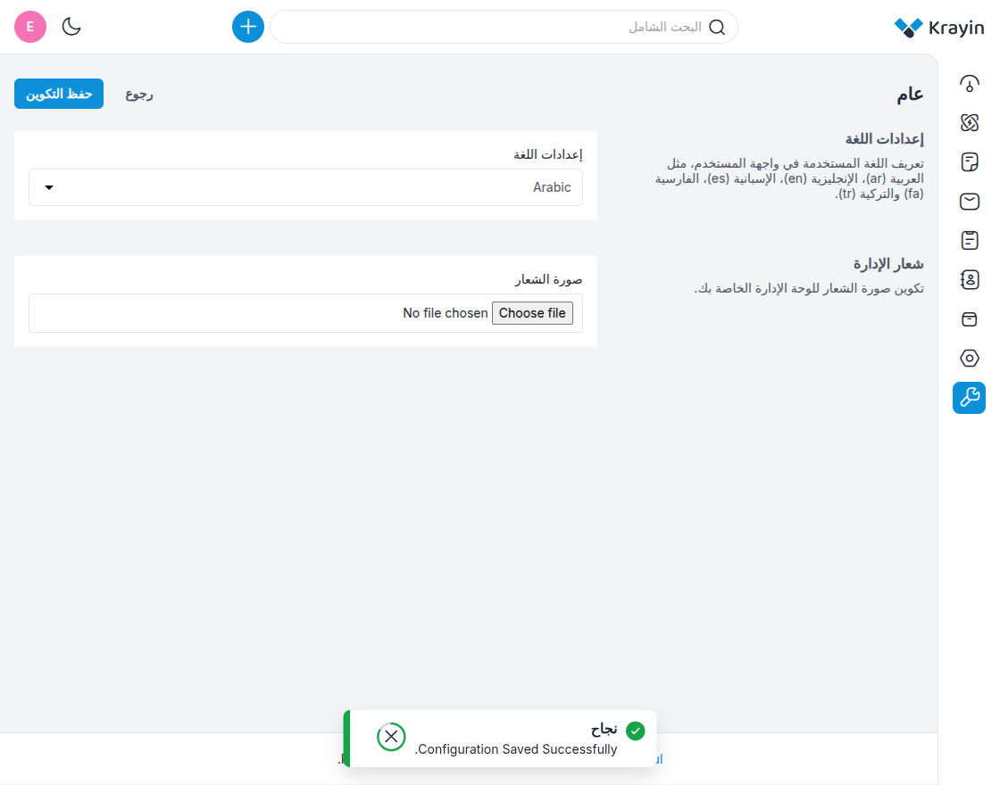
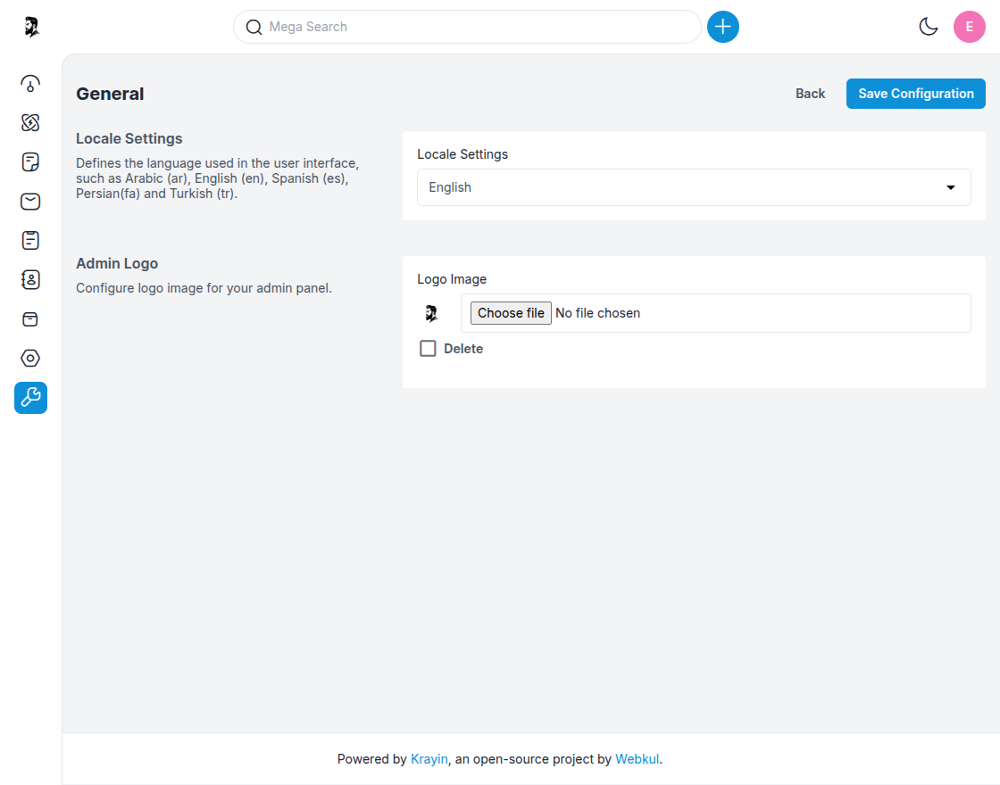

# General

---

## Locale Settings

**Step-1** Go to the admin panel of Krayin and click on  
**Configuration >> General >> Locale Setting**.

**Step-2** Select your desired locale from the dropdown.  
By default, we provide the following languages:  
**English, Arabic, Spanish, Portuguese, Persian, Turkish, and Vietnamese**.  
Now click on the **Save** button.

**Step-3** As shown in the below image, once **Arabic** is selected, the layout updates automatically to match the Arabic language and orientation.

By following the above steps, you can easily configure and use multiple locales in Krayin CRM.

---

## Admin Logo

The **Admin Logo** section allows you to upload a custom logo for the CRM admin panel, helping you maintain consistent brand identity across the system.

**Step-1** In the same **Settings >> Configuration >> General** page, scroll to the **Admin Logo** section as shown in the image below.

**Step-2** Upload the following:

**1) Logo Image –** Click on **Choose File** to upload your company’s logo.  
*Recommended formats: PNG, JPG, or WebP. 

---

**NOTE –** These settings will be reflected throughout the CRM interface, making the system more user-friendly and visually aligned with your brand.

By following the above steps, you can easily configure the **Locale** and upload your **Admin Logo** in Krayin CRM.
