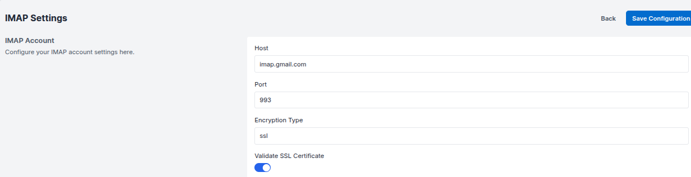
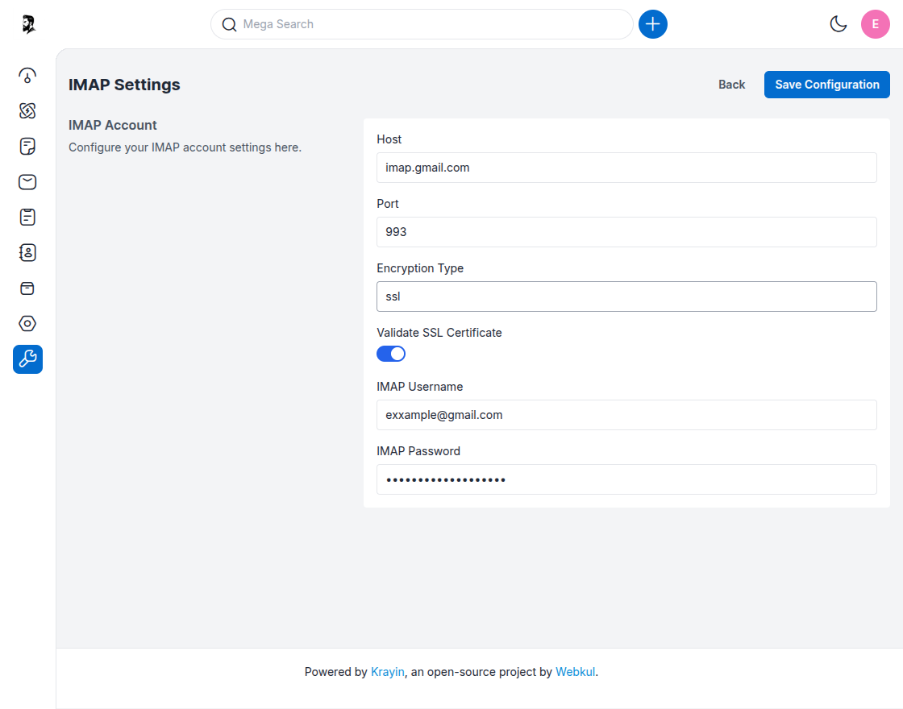

# IMAP Settings

---

## IMAP Account Configuration

The **IMAP Settings** section in Krayin CRM allows you to connect your email account to the CRM. Once configured, incoming emails will be accessible directly within the CRM interface for better communication and lead tracking.

---

### Configure IMAP Settings

**Step-1** Go to the admin panel of Krayin and click on  
**Settings >> Configuration >> IMAP Settings**.

**Step-2** In the **IMAP Account** section, enter the required server details:

- **Host** – Enter your mail server host.  
  _Example: `imap.gmail.com`_

- **Port** – Enter the secure port for IMAP.  
  _Recommended: `993`_

- **Encryption Type** – Select the encryption protocol.  
  _Common: `ssl`_

- **Validate SSL Certificate** – Check this box to validate the server's SSL certificate.

---

### Add Your Email Credentials

**Step-3** Fill in your email login details:

- **IMAP Username** – Your email address  
  _Example: `youremail@example.com`_

- **IMAP Password** – Your email account password (input is masked)

---

### Save Configuration

**Step-4** Click on the **Save Configuration** button to store the settings.

---

Once configured, Krayin CRM will begin syncing emails via IMAP, allowing you to manage inbox activity, associate emails with leads or contacts, and streamline communication without switching between platforms.
