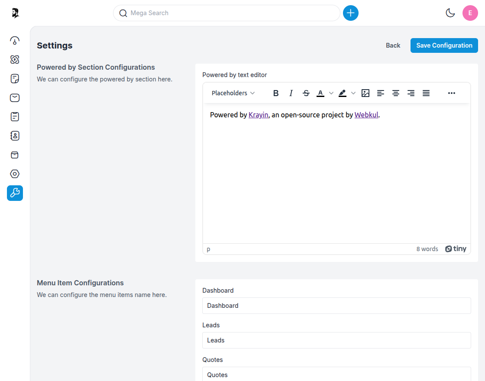
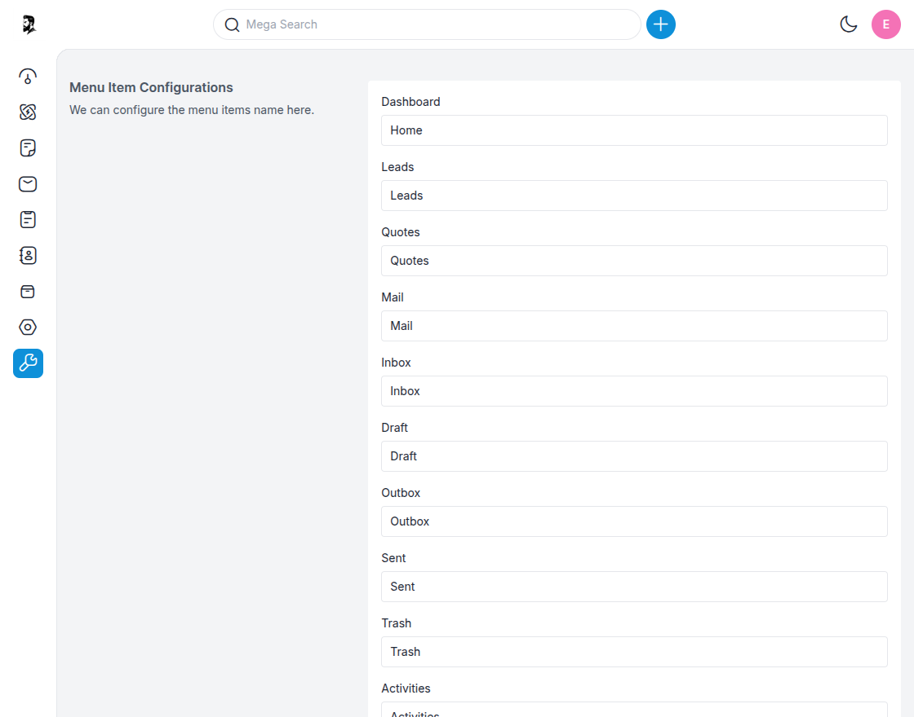
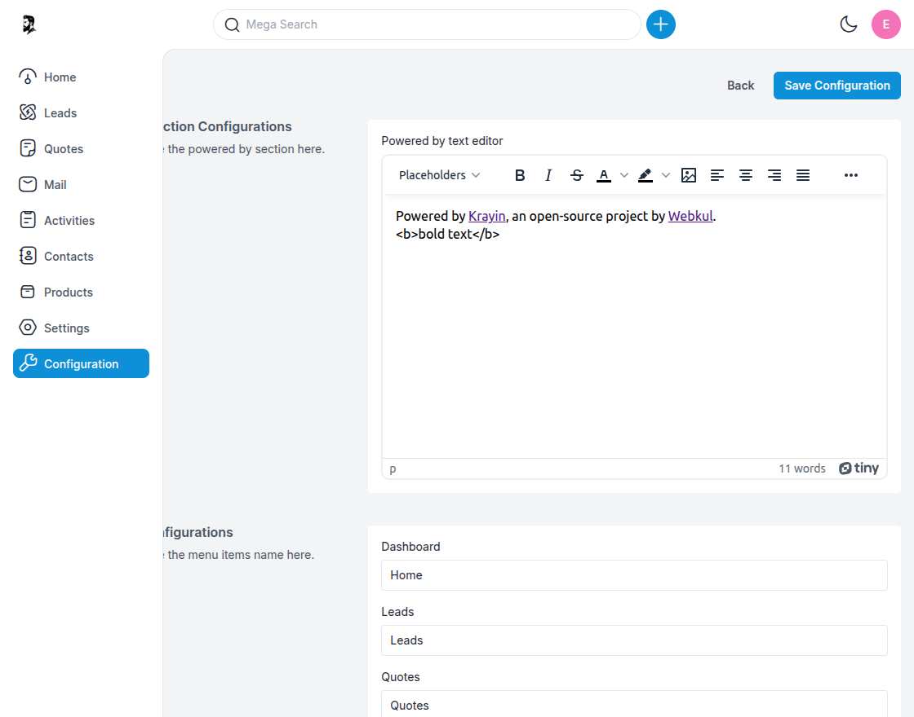
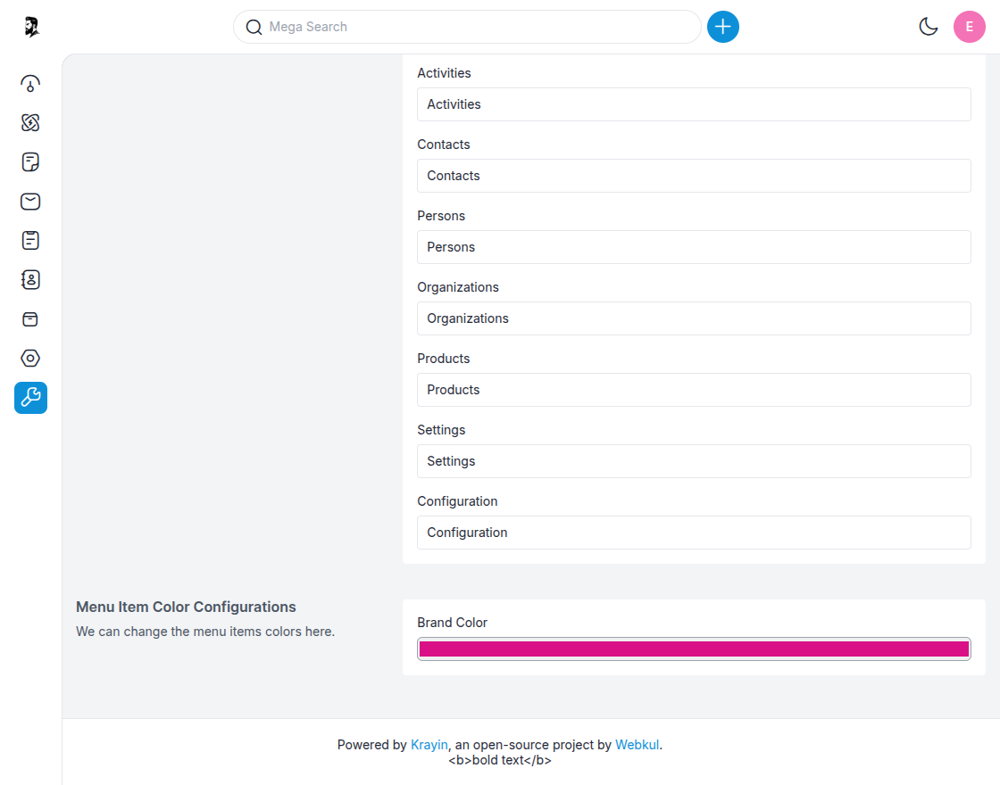
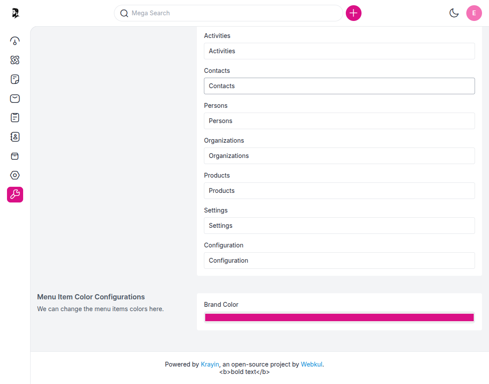

# Settings

---

## Powered by Section Configurations

The **Powered by** section allows you to customize or remove the footer text shown in the admin panel, typically used to credit the software or organization.

**Step-1** Go to the admin panel of Krayin and click on  
**Settings >> Configuration >> Powered by Section**.

**Step-2** Enter your desired footer text in the **Powered by text editor**.  

**Step-3** Click on the **Save Configuration** button to apply the changes.

> **Example:** You can change “Powered by Krayin” to “Powered by [Your Company Name]”.

By following the above steps, you can easily update the footer credit or branding in Krayin CRM.

---

## Menu Item Configurations

The **Menu Item Configurations** section allows you to rename default sidebar menu items to match your internal terminology or localization preferences.

**Step-1** Go to the admin panel of Krayin and click on  
**Settings >> Configuration >> Menu Item Configurations**.

**Step-2** In the provided list, you can update the labels for menu items like:

- Dashboard  
- Leads  
- Quotes  
- Mail  
- Inbox  
- Draft  
- Outbox  
- Sent  
- Trash  
- Activities  
- Contacts  
- Persons  
- Organizations  
- Products  
- Settings  
- Configuration

**Step-3** Replace the text **Dashboard** with **Home** or any label of your choice.

**Step-4** After updating the names, click on the **Save Configuration** button.

By following the above steps, you can rename the sidebar items to better suit your business workflow.

---

## Menu Item Color Configurations

The **Menu Item Color Configurations** section allows you to change the color scheme of the sidebar menu to match your brand’s theme.

**Step-1** Go to the admin panel of Krayin and click on  
**Settings >> Configuration >> Menu Item Color Configurations**.

**Step-2** Choose a color using the **Brand Color** picker for the menu items.

**Step-3** Click on the **Save Configuration** button to apply the selected color.

By following the above steps, you can easily customize the sidebar menu colors in Krayin CRM to reflect your brand identity.

---

**NOTE –** These settings help enhance the CRM's look and feel, making it more aligned with your company’s language, branding, and navigation preferences.
