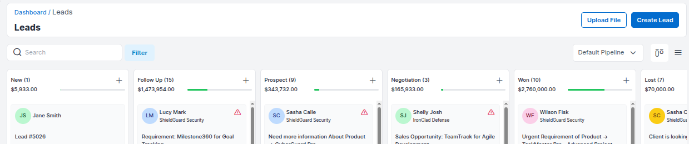
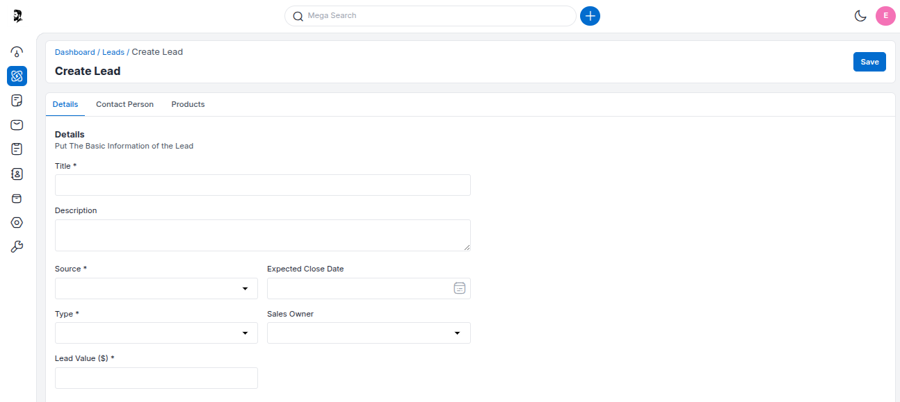
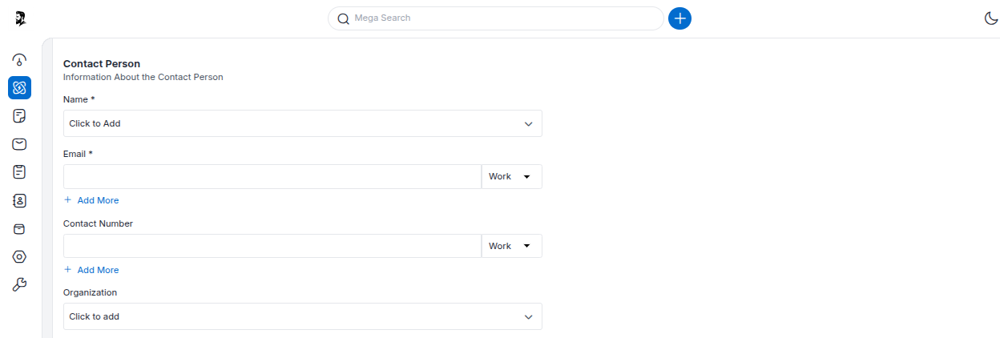
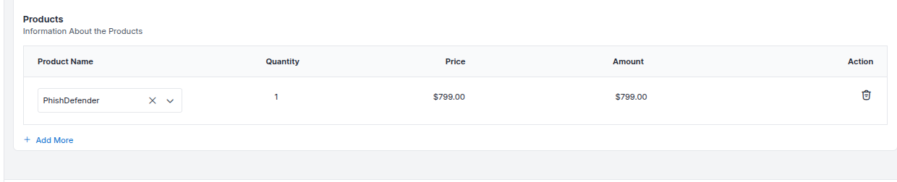
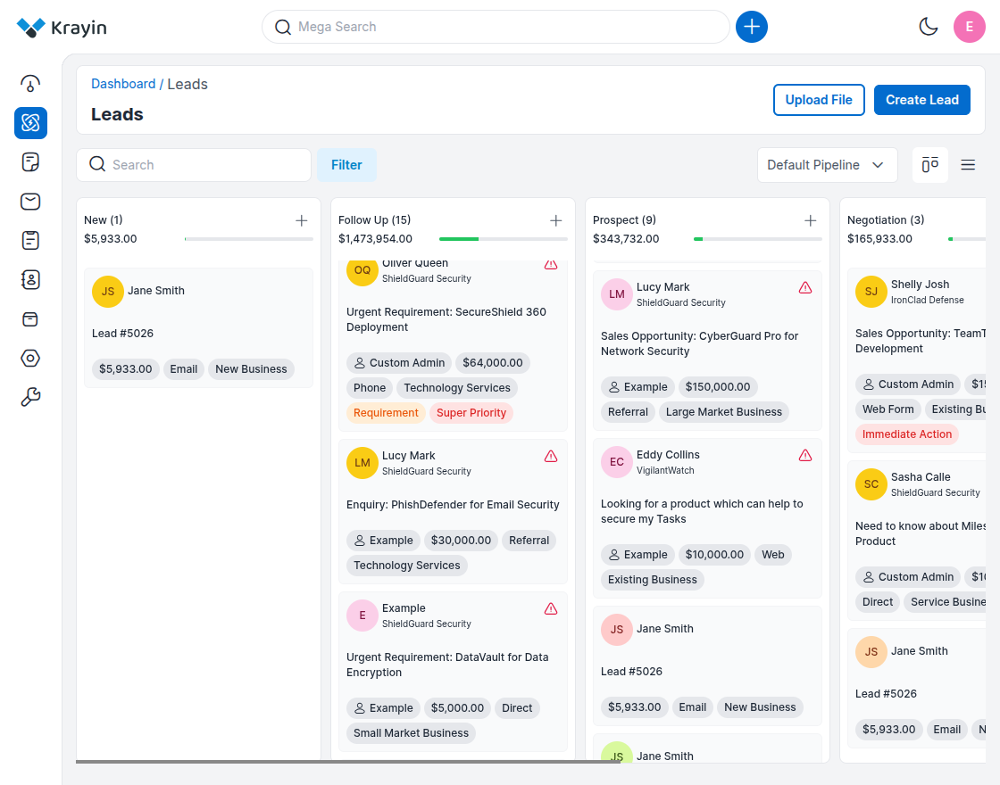
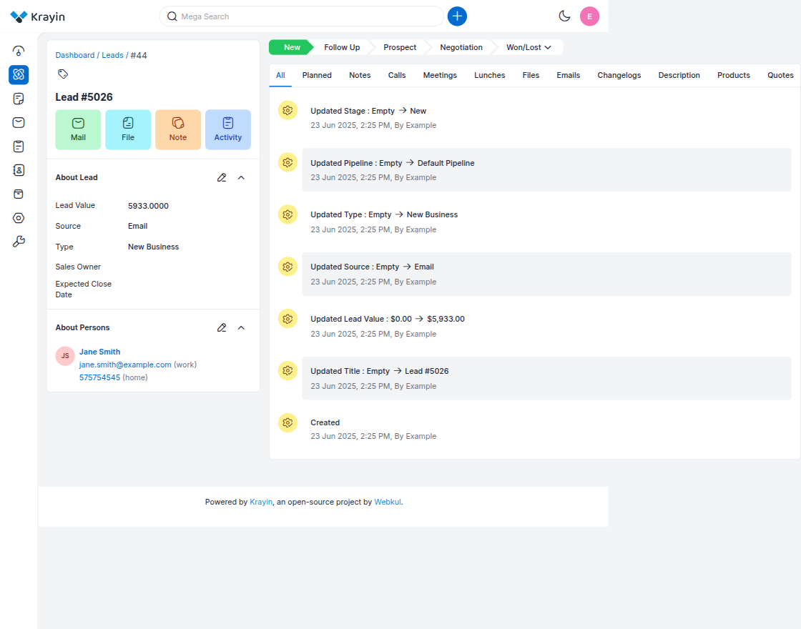
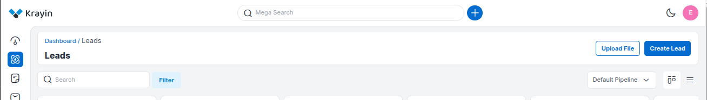
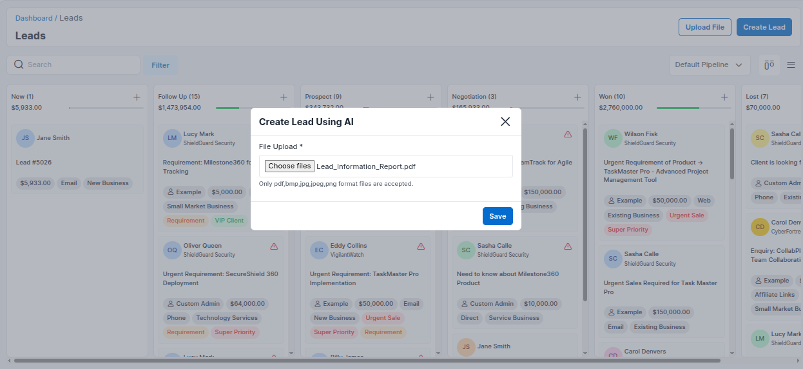
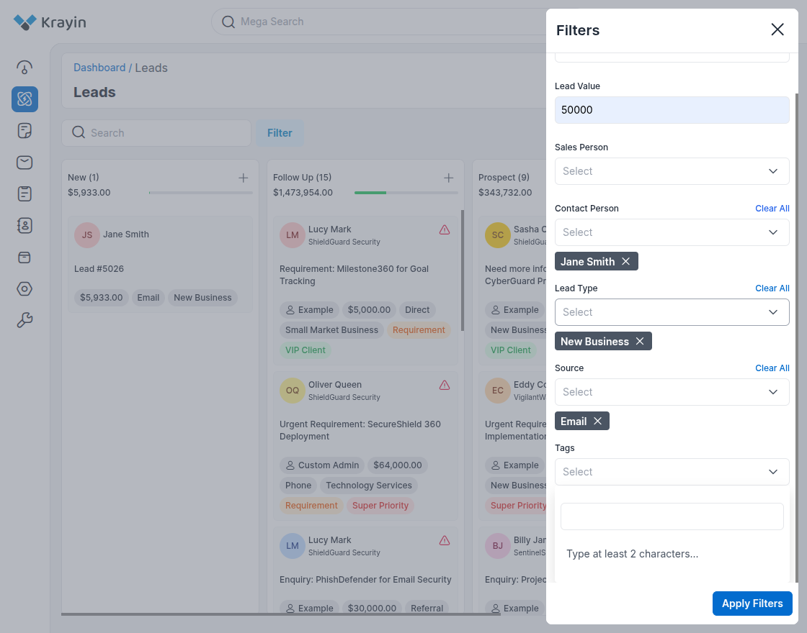

# Leads

A **Lead** is a potential customer or prospect. Generating a lead is the first step of the sales process in Krayin CRM. Lead records are designed to store all known information on the lead, including company name, address, contact details, and the lead's current position in the sales funnel.

---

## Create Leads in Krayin

### Manual Lead Creation

**Step-1** Go to the admin panel of Krayin and click on  
**Leads >> Create Lead**.

---

**Step-2** Fill in the following lead details:

- **Title** – Enter the title of the lead.  
- **Description** – Description about the opportunity.  
- **Lead Value** – Estimated value of the lead.  
- **Source** – Choose how the lead was acquired (e.g., Email, Web, Phone).  
- **Type** – Select the lead type.  
- **Sales Owner** – Assign a sales owner.  
- **Expected Close Date** – Set an estimated closing date.

---

**Step-3** Enter Contact Person information:

- **Name**  
- **Email**  
- **Contact Number**  
- **Organization**

---

**Step-4** Search Product name to add product:

- Product name  
- Price  
- Quantity  
- Total Amount

---

**Step-5** Click on **Save as Lead** to store the new lead.

A complete pipeline is generated. You can move leads between stages or customize your sales stages.

---

### Upload File to Create Leads (Magic AI)

Krayin CRM also supports **document-based lead creation** using Magic AI.

**Step-6** Go to **Leads >> All Leads** and click on the **Upload File** button.

**Step-7** Select a `.doc`, `.pdf`, or image file that contains lead-related data.  
Once uploaded, Magic AI will automatically extract details (e.g., Name, Email, Phone, Organization) and create a new lead.

The uploaded leads will appear in the **"New" stage** of the pipeline.

> 🔗 *Note: This feature requires Magic AI and DOC Generation to be enabled in*  
> **Settings >> Configuration >> Magic AI**

---

## Filter in Leads

You can use the **Filter** tab to search for specific leads.

Available filters include:

- ID  
- Lead Value  
- Sales Person  
- Contact Person  
- Lead Type  
- Source  
- Tags  
- Expected Close Date  
- Created At  

---

By following the above steps, you can easily create and manage leads in Krayin CRM—either manually or automatically using document upload with Magic AI.
