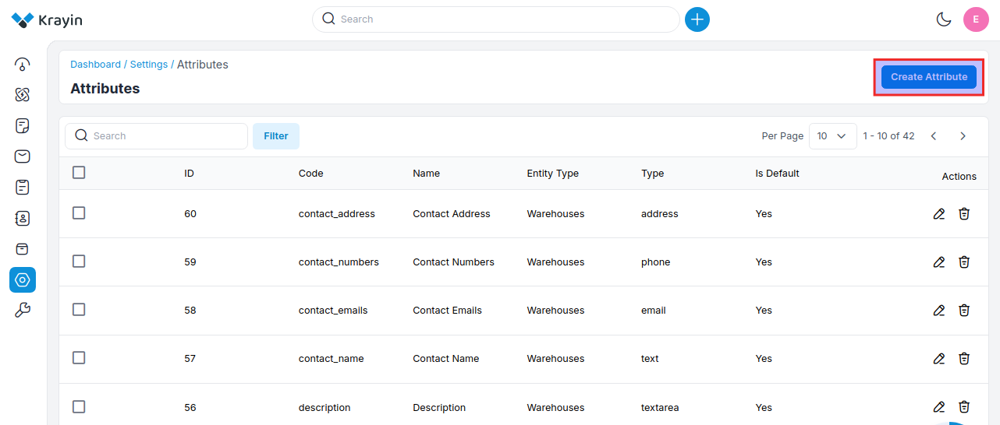
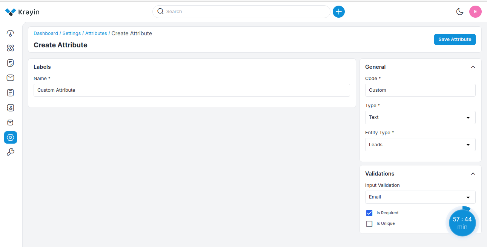
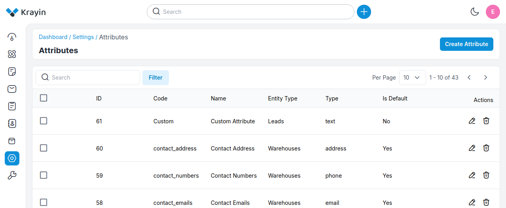
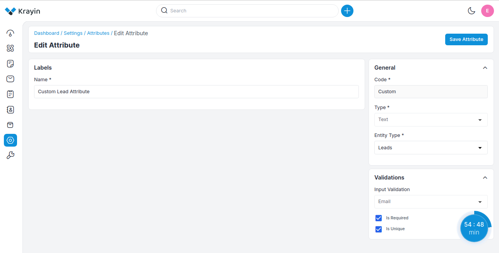
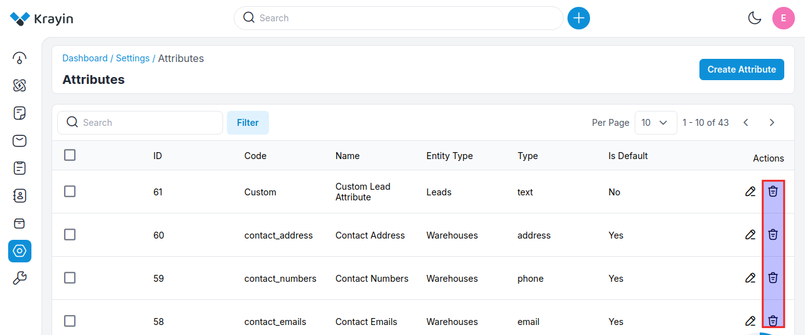
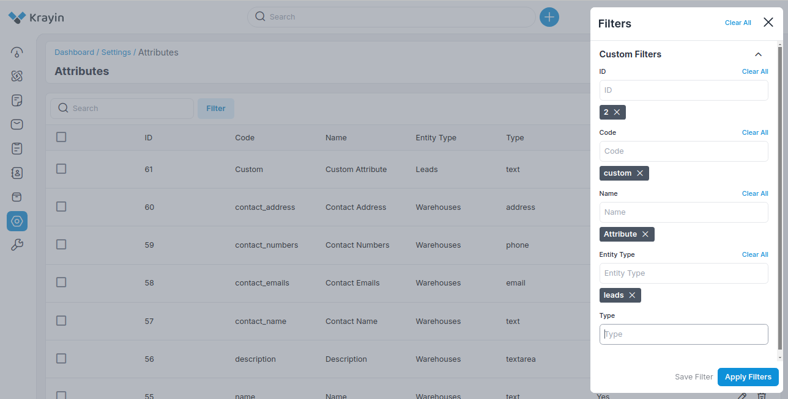

# Attributes

Attributes are used to record distinctive information on (potential) business partners, contacts, opportunities, or activities and to segment data when specifying a batch selection for generating activities, mail merge (letters), or flexible reports.

### Create Attributes in Krayin.

**Step-1** Go to admin panel of krayin and click on **Settings >> Attributes >> Create Attributes** as shown in the below image.

**Step-2** Enter the below details.

**1) Code-** Add the code of the attribute.

**2) Name-** Enter the name of the attribute.

**3) Type-** Select the type of the attribute from the dropdown.

-------------------------------------------------------------------------------------------------------------
**By default, there are 15 types as mentioned below.**

**A) Text-** A single-line input field that allows users to enter short pieces of text, such as names or titles.

**B) Textarea-** A multi-line input field used for longer text entries, such as comments or descriptions. It typically allows for more characters than a standard text field.

**C) Price-** A specialized input field for entering monetary values, often formatted to ensure the correct currency and decimal placement.

**D) Boolean-** Represents a true/false value, often used in forms as a toggle (e.g., a switch or radio button) to indicate binary choices like "yes" or "no." 

**E) Select-** A dropdown menu that allows users to select one option from a list. It can be useful for categories or predefined choices.

**F) Multiselect-** Similar to the select type, it allows users to select multiple options from a list, often using checkboxes or a multi-select dropdown.

**G) Checkbox-** A binary option that can be checked (true) or unchecked (false). It's often used for multiple-choice selections where more than one option can be selected.

**H) Email-** An input field specifically for entering email addresses. It often includes validation to ensure the entered text follows the standard email format.

**I) Address-** A specialized input for entering physical addresses, which may include fields for street, city, state, and postal code.

**J) Phone-** An input field for phone numbers, which may include validation for formatting and required country codes. 

**K) Lookup-** A field that allows users to search for and select an item from a database or a predefined list, typically enhancing data retrieval. 

**L) Date time-** A field that allows users to select both a date and a time, often through a calendar picker combined with a time selector.

**M) Date-** An input field specifically for selecting a date, usually presented with a calendar widget for easier selection. 

**N) Image-** A field for uploading or displaying images, typically allowing users to browse their device for image files.

**O) File-** A general file upload field that allows users to select and upload various types of files, such as documents, images, or other media. 

-------------------------------------------------------------------------------------------------------------
**4) Entity Type-** Select the entity type i.e. (lead, person, organization, product, quote, warehouse) for the attribute.

**5) Is Required-** Select Yes/No if you want to make the attribute a required field or not. When we set the value yes, then it will be compulsory to enter the value in this attribute.   

**6) Is Unique-** Select Yes/No if you want to make the attribute a unique field or not. If you set Yes then the attribute value will be unique so that you can not use the attribute value in another product, another person, organization, etc.

**7) Input Validation-** Select the input validation i.e. (Number, Email, Decimal, URL). For example, if you set the attribute in email validation then the value should be in email format, else error will be displayed.

Now click on **Save Attribute** button. 

**Step-3** A new record is created in the attribute data grid as shown in the below image.

### Actions in Attribute

There are two types of Actions you can perform in the Attribute section:

1) Edit
2) Delete

**A) Edit Attribute**

After Attribute creation, if you want to edit or update the attribute **Name, Entity type, Is Required, and Is Unique** values then go to the “Edit” option and click on **Save Attribute** button after making changes. 

**B) Delete Attribute**

If you want to delete an unnecessary Attribute from your Krayin CRM, in the action click on **Delete** button, as shown in the below image.

### Use of Filter in Attribute

After creating Attributes, you can use a “Filter” to find out the specific Attribute by using **Id, Code, Name, Entity Type, and Type** as shown in the image below.

By following the above steps you can easily create Attributes in Krayin CRM.

