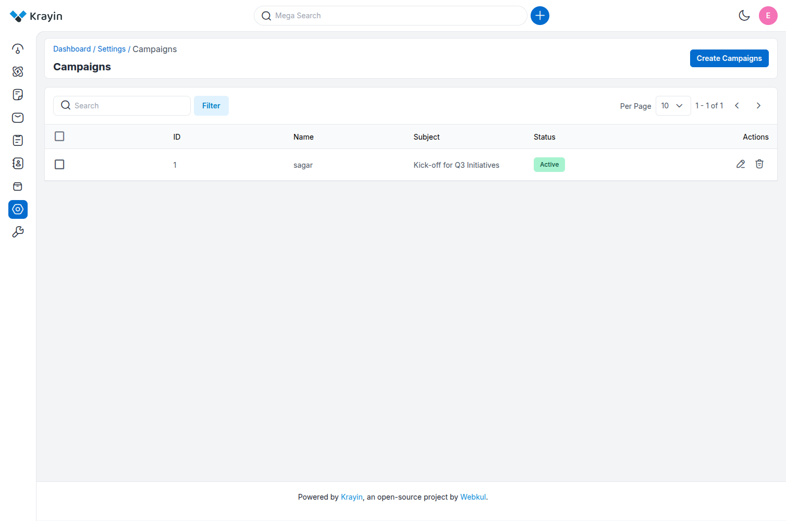
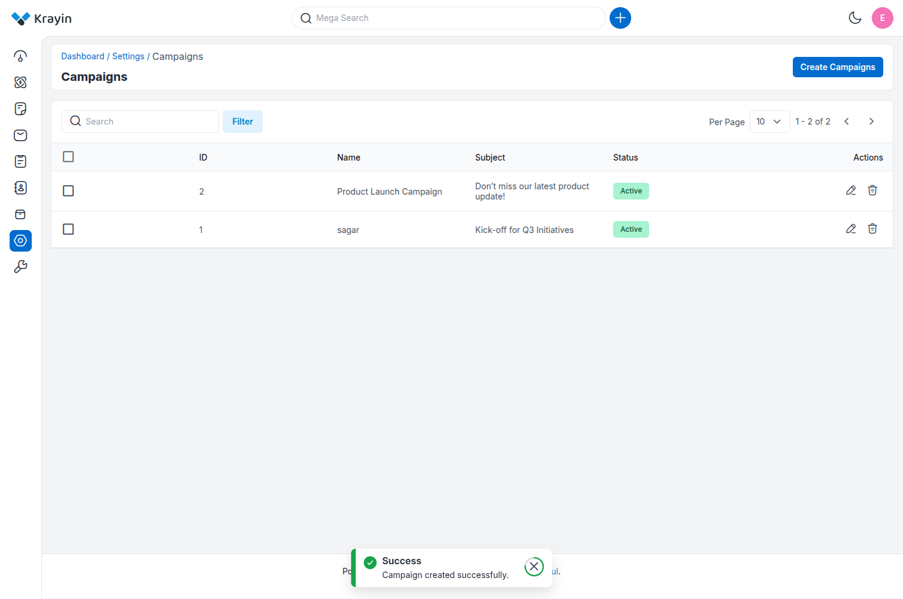
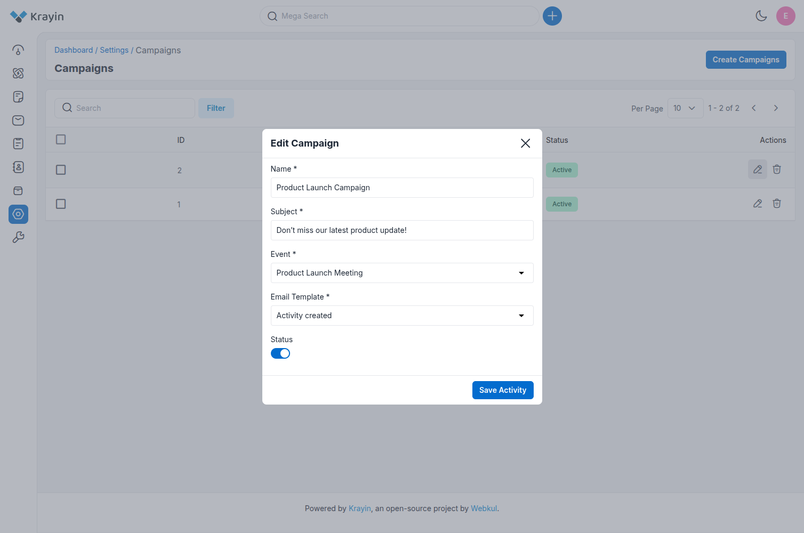
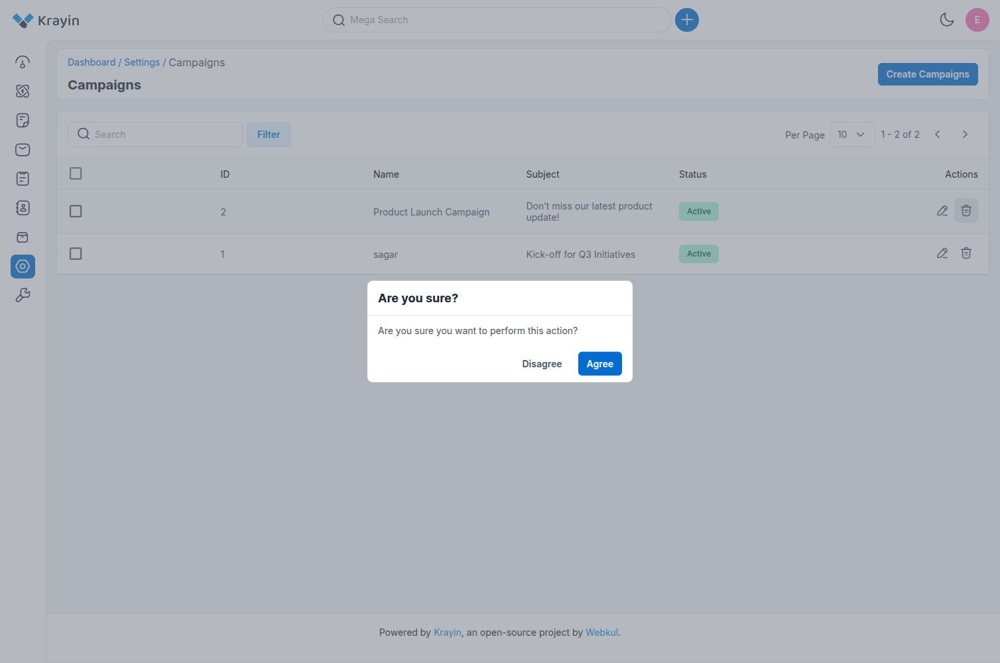
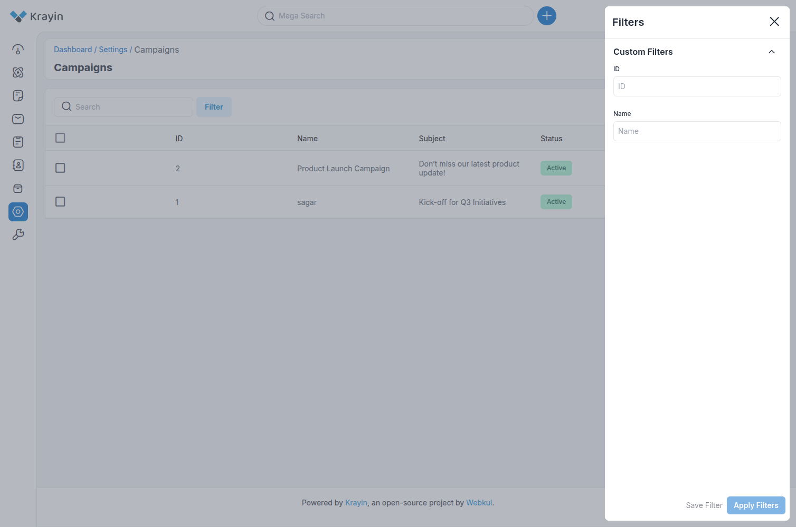

# Campaigns

In Krayin CRM, **Campaigns** are structured marketing or communication activities that are linked to events. They are designed to promote, inform, or follow up with leads and contacts using selected email templates.

Campaigns allow CRM users to send personalized messages to a group of recipients based on specific events and predefined templates.

---

### Create Campaigns in Krayin

**Step-1**  
Go to the admin panel of Krayin and click on **Settings >> Campaigns >> Create Campaign** as shown in the below image.

**Step-2**  
Add the details below:

**1) Name** – Enter the name or title of the campaign.  
*Example:* “Product Launch Campaign”, “Follow-up Mail Q3”.

**2) Subject** – Enter the subject line of the email to be sent through this campaign.  
*Example:* “Don’t miss our latest product update!”

**3) Event** – Select the related event from the dropdown list.  
This links the campaign with a specific scheduled activity like a meeting or demo.

**4) Email Template** – Choose the email template that should be used to send emails to users or leads.

**5) Status** – Toggle the switch to set the campaign status as **Active** or **Inactive**.

Now click on the **Save Activity** button.

**Step-3**  
A new record is created in the campaign data grid as shown in the below image.

**The campaign list includes:**

- **ID:** Unique identifier of the campaign.
- **Name:** Campaign title (e.g., *sagar*).
- **Subject:** Subject of the email (e.g., *Kick-off for Q3 Initiatives*).
- **Status:** Indicates whether the campaign is **Active** or **Inactive**.
- **Actions:** Options to edit ✏️ or delete 🗑️ the campaign.

---

### Edit Campaigns

You can modify or edit campaigns whenever needed.  
Click on the **Edit** icon in the Actions column to update:

- **Name**
- **Subject**
- **Event**
- **Email Template**
- **Status**

---

### Deleting Campaigns

To remove unnecessary campaigns, click on the **Delete** icon from the Actions column.

---

### Use of Filter in Campaigns

You can use the **Filter** option to search for specific campaigns using:

- **ID**
- **Name**

---

**NOTE:**  
Each campaign must be linked to an **event**. If you need to run the same campaign for multiple events, you must currently create separate campaigns for each event.

By following the above steps, you can easily create and manage campaigns in Krayin CRM.
