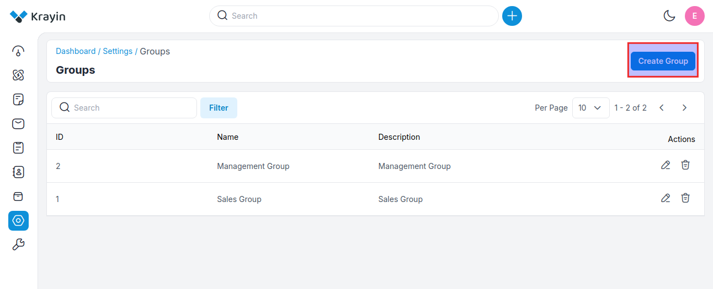
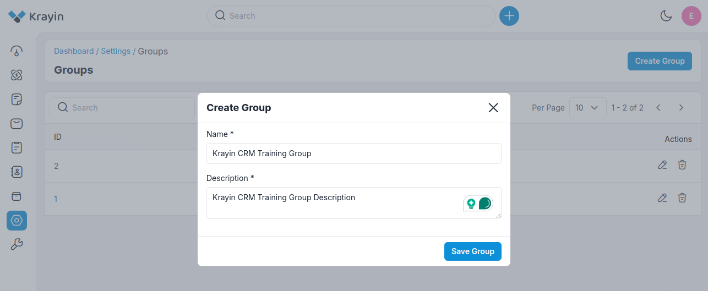
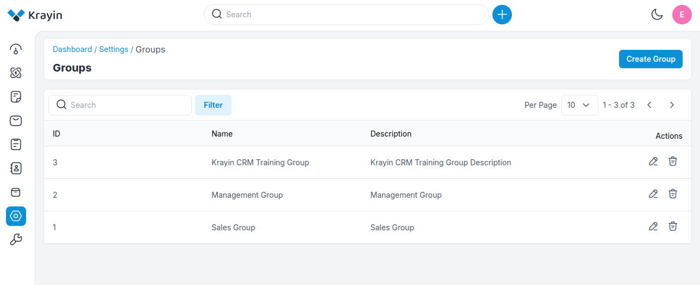
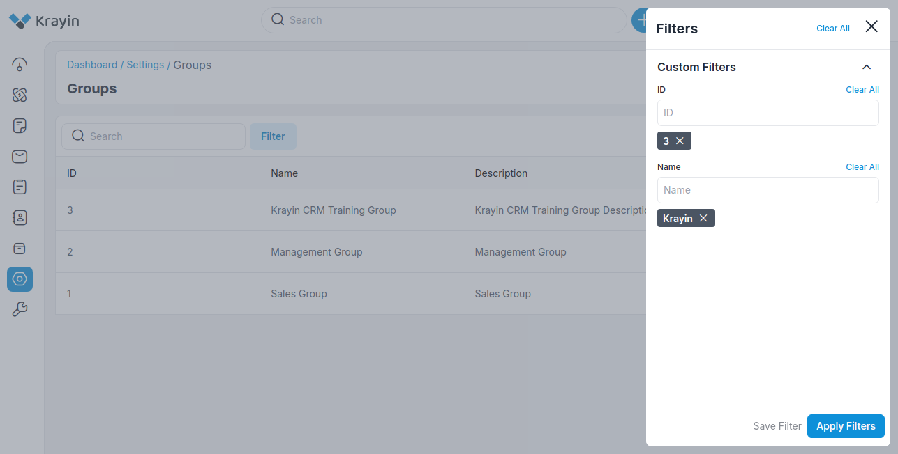
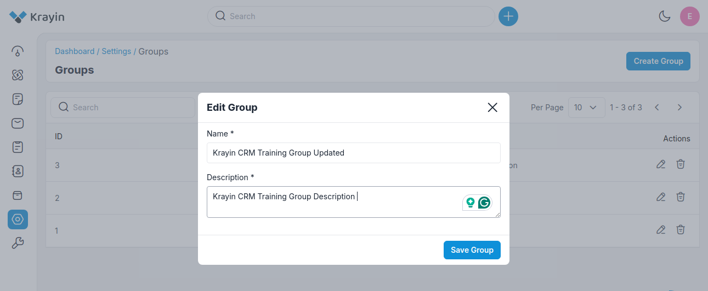
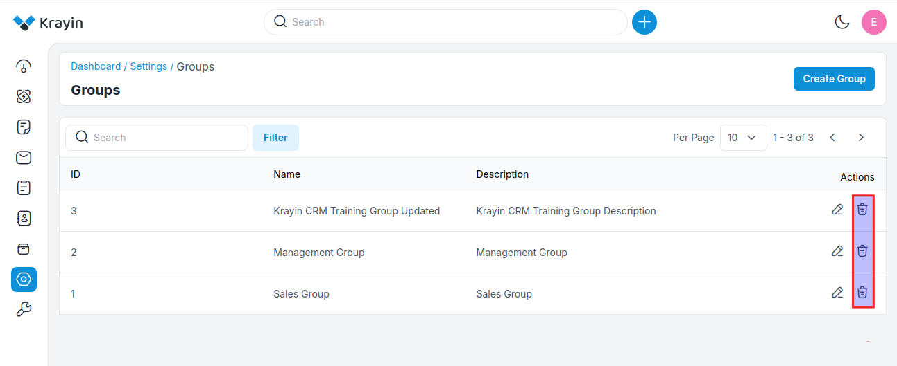

# Groups

In Krayin CRM, groups typically refer to a feature that allows users to categorize or segment contacts, leads, or customers based on certain criteria.

These groups can help organize data and streamline communication or marketing efforts. Users can create groups based on various factors such as demographics, interests, purchasing behavior, or any other relevant attributes. 

### Create Groups in Krayin

**Step-1** Go to admin panel of krayin and click on **Settings >> Groups >> Create Group** as shown in the below image.

**Step-2** Enter the below details.

**1) Name-** Enter the name of the group.

**2) Description-** Add the description of the group.

Now click on **Save Group** button.

**Step-3** A new record is created in the group data grid as shown in the below image.

### Use of Filter in Groups

After creating groups, you can use a “Filter” to find out the specific group by using **Id and Name**.

### Actions in Group

There are two types of actions you can perform in the Group section:

1) Edit
2) Delete

**A) Edit Groups**

After creating a group, if you want to edit or update the group **Name and Description**, go to the “Edit” option and click the **Save Group** button after making your changes.

**B) Delete Groups**

If you want to delete an unnecessary group from your Krayin CRM, in the action click on **Delete** button, as shown in the below image.

**NOTE-** These Groups will be visible while creating a User.

By following the above steps you can easily create groups in Krayin CRM.

