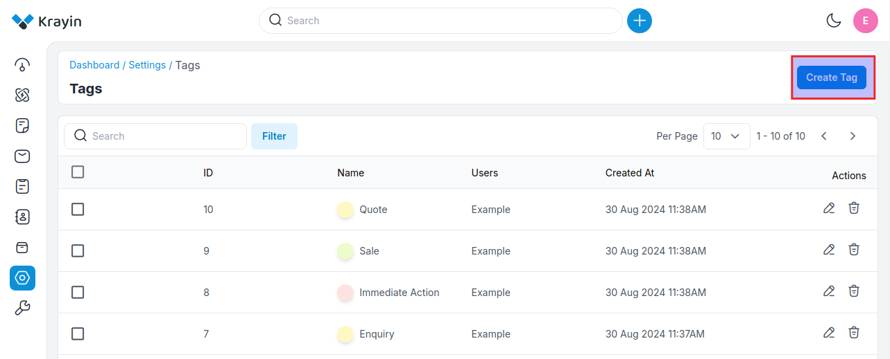
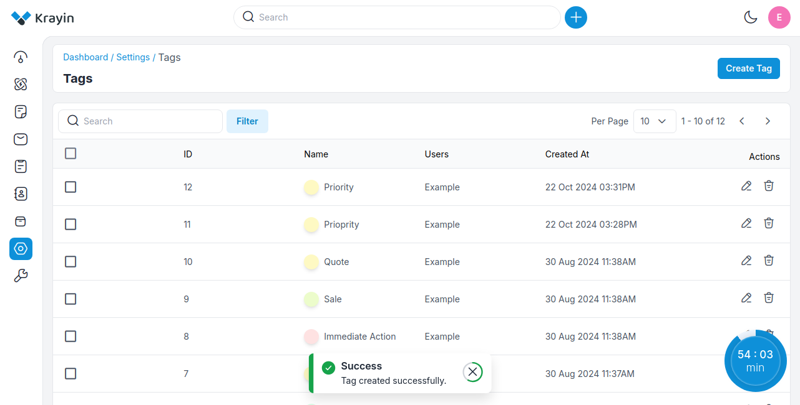
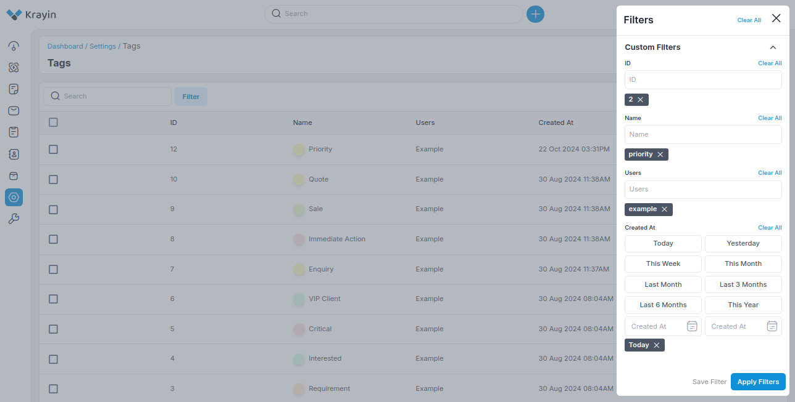
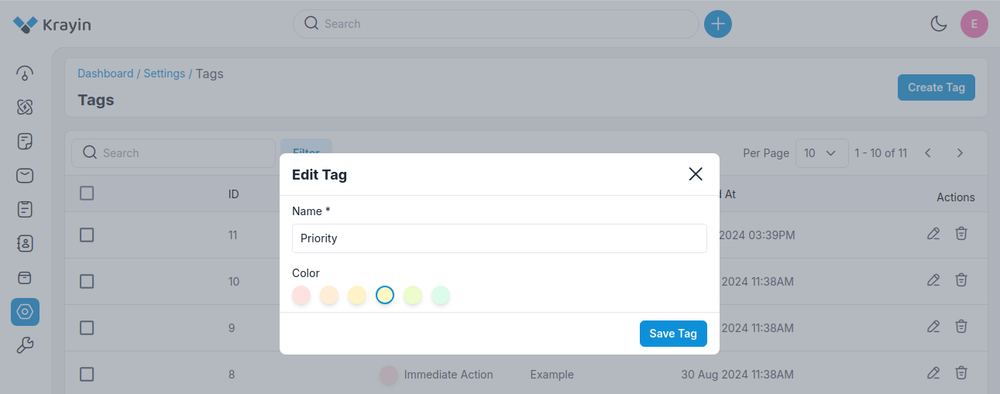
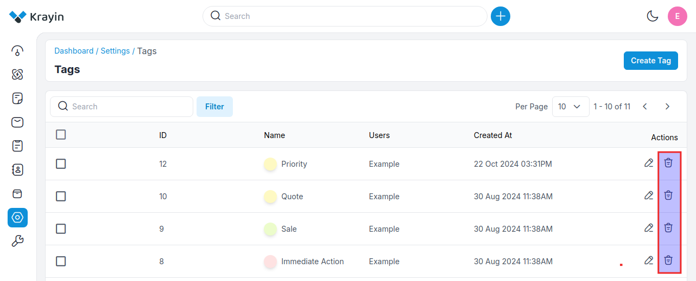

# Tags

Tags are unique identifiers that you can attach to customer data in your CRM system. 

They allow you to group people based on their needs and interests so that when it's time for marketing, they get the right message at the right time - something all marketers want!

### Create Tags in Krayin.

**Step-1** Go to admin panel of krayin and click on **Settings >> Tags >> Create Tag** as shown in the below image.

**Step-2** Enter the **Name** and **Color** of the tag as shown in the below image.

**Step-3** A new record is created in the tags data grid as shown in the below image.

### Use of Filter in Tags

After creating the Tags, you can use a “Filter” to find out the specific tag by using **ID, Name, Users, Created At**.

### Actions in Tags

There are two types of actions you can perform in the Tags section:

1) Edit
2) Delete

**A) Edit Tags**

After creating Tags, if you want to edit or update the **Tags Name** and **Color**, go to the “Edit” option and click the **Save Tag** button after making your changes.

**B) Deleting Tags**

If you want to delete unnecessary Tags from your Krayin CRM, in the action click on **Delete** button, as shown in the below image.

By following the above steps you can easily create Tags in Krayin CRM.
