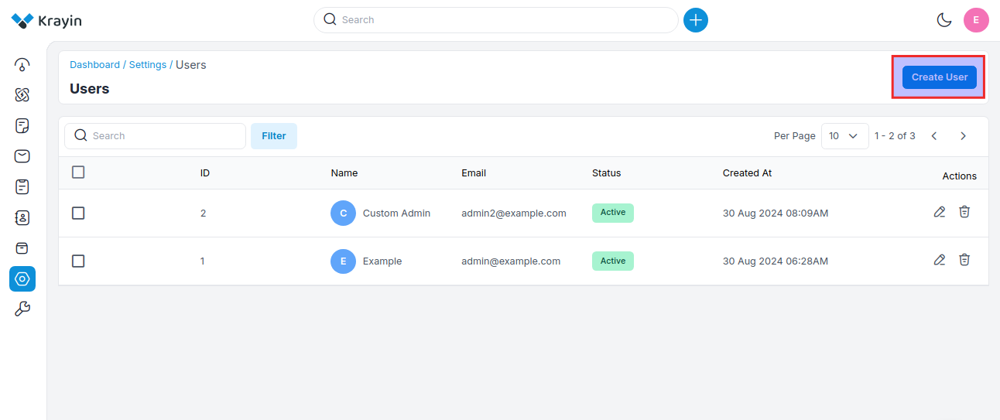
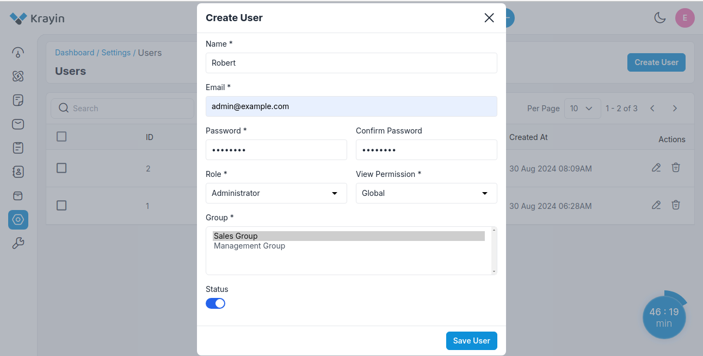
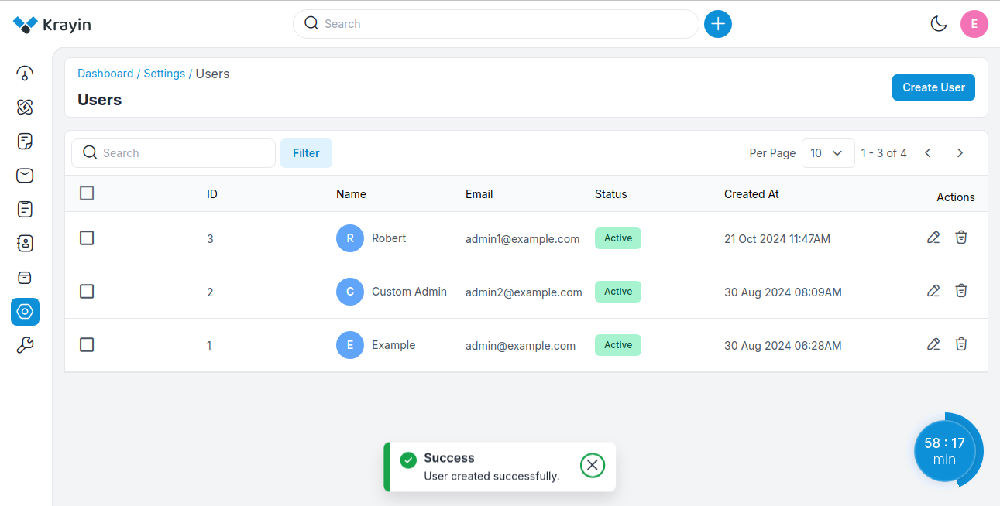
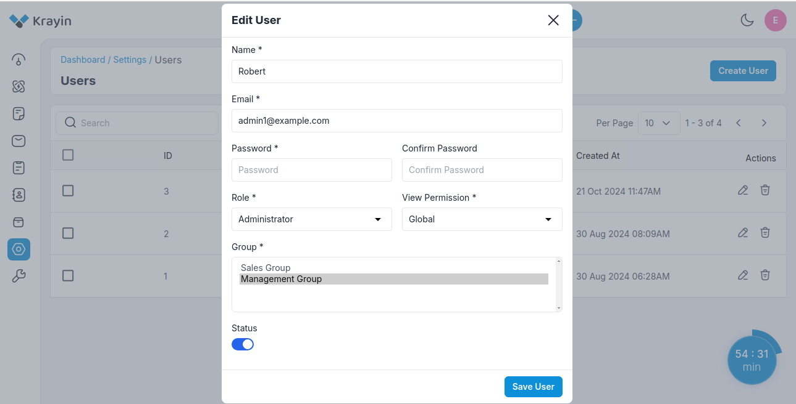
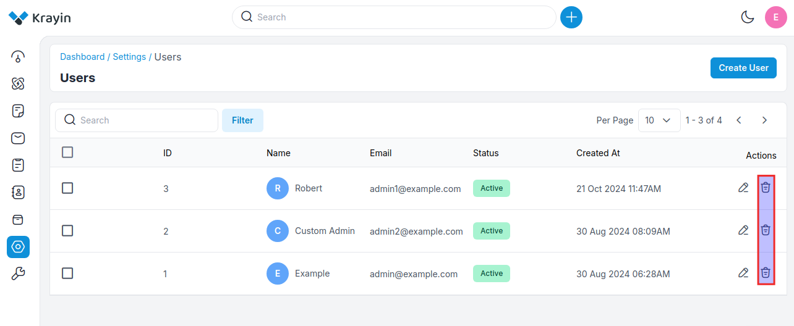
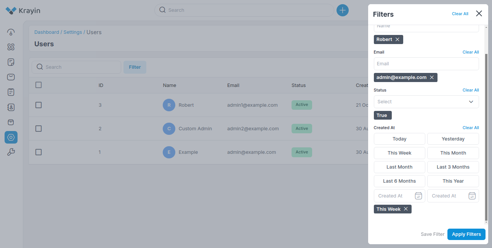

# Users

A user typically refers to an individual who interacts with the CRM platform to manage customer relationships, sales processes, marketing campaigns, and other related activities. 

### Create a User in Krayin

**Step-1** Go to admin panel of krayin and click on **Settings >> Users >> Create User** as shown in the below image.

**Step-2** Enter the below details.

**1) Name-** Enter the name of the user.

**2) Email-** Enter the email of the user.

**3) Password-** Enter the password of the user.

**4) Role-** Select the role that you want to assign to the particular user.

**5) View Permissions-** Select the permission i.e. **Global, Group, Individual** while creating the user, detailed explanation is mentioned below.

**a) Global:** Permissions that apply to all users across the system or application. This level grants broad access and capabilities.

**b) Group:** Permissions assigned to a specific group of users. This allows for managing access collectively, making it easier to apply the same permissions to multiple users without setting them individually.

**c) Individual:** Permissions assigned to a single user. This allows for tailored access and control based on the specific needs of that user.

**6) Group-** Select the group which you want to assign to the user.

**7) Status-** Enable/Disable the status of the user according to your requirements.

Now click on **Save User** button.

**Step-3** A new record is created in the user data grid as shown in the below image.

### Actions in Users

There are two types of actions you can perform in the user section:

1) Edit
2) Delete

**A) Edit User**

After User creation, if you want to edit or update the **name, email, password, role, view permission, group, & status** then go to the “Edit” option and click on **Save User** button after making changes.

**B) Deleting Users**

If you want to delete an unnecessary user from your Krayin CRM, in the action click on the Delete button, as shown in the below image.

### Use of Filter in Users

After creating a User, you can use a “Filter” to find out the specific users by using **“Name, Email, Status, Created At”**

**NOTE-** These users can be assigned while creating a lead. 

By following the above steps you can easily create users in Krayin CRM.

