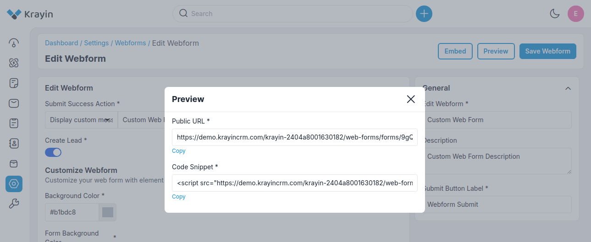

# Webforms

Web forms simplify the process of capturing visitors' or users' information from your website into your CRM system. They are designed to automate the importing of data. Non-technical users find it easy to design and publish their web forms.

### Create Webforms in Krayin

**Step-1** Go to admin panel of krayin and click on **Settings >> Webforms >> Create Webform** as shown in the below image.

**Step-2** Add the below details.

**1) Webform Name-** Enter the name of the web form.

**2) Description-** Enter the description of the web form.

**3) Submit Button Label-** Enter the label name of the submit button.

**4) Submit Success Action-** Enter the custom message of submit success action also you can apply the redirect URL.

**5) Create Lead-** You can Enable/Disable from here.

**6) Customize Web Forms-** Customize your web form with element colors of your choosing with **CSS** for **Background Color, Form Background, Form Title Color, Form Submit Button, Attribute Label Color**.

**7) Attributes-** Add attributes of the form you can easily add more attributes after clicking on **Add Attribute** button or you can delete them as well as per your requirements.

Now click on **Save Web Form** button.

**Step-3** A new record is created in the webform data grid as shown in the below image.

### Use of Filter in Webform

After creating Webform, you can use a “Filter” to find out the specific Webform by using **Title** as shown in the image below.

### Actions in Webform

There are three types of actions you can perform in the Webform section:

1) Edit
2) Delete
3) View

**A) Edit Webform**

After Webform creation, if you want to edit the Webform **Submit Success Action, Create Lead, CSS Colors,  Attributes, Name, Description, Submit Button Label** then go to the “Edit” option and click on **Save Webform** button after making changes.

Additionally, there is **Embed** button after clicking this you can able to preview the **Public URL & Code Snippet** of the Webform

**B) Deleting Webform**

If you want to delete an unnecessary Webform from your Krayin CRM, in the action click on **Delete** button, as shown in the below image.

**C) View Webform**

If you want to view a Webform click on **View** button from action and the webform will become visible as per your applied CSS.

By following the above steps you can easily create & manage Webforms in Krayin CRM.
