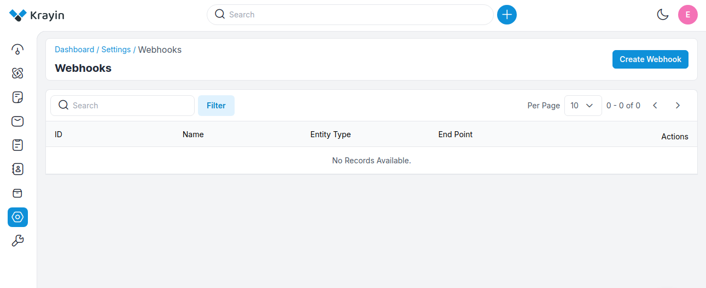
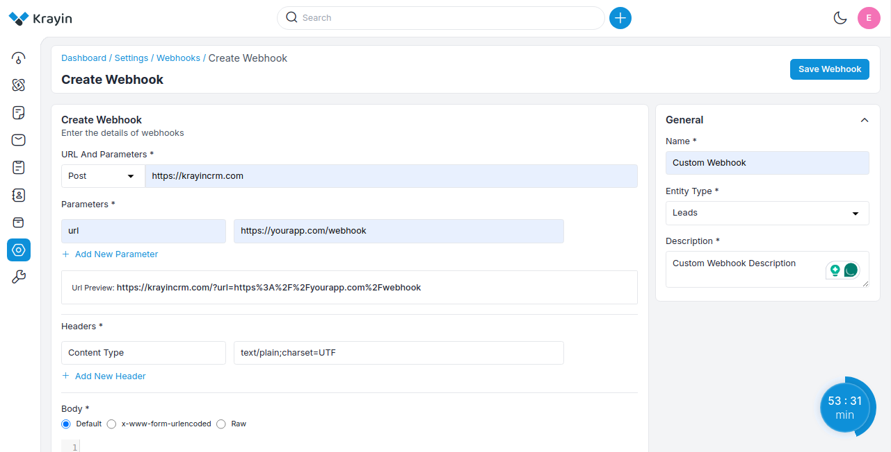
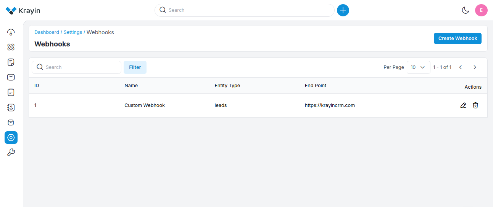
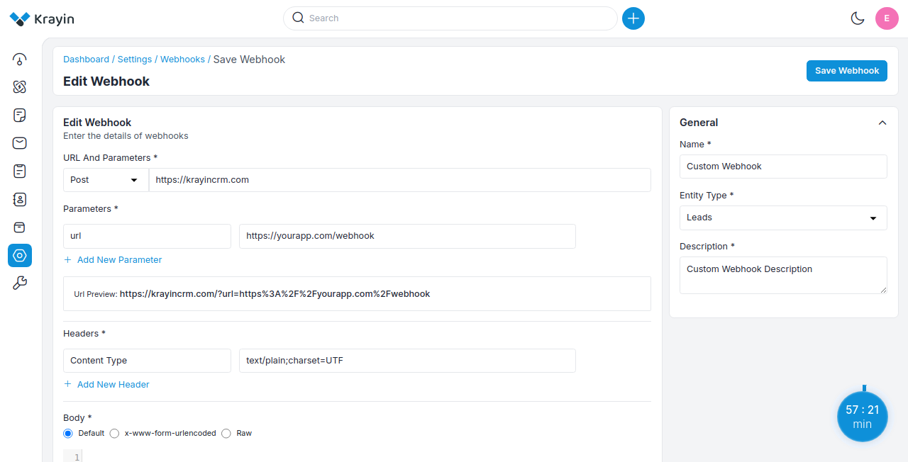
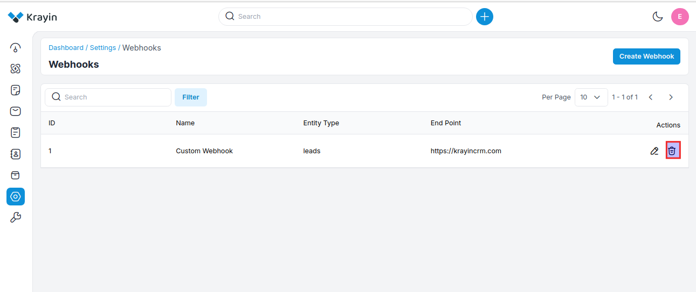
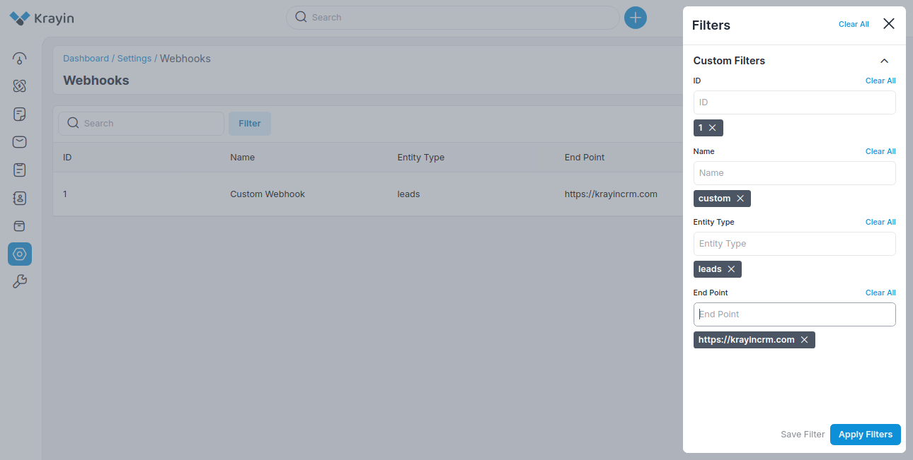

# Webhooks

Webhooks are used to facilitate real-time communication between the CRM and other applications or services. 

They allow the CRM to send data automatically whenever specific events occur, enhancing integration and workflow automation.

### Create Attributes in Krayin

**Step-1** Go to admin panel of krayin and click on **Settings >> Webhooks >> Create Webhooks** as shown in the below image.

**Step-2** Enter the below details.

**1) URL And Parameters-** Enter the URL endpoint you can also select the **POST and PUT** methods and the parameters i.e. **Key and Value** 

**2) Headers-** Enter the Header key and value 

**3) Body-** Select an option from the radio buttons: **Default, x-www-form-urlencoded, or Raw**. If you select the **Raw** option, you will see a dropdown to choose the format in which you want to receive the data: **JSON or TEXT**.

**4) Name-** Enter the name of the webhook.

**5) Entity Type-** Select the entity type from the dropdown i.e. **lead, person, organization, product, quote, warehouse** for the webhook.

**6) Description-** Enter the description of the Webhook.

At last, click on **Save Webhook** button.

**Step-3** A new record is created in the Webhook data grid as shown in the below image.

### Actions in Webhook

There are two types of Actions you can perform in the Webhook section:

1) Edit
2) Delete

**A) Edit Webhook**

After Webhook creation, if you want to edit or update the Webhook **URL & Parameters, Headers, Body, Name, Entity Type, Description** values then go to the “Edit” option and click on **Save Webhook** button after making changes. 

**B) Deleting Webhook**

If you want to delete an unnecessary Webhook from your Krayin CRM, in the action click on **Delete** button, as shown in the below image.

### Use of Filter in Webhook 

After creating a Webhook, you can use a “Filter” to find out the specific Webhook by using **ID, Name, Entity Type, End Point** as shown in the image below.

By following the above steps you can easily create & manage Webhook in Krayin CRM.
